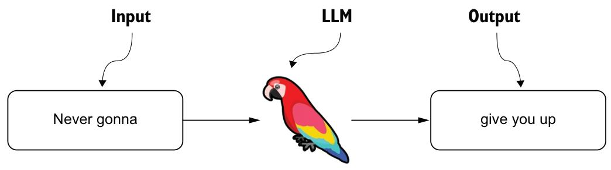
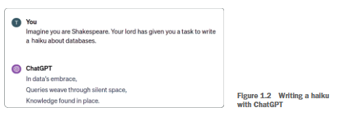
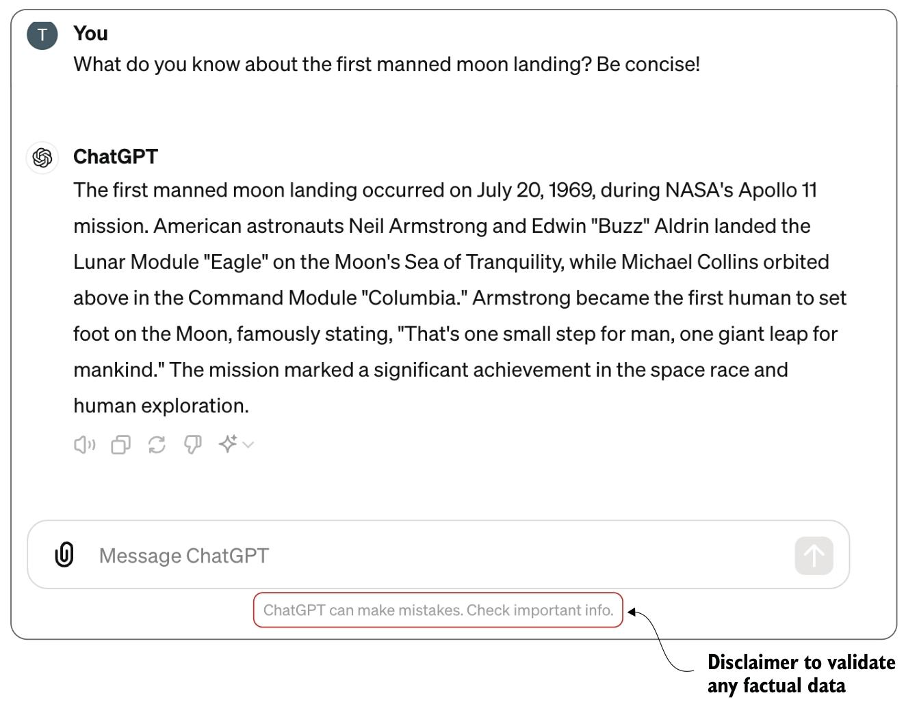
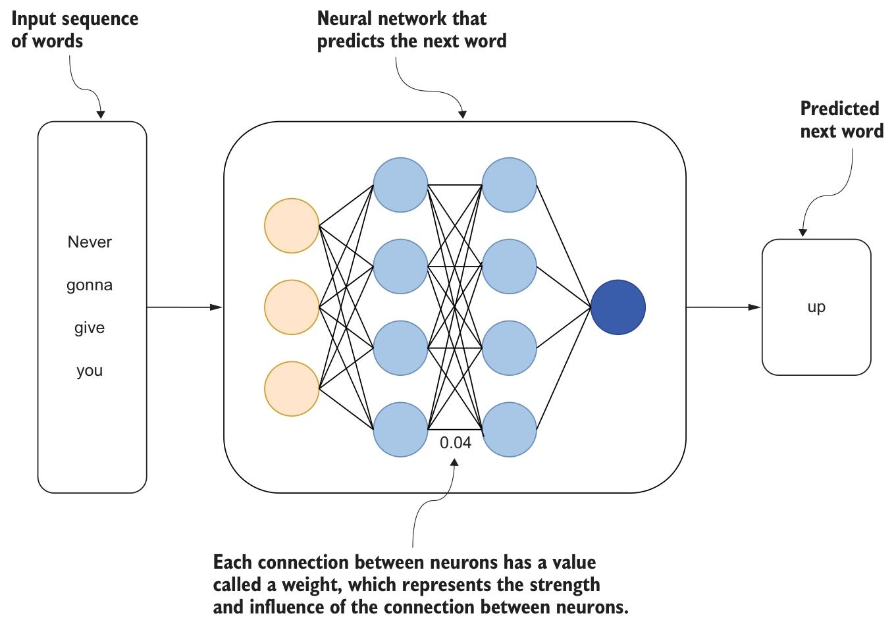

到目前为止，你很可能已经听说过或接触过 ChatGPT，它是对话式人工智能最具代表性的例子之一。ChatGPT 是由 OpenAI 开发的对话式应用，由 GPT-4 、GPT-5等大语言模型（LLM）提供支持。大语言模型基于Transformer架构构建（Vaswani 等人，2017），这使其能够高效地处理和生成文本。这些模型在海量文本数据上进行预训练，能够学习到文本的模式、语法、语境，甚至具备一定程度的推理能力。训练过程会向模型输入各类文本类型的大型数据集，核心目标是让模型能够准确预测序列中的下一个单词。这种广泛的学习积累使模型能够基于从数据中习得的模式，理解并生成类人文本。例如，如果你将“Never gonna”作为输入传给大语言模型，得到的回复可能与图 1.1 所示的内容相似。

_图1.1展示了一个大语言模型（LLM）处理输入“Never gonna”并生成输出“give you up”的过程。这凸显了大语言模型如何依赖其在训练过程中学习到的模式和关联，例如源自流行音乐等常见文化参考的模式和关联。这些回复的质量和相关性在很大程度上取决于训练数据集的多样性和深度，而这又决定了大语言模型识别和复现此类模式的能力。_

尽管大语言模型擅长生成符合语境的文本，但它们远不止做语句的自动补全。它们遵循指令并适应各类任务的出色能力也令人赞叹。例如，如图1.2所示，你可以让ChatGPT以特定风格生成关于某一主题的俳句。这一能力不仅体现了模式识别，更展现了对特定任务指令的理解，从而能生成远超简单文本预测的创意且细腻的输出内容。

 _图1.2 用ChatGPT创作俳句_

大语言模型（LLM）遵循指令并生成多样、复杂内容的能力——无论是创作一首俳句还是提供结构化的回复——都超越了单纯预测序列中下一个单词的范畴。这种理解并执行详细指令的能力，使大语言模型具备了适用于各类任务的独特优势。在本书中，你将运用这种指令遵循能力来设计和优化检索增强生成（RAG）流程。借助遵循指令的功能，你能更高效地整合检索组件，根据特定场景定制回复，并优化系统以提升准确性与可用性。

ChatGPT 广博的通用知识储备同样令人惊叹。例如，图 1.3 展示了在被问及首次载人登月任务时，ChatGPT 给出的回答。

如果你用 NASA 或维基百科的外部信息来验证这一回答，会发现模型给出的是准确的内容，没有虚假信息。这样的回答可能会让你觉得，大语言模型会构建一个庞大的事实数据库，在收到提示时就能从中调取信息。但实际上，模型并不会存储训练数据集中的特定事实、事件或信息。相反，它训练训练语言的复杂数学表征。请记住，大型语言模型基于Transformer架构，这是一种基于神经网络的深度学习架构，用于预测下一个单词，如图1.4所示。

_图1.4展示了一个预测序列中下一个单词的神经网络，其工作原理与大语言模型（LLM）类似。图的中心部分是一个包含多层神经元的网络，神经元之间通过线条连接，这些线条代表信息的流动路径。每个连接都有一个权重，例如：示例中的数值0.04，它决定了连接的强度。在训练过程中，模型会学习这些权重的数值，以提升预测的准确性。当被问及某个具体的历史事件时，大语言模型并非从其训练数据中调取该事件的记忆，而是基于其神经网络中学习到的权重生成回应，这与预测序列中下一个单词的过程类似。因此，尽管大语言模型能给出看似具备丰富知识的回答，但其回应是基于这些学习到的权重，而非明确的记忆存储。引用 Andrej Karpathy 的话来说：“我们大致能明白，它们（大语言模型）会构建并维护某种知识数据库，但这个知识库本身却非常怪异、不完善且反常”（https://www.youtube.com/watch?v=zjkBMFhNj_g，12分40秒处）。_
