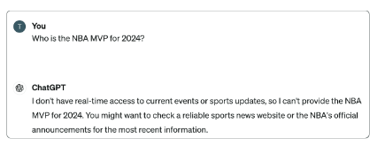
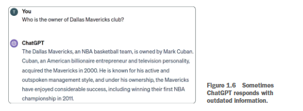
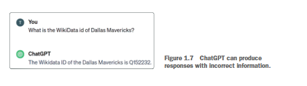
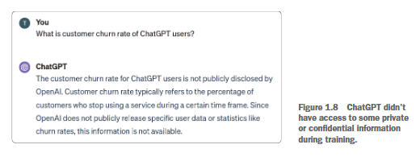

大语言模型是人工智能发展史上具有突破性的一步，在各类应用中展现出了卓越的性能。然而，与任何具有变革性的技术一样，它们也面临着诸多挑战与限制。接下来的部分，我们将深入探讨其中一些局限性及其带来的影响。

---

### 1. 知识截至问题

最明显的局限性在于，大型语言模型无法知晓其训练数据集中未包含的事件或信息。目前，ChatGPT-4 所掌握的信息仅截止到 2023 年 10 月。例如，如果你向 ChatGPT 询问 2024 年发生的某一事件，得到的回复会与图 1.5 中展示的内容类似。



在大语言模型（LLM）的语境中，知识截止日期指的是模型训练数据所包含信息的最近时间节点。该模型可获取来自各类来源的、涵盖截至该时间节点各类事件信息的广泛文本数据，并利用这些数据生成回复、提供信息。在该截止日期之后发生或发布的任何内容，模型均不了解，因为这些内容并未纳入其训练数据集；因此，模型无法提供关于该截止日期之后发生的事件、发展动态或研究的信息。

---

### 2. 过时信息

不太明显的局限性是，大语言模型有时会提供过时的回复。尽管它们能提供截至其知识截止日期的详细且准确的信息，但可能无法反映最新的发展。例如，2023年末，马克·库班将其在达拉斯独行侠队的多数股权出售给了阿德尔森家族和杜蒙家族，同时保留了少数股权。这一重大更新凸显了过去正确的信息如何会变得过时。比如，在查询达拉斯独行侠队的相关问题时，图1.6中显示的回复仍将库班列为唯一所有者，这已不再准确。



这凸显了为模型定期更新训练数据或让其获取实时信息的重要性。随着事件和事实的不断演变，即便是所有权结构这类微小细节，也会对我们对某个组织或个人的认知产生重大影响。这一局限性强调了确保人工智能系统在动态环境中保持准确性和相关性的重要性。

---

### 3. 纯粹的幻觉

大语言模型的另一个著名局限性是，它们倾向于给出肯定、自信的回答——即便这些答案包含错误或编造的信息。

人们可能会认为，尽管这些模型有知识截止日期，但它们能提供截至该日期前的准确事实数据。然而，即便是关于截止日期之前发生的事件的信息，也可能并不可靠。

一个典型的例子，发生在美国律师向法院提交虚假、伪造的法律引用时，他们并未意识到这些引用是由 ChatGPT 生成的（诺伊迈斯特，2023）。这类看似笃定的错误信息通常被称为“幻觉”，即模型输出的信息听起来合理，但实际上事实错误或完全是凭空捏造的。URL、学术引用或 WikiData 标识符等外部参考尤其容易出现这种情况。

出现幻觉是因为大语言模型并非推理引擎。它们是概率语言模型，训练目标是根据训练数据中的模式预测出听起来合理的下一个Token。它们不会像人类那样掌握事实。相反，它们会通过猜测最可能的续文来生成文本，而不考虑内容是否真实。统计模式匹配与实际理解之间的这一本质区别，是大语言模型与人类认知的区别所在。

为了说明这一点，我们可以让 ChatGPT 提供达拉斯独行侠 NBA 球队的维基数据编号。如图 1.7 所示，该模型自信地返回了一个标识符——但这个标识符是错误的。



该模型自信地回复了一个遵循WikiData格式的ID。然而，如果你核实这一信息，会发现Q152232是电影《Womanlight》的WikiData ID（https://www.wikidata.org/wiki/Q152232）。因此，用户必须认识到，大语言模型虽然通常能提供有用信息，但并非万无一失，可能会生成错误信息。以批判性态度看待它们的回复，并通过可靠的外部来源核实其准确性至关重要，尤其是在精准性和事实正确性至关重要的场景中。

---

### 4. 缺乏私人信息

如果你正在使用大语言模型（LLM）开发一款企业聊天机器人，你很可能希望它能回答涉及内部或专有信息的问题，而这些信息并非公开可获取的。在这种情况下，即便相关信息或事件发生在大语言模型的知识截止日期之前，它们也不会被纳入其训练数据中。因此，该模型无法针对此类查询生成准确的回答，如图1.8所示。



一种潜在的解决方案是将公司的内部信息公之于众，以期这些信息能被纳入大语言模型的训练数据集。然而，这种方法既不切实际也不安全。因此，我们将探索并展示更有效的策略，在保障数据隐私和控制权的前提下克服这些局限性。

```
关于大语言模型其他局限性的说明
虽然本书将重点探讨大语言模型在生成回复时提供准确事实与最新信息方面的局限性，但也必须承认大语言模型还存在其他限制。其中一些限制包括
- 回复中的偏见——大语言模型有时会生成带有偏见的回复，这反映了训练数据中存在的偏见。
- 缺乏理解与语境——尽管大型语言模型（LLM）结构复杂，但它们并不能真正理解文本。它们依据从数据中习得的模式来处理语言，这意味着它们可能会忽略语义的细微差别与语境的微妙之处。
- 提示词注入漏洞——大型语言模型易受提示词注入攻击，恶意用户会精心设计输入，操控模型生成不当、带有偏见或有害的回复。在实际场景中，这一漏洞对保障大型语言模型应用的安全性与完整性构成了重大挑战。
- 回答不一致——大语言模型在多次交互中对同一问题可能给出不同答案。这种不一致源于其概率特性和缺乏持久记忆，这可能会阻碍它们在要求稳定性和可重复性的应用中发挥作用。
本书旨在探讨并解决大型语言模型（LLM）在生成事实准确且具有时效性的回复时所存在的特定局限性。尽管我们认识到大型语言模型还存在其他局限性，但我们的讨论将不涉及这些内容。
```

---
