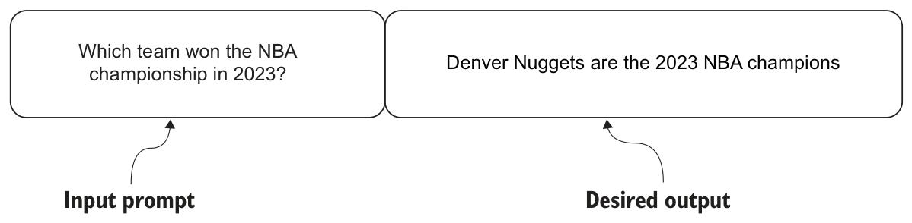
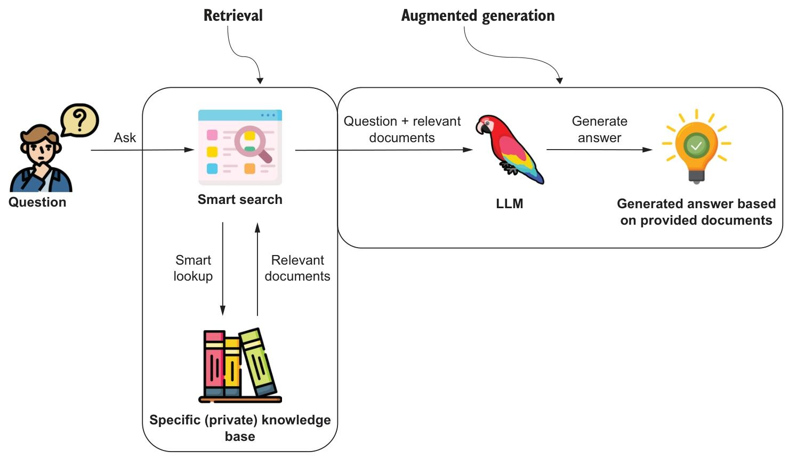
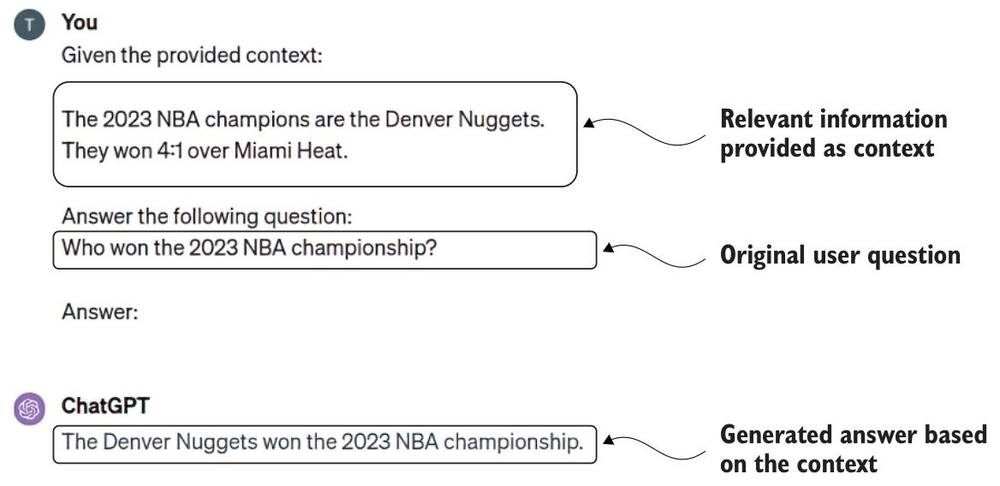
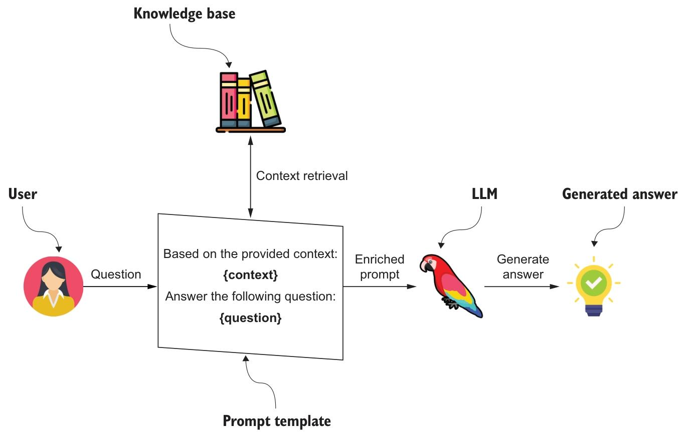
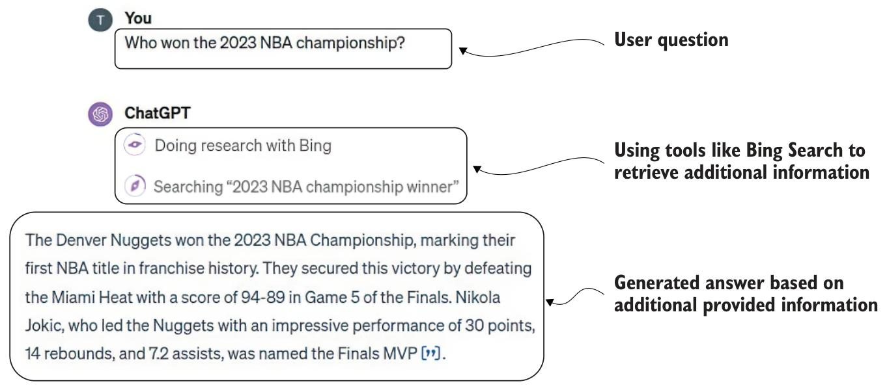

大语言模型是功能强大的头脑，但在处理领域特定问题或获取专业、最新的知识时往往存在局限性。在商业环境中部署类似 ChatGPT 的应用，需要输出结果既精准又符合事实。为克服这些挑战，我们可通过监督微调、检索增强生成等方法向大语言模型注入领域特定知识。本节将探讨这些方法的工作原理，以及如何将其应用于向大语言模型注入领域特定知识。

### 1. 监督微调

起初，我们很多人以为可以通过额外训练可以克服大语言模型的局限性。比如，我们可以通过持续更新模型来突破知识截止日期的限制。要有效解决这一问题，我们首先需要更深入地理解大语言模型的训练原理。正如 Andrew Karpathy 在视频（https://www.youtube.com/watch?v=bZQun8Y4L2A）中所介绍的，像ChatGPT这样的大语言模型训练可分为以下四个阶段：

1. 预训练（Pretraining） - 模型阅读海量文本，通常超过一万亿个 Token，以学习基础的语言模式。它会练习预测句子中下一个出现的单词。这是基础步骤，就像在能够写作之前先学习词汇和语法一样。这是资源消耗最高的阶段，可能需要数千个GPU，并且需要连续训练数月时间。
2. 有监督微调（Supervised finetuning）- 模型被喂取高质量对话的具体示例，以提升其像贴心助手一样回应的能力。它会继续练习语言表达，现在重点放在生成实用且准确的回复上。可以将其理解为从基础语言学习过渡到练习对话技巧。这一过程所需的资源远少于预训练，如今即便是小型大语言模型，也能在单台笔记本电脑上完成该步骤。
3. 奖励建模（Reward modeling） - 该模型通过对比同一问题的不同答案来区分优质与劣质回应。这就好比有一位教练向模型展示何为出色的表现，让模型力求复刻这种高质量的水平。
4. 强化学习（Reinforcement learning） - 模型与用户在模拟环境下交互，根据反馈进一步优化自身回应。这类似于学习一项运动：不仅通过练习训练，还通过实际比赛并从经验中学习。

由于预训练阶段成本高昂且耗时，因此无法进行持续更新，所以我们的思路是利用有监督微调阶段来克服大语言模型的局限性。在有监督微调阶段，你需要为语言模型提供特定的输入提示示例，以及你期望模型生成的对应理想输出。图1.9展示了一个这样的示例。

_Figure 1.9 Sample record of a supervised finetuning dataset_

图1.9 展示了一个可用于微调大语言模型（LLM）的问答示例。在该示例中，输入提示或问题是关于哪支球队赢得了2023年NBA总冠军，对应的答案是丹佛掘金队。其原理是，通过这个示例，大语言模型会将这一事实信息纳入其语言的数学表示中，从而能够回答与2023年NBA总冠军相关的问题。一些研究表明，有监督微调能够提升大语言模型的事实准确性（Tian等人，2023年）。然而，其他采用不同方法的研究也显示，大语言模型难以通过微调学习新的事实信息（Ovadia等人，2023年）。

尽管有监督微调能够提升模型的整体知识储备，但它仍是一个复杂且不断发展的研究领域。因此，在当前技术发展阶段，在生产环境中部署可靠的微调语言模型面临着重大挑战。幸运的是，目前存在一种更高效、更简便的方法来解决大语言模型的知识局限性问题。

### 2. 检索增强生成

提升大语言模型准确性并克服其局限性的第二种策略是检索增强生成（RAG： Retrieval Augmented Generation）工作流，该工作流将大语言模型与外部知识库相结合，以输出准确且最新的回复。它不再依赖大语言模型的内部知识，而是将相关事实或信息直接提供在输入提示词中（刘易斯等人，2020年）。这一概念（检索增强生成）利用了大语言模型在理解和生成自然语言方面的优势，同时在提示词中提供事实性信息，减少了对大语言模型内部知识库的依赖，进而降低了幻觉现象的发生。

RAG 工作流程主要分为两个阶段：

- 检索（Retrieval）
- 增强式生成（Augmented generation）

在检索阶段，从外部知识库或数据库中定位相关信息。在增强生成阶段，将检索到的信息与用户输入相结合，以优化提供给大语言模型（LLM）的上下文，使其能够基于可靠的外部事实生成回复。检索增强生成（RAG）的工作流程如图1.10所示。

_Figure 1.10 Providing relevant information to the LLM as part of the input_

如上所述，大语言模型（LLM）非常擅长理解自然语言并遵循提示词中的指令。在检索增强生成（RAG）流程中，核心目标转向了面向任务的响应生成，此时大语言模型需遵循一系列指令。该流程涉及：利用检索工具从特定知识库中获取相关文档，随后大语言模型根据提供的文档生成答案，确保响应准确、符合语境且与特定指导原则一致。这种系统化的方法将答案生成过程转变为一项针对性任务，即通过审查和利用检索到的信息来生成最终答案。图1.11展示了在输入提示词中提供事实性信息的示例。

- 提供的背景信息 - 一段介绍相关信息的事实性陈述——在本案例中，指明丹佛掘金队以4:1的比分战胜迈阿密热火队，成为2023年NBA总冠军。这部分内容是大语言模型（LLM）的知识库输入。
- 用户查询 - 一个具体的问题：“谁赢得了2023年NBA总冠军？”，该问题指引大语言模型从提供的背景信息中提取相关内容。
- 生成的答案 - 大语言模型的回复与检索到的上下文一致：“丹佛掘金队赢得了2023年NBA总冠军。”

_Figure 1.11 Providing relevant information to the answer as part of the prompt_

你可能会好奇，如果用户需要同时提供上下文和问题，RAG 流程的优势是什么。实际上，检索系统是独立于用户运行的。用户只需提供问题，而检索过程则在后台进行，如图 1.12 所示。

**_Figure 1.12 Populating the relevant data from the user and knowledge base into the prompt template and then passing it to an LLM to generate the final answer_**

在RAG流程中，用户首先提出一个问题。在后台，系统将该问题转化为搜索查询，并从公司文档、知识文章或数据库等来源中检索相关信息。先进的检索算法会找到最合适的内容，随后将其与原始问题结合，形成增强后的提示词。这个提示词会被发送至大语言模型（LLM），模型会结合问题和检索到的上下文生成回复。整个检索过程均为自动完成，除了用户的原始问题外，无需额外输入。这使得RAG既流畅高效，又能提升事实准确性，同时降低答案出现幻觉的可能性。

RAG 方法凭借其简洁性和高效性已成为主流。如今它也成为了 ChatGPT 界面的一部分，在生成最终答案之前，大语言模型（LLM）可以通过网络搜索来查找相关信息。ChatGPT 付费版的用户对图 1.13 中展示的 RAG 流程并不陌生。

_Figure 1.13 ChatGPT uses Web Search to find relevant information to generate an up-to-date answer._

虽然 ChatGPT 中 RAG 的具体实现并未公开披露，但我们可以尝试推断其底层运作机制。当大语言模型出于某种原因认为需要获取额外信息时，它会向网络搜索模块输入查询。我们无法确切知晓它如何浏览搜索结果、解析网页信息，或是判断已获取足够信息。不过可以确定的是，它将“2023 年 NBA 总冠军得主”这一关键词输入网络搜索，并依据 NBA 官方网站（https://www.nba.com/playoffs/2023/the-finals）上的可用信息生成了最终回复。
