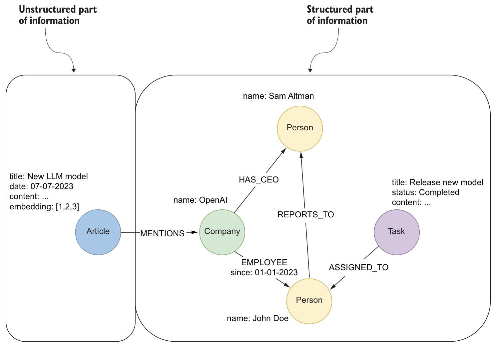

在规划实施RAG应用时，选择合适的存储解决方案至关重要。尽管有众多数据库可供选择，但我们认为知识图谱和图数据库特别适用于大多数RAG应用。知识图谱是一种数据结构，它使用节点表示概念和实体，通过关系连接这些节点。图1.14展示了一个知识图谱示例。

_Figure 1.14 A knowledge graph can store complex structured and unstructured data in a single database system._

知识图谱具有极强的通用性，既能存储结构化信息（如：员工详情、任务状态和公司层级），也能存储非结构化信息（如文章内容）。如图1.14所示，这种双重特性使其成为复杂RAG应用的理想选择。结构化数据支持精准高效的查询，可回答诸如“有多少任务分配给了某一特定员工？”或“哪些员工向某一特定经理汇报？”之类的问题。例如，在图1.14中，结构化数据如“山姆·奥特曼是……的首席执行官”。

“OpenAI”或“John Doe 自 2023 年 1 月 1 日起为 OpenAI 员工”这类信息可直接用于查询，以回答“OpenAI 的首席执行官是谁？”或“John Doe 入职公司多久了？”等问题。同样，“John Doe 被分配到一项状态为已完成的任务”这类结构化关系，可支持“哪些任务已由员工完成？”或“OpenAI 中谁被分配到了具体任务？”等精准查询。这一能力对于从复杂且相互关联的数据中提取可落地的洞察至关重要。

另一方面，非结构化数据（如文章文本）则通过提供丰富的上下文信息来补充结构化数据，这些信息能增加内容的深度与细节。例如，图1.14中的非结构化文章节点提供了某款新型大语言模型（LLM）及嵌入技术的相关细节，但由于缺乏结构化框架，它无法回答“这篇文章与OpenAI员工有何关联？”这类具体问题。

重要的是，仅靠非结构化数据无法回答所有类型的问题。尽管它能为开放式或模糊查询提供见解，但却缺乏过滤、计数或聚合等精准操作所需的结构。例如，要回答“一家公司内有多少任务已完成？”或“哪些员工被分配到了与OpenAI相关的任务中？”这类问题，就需要结构化的关系和属性，如图1.14右侧所示。若没有结构化数据，这类查询就需要详尽的文本解析与推理，这不仅计算成本高昂，结果也往往不够精准。知识图谱在同一框架中整合结构化与非结构化信息，实现了两类数据的无缝融合，使其成为在RAG应用中高效、准确回答各类问题的强大工具。此外，非结构化数据与结构化数据之间的显式关联，还能解锁高级检索策略，比如将文本中的实体与图节点关联，或是结合来源文本对结构化结果进行上下文还原——这些都是单独使用其中一种数据难以甚至无法实现的。
