## 0. 章节简介

大语言模型（LLM）已经在多个领域展现出强大的能力，但它们也存在一系列显著局限，而这些局限会直接影响其在真实场景中的可用性，尤其是在需要输出准确且最新信息的任务中。为缓解这些问题，业界广泛采用的一种方法是检索增强生成（RAG）。RAG 通过将大语言模型与外部知识库结合起来，使系统能够生成更准确、更及时的回答。借助运行时从可信来源检索到的数据，RAG 可以显著降低幻觉出现的概率，尽管无法彻底消除这一问题。与此同时，RAG 还使系统能够将模型已有的通用知识与特定领域的专业知识结合起来，而后者往往并未被模型的预训练数据充分覆盖。尽管如此，许多 RAG 实现仍主要聚焦于非结构化数据，而忽视了知识图谱等结构化数据源的价值。

知识图谱通过对实体、实体属性及实体间关系进行结构化表示，提供了一套统一的语义框架，能够打通结构化数据与非结构化数据之间的隔阂。例如，客户支持记录通常属于非结构化文本，而产品目录或用户数据库则属于结构化数据。打通两者，意味着系统能够把用户在对话中提到的“我最近下单的笔记本电脑”，与其具体型号、购买日期及保修状态等结构化记录关联起来。在 RAG 场景中，知识图谱能够支持更精准、更具上下文且关系明确的信息检索。例如，它可以将用户关于药物相互作用的提问，实时关联到结构化医疗指南、历史案例研究和患者病史。将知识图谱整合进 RAG 流程，不仅有助于弥补大语言模型的局限，也能显著提升检索质量，并为医疗、金融、技术支持等领域的数据管理与应用提供更完整的方法论。

本书面向希望构建更稳健、可解释、能力更强的 RAG 系统的开发者、研究人员和数据从业者。你将学习如何利用知识图谱增强现有的 RAG 架构，以及如何从零构建完整的 GraphRAG 流程。在此过程中，你还会掌握数据建模、图谱构建、检索设计与系统评估等关键实践技能。

读完本书后，你将清楚理解大语言模型、检索增强生成与知识图谱之间的协同关系，并能够据此构建可处理复杂问题、输出准确可靠且具备可解释性的系统。

---

## 1. 大语言模型简介

到目前为止，你很可能已经听说过，甚至使用过 ChatGPT。它是最具代表性的对话式人工智能应用之一，由 OpenAI 开发，并由 GPT-4、GPT-5 等大语言模型（LLM）提供支持。大语言模型建立在 Transformer 架构之上（Vaswani 等，2017），因此能够高效处理和生成文本。这类模型会在海量文本数据上进行预训练，从中学习语言模式、语法结构、上下文关系，甚至展现出一定程度的推理能力。其训练目标的核心，是根据已有序列预测下一个最可能出现的词。正是这种大规模训练，使模型能够基于从数据中习得的统计模式，生成接近人类表达方式的文本。例如，如果你向模型输入“Never gonna”，得到的回复很可能会与图 1.1 类似。

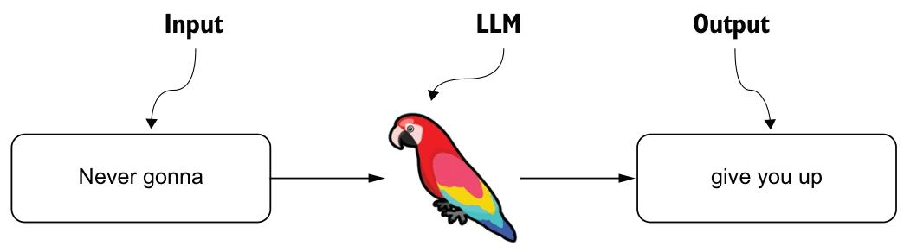

_图 1.1 展示了大语言模型（LLM）在接收输入“Never gonna”后生成输出“give you up”的过程。这个例子说明，模型的回复依赖于训练过程中学到的语言模式与关联关系，其中也包括来自流行文化的常见表达。回复的质量与相关性，在很大程度上取决于训练数据的广度与深度，而这又直接影响模型识别并复现这类模式的能力。_

尽管大语言模型擅长生成符合语境的文本，但它们的能力远不止于“自动补全句子”。更值得关注的是，它们能够理解指令，并适配多种任务。例如，如图 1.2 所示，你可以要求 ChatGPT 以特定风格围绕某个主题创作一首俳句。这种能力不仅体现了模型对语言模式的掌握，也说明它能够理解任务约束，并据此生成超越简单文本续写的、具有创造性和细腻度的内容。

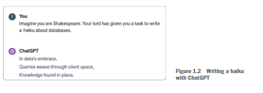 _图 1.2 使用 ChatGPT 创作俳句_

大语言模型能够理解指令并生成多样且复杂的内容。无论是写一首俳句，还是输出结构化回复，这种能力都已远远超出“预测下一个词”这一表层描述。正是这种对复杂指令的理解与执行能力，使大语言模型适用于大量实际任务。在本书中，你将利用这种能力来设计和优化检索增强生成（RAG）流程，更高效地组织检索组件、针对特定场景定制回答，并进一步提升系统的准确性与可用性。

ChatGPT 展现出的广泛通用知识同样令人印象深刻。例如，图 1.3 展示了它在回答“首次载人登月任务”这一问题时给出的结果。

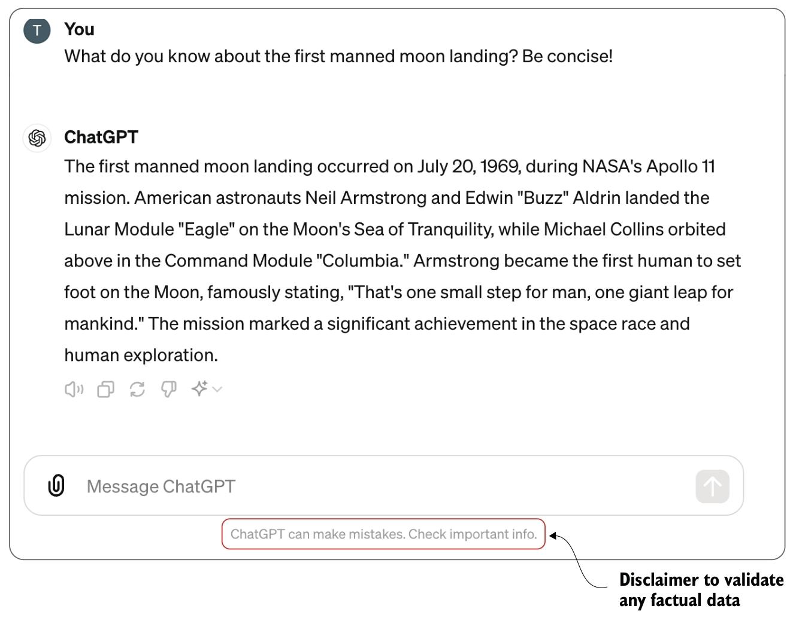

如果你借助 NASA 或维基百科等外部来源核实这一回答，会发现它是准确的，并不存在虚构内容。这种表现很容易让人误以为，大语言模型内部维护着一个庞大的事实数据库，并能在回答时直接调用其中的信息。但事实并非如此。模型并不会以显式方式存储训练数据中的具体事实、事件或条目，而是学习语言的复杂数学表示。请记住，大语言模型建立在 Transformer 架构之上，本质上仍是一种用于预测下一个词的神经网络模型，如图 1.4 所示。

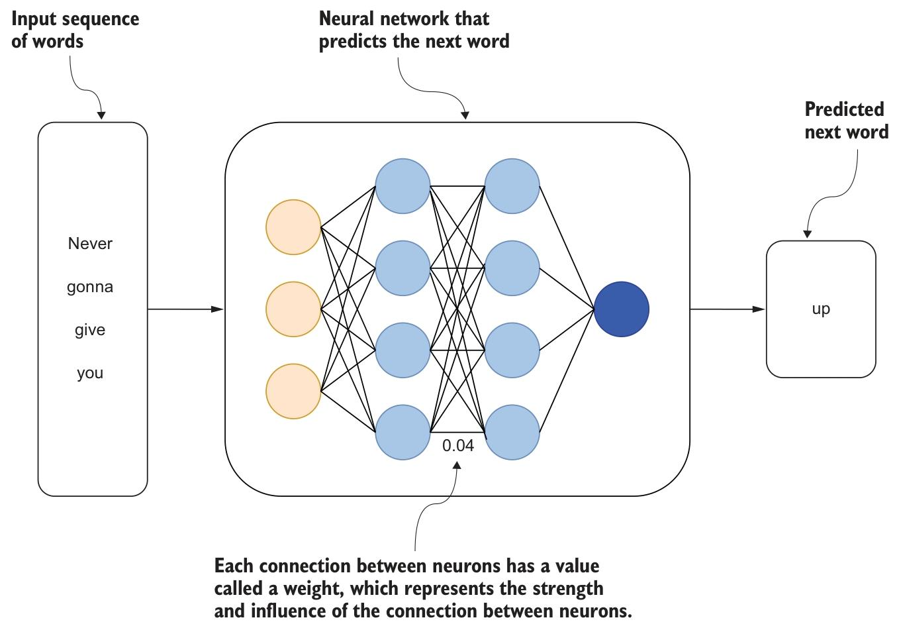

_图 1.4 展示了一个用于预测序列中下一个词的神经网络，其工作机制与大语言模型（LLM）相似。图中央是由多层神经元构成的网络，神经元之间通过连线连接，代表信息在网络中的传播路径。每条连接都带有权重，例如图中的 0.04，用于表示连接强度。训练过程中，模型会不断调整这些权重，以提升预测准确性。当被问及某个具体历史事件时，大语言模型并不是从某个“记忆库”中调出该事件，而是基于已学习到的参数权重生成回答。因此，尽管模型的输出看起来像是在调用知识，但其本质仍是基于参数分布进行生成，而不是显式检索。正如 Andrej Karpathy 所说：“我们大致能明白，它们会构建并维护某种知识数据库，但这个知识库本身却非常怪异、不完善且反常。”（https://www.youtube.com/watch?v=zjkBMFhNj_g，12 分 40 秒处）_

---

## 2. 大语言模型的局限性

大语言模型是人工智能发展中的一次重要突破，已在多类应用中展现出卓越能力。然而，任何具有变革性的技术都不可能没有边界条件。接下来，我们将聚焦几项最关键的局限性，以及它们在实际应用中带来的影响。

### 2.1. 知识截止

最直接的一项局限是：大语言模型无法知晓训练数据中未包含的事件或信息。例如，ChatGPT-4 的知识范围截至 2023 年 10 月。如果你向它询问 2024 年发生的事件，得到的回答通常会类似于图 1.5 所示。

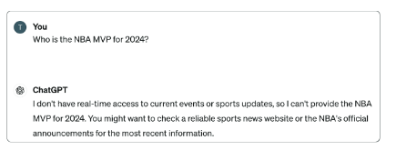

在大语言模型的语境下，“知识截止日期”指的是模型训练数据所覆盖信息的最晚时间点。模型可以利用截至该时间点之前的各类文本数据生成回答，但对于截止日期之后发生或发布的事件、研究进展和事实变化，则并不知情，因为这些内容并未被纳入训练数据之中。

### 2.2. 过时信息

另一项不那么直观、但同样重要的局限是：模型可能会给出“曾经正确、现在过时”的答案。即使某条信息在训练时是准确的，现实世界的变化也可能让它失效。例如，2023 年底，马克·库班将其持有的达拉斯独行侠队多数股权出售给阿德尔森家族和杜蒙家族，只保留少数股份。这意味着过去正确的描述已经不再适用。如果此时继续询问独行侠队的所有权信息，模型仍可能像图 1.6 那样，将库班视为唯一所有者，而这显然已经不再准确。

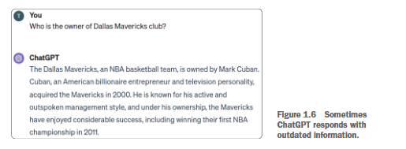

这也说明了两件事的重要性：要么定期更新模型的训练数据，要么让系统能够访问实时信息源。随着事实持续变化，即便是所有权结构这样的细节，也可能对用户判断某个组织或个人的现状产生重要影响。因此，若要在动态环境中保持系统的准确性与相关性，仅依赖静态预训练模型显然是不够的。

### 2.3. 纯粹的幻觉

大语言模型另一个广为人知的问题，是它们经常以非常确定的语气给出错误答案，甚至直接编造信息。

很多人会以为，虽然模型受知识截止日期限制，但至少在截止日期之前的事实应当是可靠的。实际情况并非如此。即便是早于知识截止日期的事件，模型给出的信息也未必准确。

一个典型案例是，美国律师曾将 ChatGPT 生成的虚假法律引用提交给法院，而他们当时并未意识到这些引用根本不存在（诺伊迈斯特，2023）。这类“听起来合理、实际上错误”的输出，通常被称为“幻觉”。它指的是模型生成了貌似可信、实则与事实不符，甚至完全捏造的内容。URL、学术引文以及 WikiData 标识符等外部引用信息，尤其容易出现这类问题。

幻觉之所以出现，是因为大语言模型本质上不是事实推理引擎，而是概率语言模型。它们的训练目标，是基于数据中的统计模式预测下一个最可能出现的 Token，而不是验证内容真伪。换言之，模型并不是“知道”某件事是真的，它只是生成了在语境中最像真话的文本。统计模式匹配与真实理解之间的差异，正是大语言模型与人类认知的重要区别之一。

为了说明这一点，我们可以让 ChatGPT 给出达拉斯独行侠队的 WikiData 编号。如图 1.7 所示，它会自信地返回一个看似正确的标识符，但这个标识符实际上是错的。

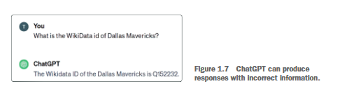

模型返回的是一个完全符合 WikiData 编号格式的 ID，但一经核实就会发现，Q152232 实际上对应的是电影《Womanlight》（https://www.wikidata.org/wiki/Q152232），而不是达拉斯独行侠队。因此，用户必须认识到：大语言模型虽然常常能提供有价值的信息，但绝非天然可靠。在对准确性和事实性要求极高的场景中，始终应以批判性态度看待模型输出，并使用可信外部来源进行核验。

---

### 2.4. 缺乏私人信息

如果你正使用大语言模型开发企业级聊天机器人，很可能希望它能够回答涉及内部资料或专有数据的问题，而这类信息通常并不公开。此时，即便这些信息产生于模型知识截止日期之前，也不会出现在模型的训练数据中。因此，对于这类查询，模型通常无法给出准确回答，如图 1.8 所示。

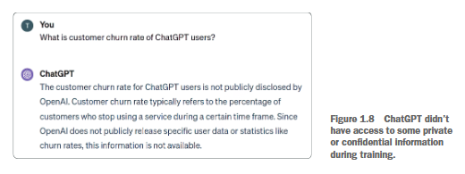

理论上，一个极端做法是把公司的内部信息全部公开，以便未来可能被纳入模型训练数据。但这显然既不现实，也不安全。因此，我们更需要探索的是：如何在不牺牲数据隐私和控制权的前提下，弥补模型在这类场景中的能力缺口。

```
关于大语言模型其他局限性的说明
虽然本书重点关注大语言模型在输出事实准确、且具备时效性信息方面的限制，但也需要指出，它们还存在其他重要问题，例如：
- 偏见输出。模型有时会生成带有偏见的回答，这通常反映了训练数据中原有的偏差。
- 缺乏真正的理解。尽管模型结构复杂，但它们并不真正“理解”文本，而是基于模式处理语言，因此可能忽视语义和上下文中的微妙差异。
- 提示词注入风险。大语言模型容易受到提示词注入攻击，恶意用户可通过精心构造的输入诱导模型输出不当、偏颇或有害内容，这会直接影响系统安全性与完整性。
- 回答不一致。对于同一个问题，模型在不同交互中可能给出不同答案。这种不稳定性源于其概率生成特性及缺乏持久记忆，在要求一致性和可重复性的应用中尤为突出。

本书聚焦的，是如何应对大语言模型在生成事实准确、且具备时间敏感性的回答时所暴露出的核心局限。其他问题同样重要，但不在本书的主要讨论范围内。
```

---

## 3. 克服大语言模型的局限性

大语言模型可以被视为能力强大的通用引擎，但在处理特定领域问题、或需要访问专业且最新的信息时，往往存在明显短板。在商业环境中部署类似 ChatGPT 的系统时，输出结果不仅要自然流畅，更必须准确、可信。为解决这些问题，常见思路包括监督微调与检索增强生成等方法。本节将介绍这些方法的工作机制，以及它们如何帮助模型获得领域相关知识。

### 3.1. 监督微调

起初，很多人都以为只要继续训练模型，就能自然解决这些局限。例如，通过持续更新训练过程，似乎就可以突破知识截止日期的限制。要判断这种思路是否可行，首先必须更清楚地理解大语言模型的训练方式。正如 Andrew Karpathy 在视频（https://www.youtube.com/watch?v=bZQun8Y4L2A）中所解释的，像 ChatGPT 这样的模型训练大致可以分为四个阶段：

1. 预训练（Pretraining）: 模型阅读海量文本，通常规模可达万亿级 Token，以学习基础语言模式。其目标是预测句子中的下一个词。这是整个过程的基础阶段，类似于在写作之前先掌握词汇和语法，也是资源消耗最大的阶段，往往需要数千张 GPU 持续训练数月。
2. 有监督微调（Supervised Finetuning）: 模型会看到大量高质量对话示例，以学习如何像一个有帮助的助手那样作答。此阶段仍在训练语言生成能力，但重点转向实用、准确且符合任务要求的回应。与预训练相比，这一步所需资源要少得多，小型模型甚至可以在单台笔记本电脑上完成。
3. 奖励建模（Reward Modeling）: 模型通过比较同一问题的不同答案，学习区分高质量与低质量的回应。可以把这一步理解为给模型配备了一位“教练”，让它知道什么样的回答更值得偏好。
4. 强化学习（Reinforcement Learning）: 模型在模拟交互环境中根据反馈进一步优化输出。这类似于通过实战不断修正表现，而不只是停留在离线训练阶段。

由于预训练成本极高且周期漫长，持续通过预训练来更新模型几乎不可行。于是，一个更现实的思路是利用有监督微调来弥补模型局限。在这一阶段，你需要为模型提供特定输入提示及其理想输出，让模型学习如何在类似情境下给出更合适的回答。图 1.9 展示了一个典型示例。

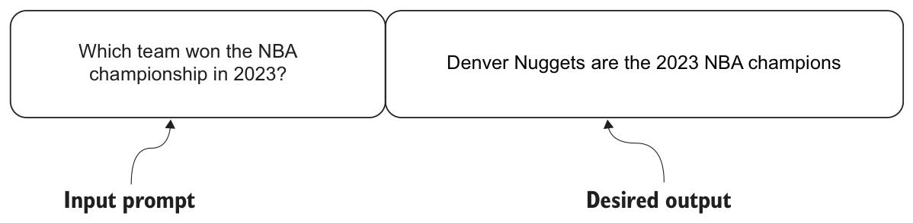

_图 1.9 监督微调数据集中的示例记录_

图 1.9 展示了一个可用于微调大语言模型的问答样本。输入问题是“哪支球队赢得了 2023 年 NBA 总冠军？”，对应答案是“丹佛掘金队”。其思路在于，通过反复看到此类样本，模型有机会将相关事实纳入参数表示，从而更好地回答类似问题。一些研究表明，有监督微调确实能够提升模型的事实准确性（Tian 等，2023）；但也有研究指出，模型通过微调学习新事实的效果并不稳定，甚至可能相当有限（Ovadia 等，2023）。

因此，尽管有监督微调在一定程度上有助于增强模型能力，但它仍然是一个复杂、且尚在持续演进中的研究方向。在现阶段，要在生产环境中稳定部署一个“依靠微调获得新知识”的可靠模型，仍面临不小挑战。幸运的是，针对知识局限这一问题，目前还有一种更高效、也更易落地的方案。

---

### 3.2. 检索增强生成

第二种提升大语言模型准确性、并克服其知识局限的策略，是检索增强生成（RAG，Retrieval-Augmented Generation）。它通过将大语言模型与外部知识库连接起来，生成更准确、也更具时效性的回答。与其依赖模型内部参数中隐含的知识，RAG 更强调在提示词中直接提供相关事实或背景信息（Lewis 等，2020）。这种方法既利用了大语言模型理解和生成自然语言的优势，又减少了系统对模型“内生知识”的依赖，从而有助于降低幻觉发生的概率。

RAG 的工作流程通常分为两个阶段：

- 检索（Retrieval）
- 增强式生成（Augmented generation）

在检索阶段，系统会从外部知识库或数据库中定位与问题相关的信息；在增强生成阶段，这些检索结果会与用户输入共同组成提示上下文，使大语言模型能够基于可靠事实生成回答。RAG 的基本工作流程如图 1.10 所示。

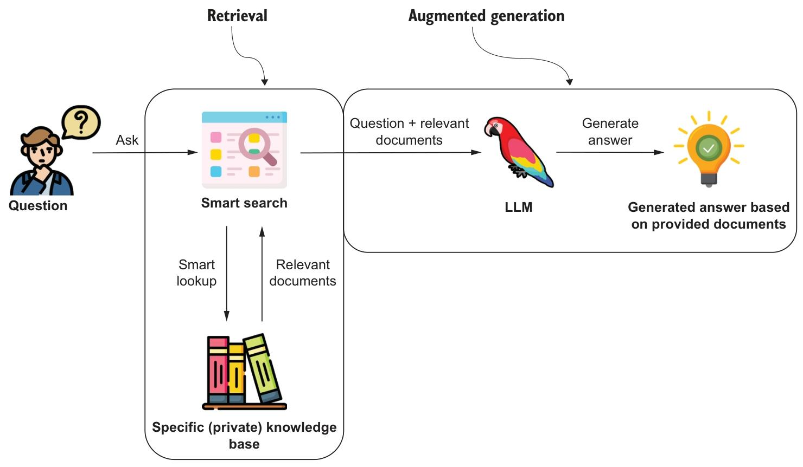

_图 1.10 将相关信息作为输入上下文提供给大语言模型_

如前所述，大语言模型非常擅长理解自然语言，并按照提示词中的要求执行任务。在 RAG 流程中，模型的角色不再是“单独回答问题”，而是“基于给定材料完成回答任务”。系统先通过检索工具从知识库中获取相关文档，再由大语言模型结合这些文档生成答案，以保证回答更准确、更契合上下文，也更符合预设规则。图 1.11 展示了如何在提示词中显式提供事实性信息。

- 提供的背景信息：一段事实性描述。在本例中，它说明丹佛掘金队以 4:1 战胜迈阿密热火队，获得 2023 年 NBA 总冠军。这部分内容为大语言模型提供了外部知识上下文。
- 用户查询：一个具体问题，即“谁赢得了 2023 年 NBA 总冠军？”，用于指引模型从给定背景中提取相关事实。
- 生成的答案：模型根据上述上下文生成回答，即“丹佛掘金队赢得了 2023 年 NBA 总冠军。”

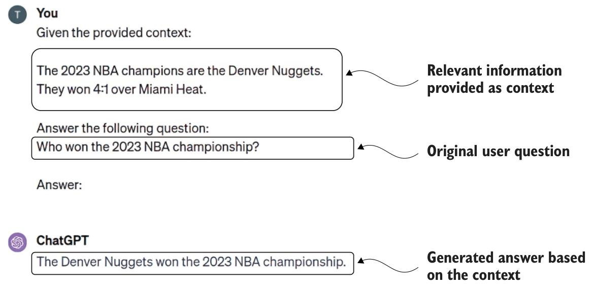

_图 1.11 在提示词中提供事实性信息以支持答案生成_

你可能会问：如果还需要提供上下文，那 RAG 的优势体现在哪里？关键在于，这些上下文并不需要用户手动准备。对于用户而言，仍然只需要提出问题；相关信息的检索由系统在后台自动完成，如图 1.12 所示。

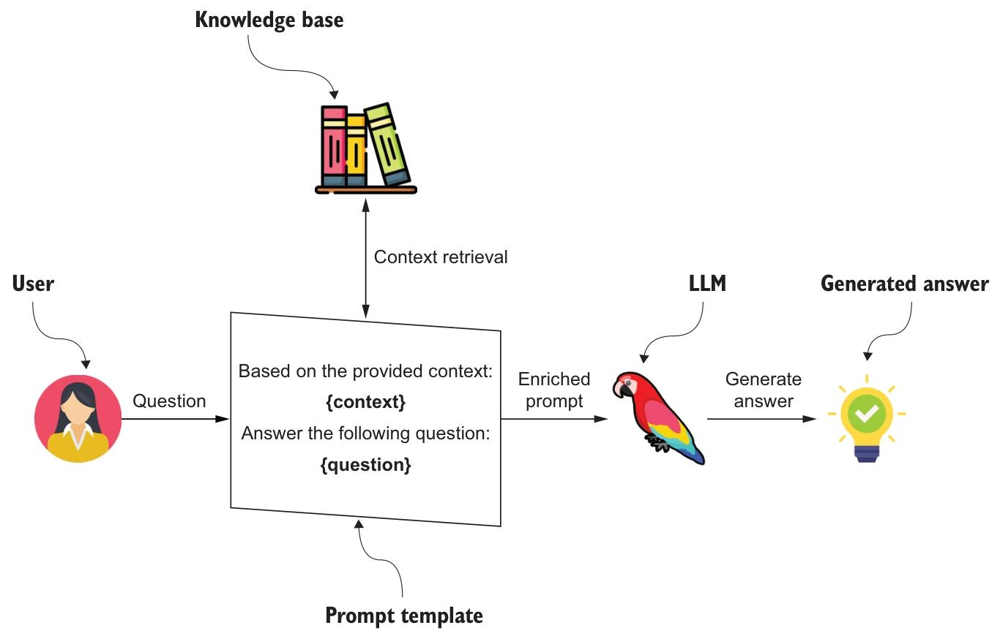

**_图 1.12 将用户问题与知识库中的相关数据填充到提示模板中，再交给大语言模型生成最终答案_**

在 RAG 流程中，用户首先提出问题。系统随后在后台将该问题转化为搜索查询，从公司文档、知识文章或数据库等信息源中检索相关内容。检索模块找到最合适的材料后，会将其与原始问题一起组装为增强后的提示词，再交给大语言模型生成回答。整个过程对用户而言是透明的，除原始提问外无需额外输入。正因如此，RAG 能在保持交互流畅的同时，提升答案的事实准确性，并降低幻觉出现的可能性。

由于实现思路清晰、效果也足够直接，RAG 已经成为当前最主流的增强方案之一。如今，它甚至已经成为 ChatGPT 产品体验的一部分。在生成最终答案之前，模型会先通过网络搜索获取相关信息。对于 ChatGPT 付费版用户而言，图 1.13 展示的流程并不陌生。

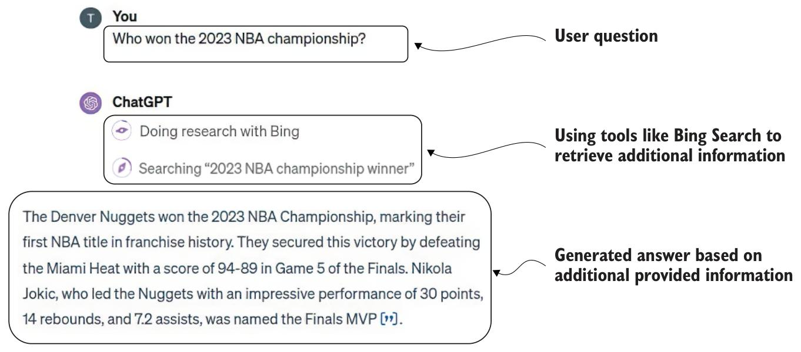

_图 1.13 ChatGPT 通过 Web Search 获取相关信息，以生成具备时效性的回答_

虽然 ChatGPT 中 RAG 的具体实现细节并未完全公开，但其基本工作方式并不难推测。当模型判断自身需要额外信息时，它会向网络搜索模块发出查询请求。我们或许无法准确知道它如何遍历搜索结果、解析网页内容，或者依据什么标准判断“信息已经足够”，但至少可以确认，它会将类似“2023 年 NBA 总冠军得主”这样的查询发送到搜索系统中，再基于 NBA 官方网站（https://www.nba.com/playoffs/2023/the-finals）等来源生成最终回答。

---

## 4. 知识图谱数据库作为RAG应用的数据存储

在设计和落地 RAG 应用时，选择合适的数据存储方案至关重要。尽管可选数据库很多，但我们认为，知识图谱和图数据库特别适合大多数 RAG 场景。知识图谱是一种以节点表示实体与概念、以关系表示连接的数据结构。图 1.14 展示了一个知识图谱示例。

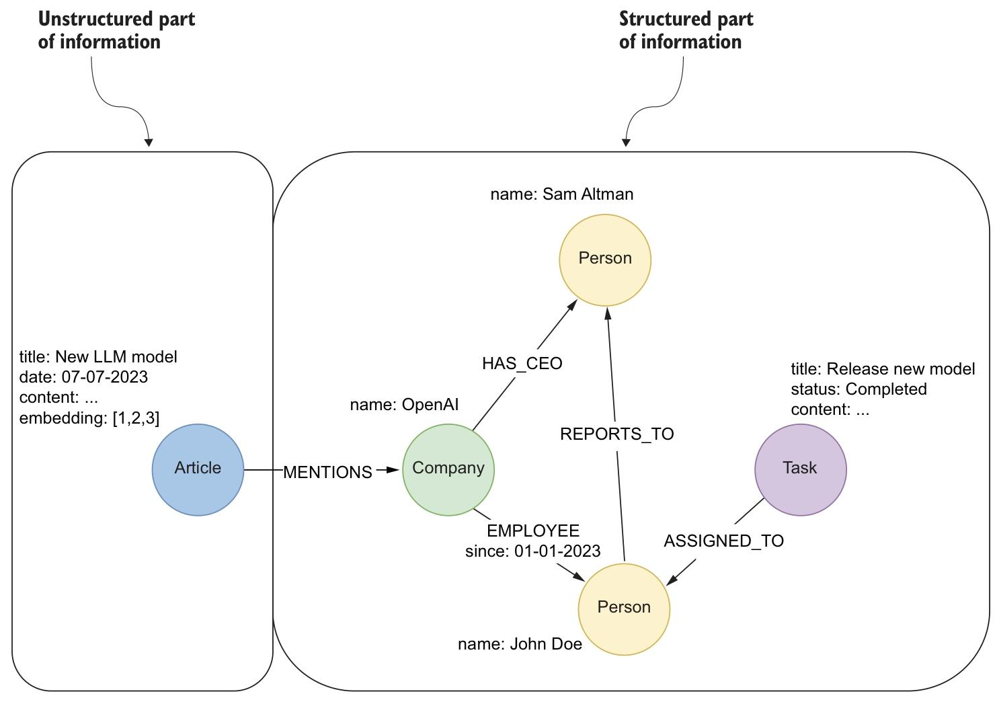

_图 1.14 知识图谱能够在同一数据库系统中统一存储复杂的结构化与非结构化数据_

知识图谱具有很强的表达能力，既能存储结构化信息，例如员工信息、任务状态和组织层级，也能存储文章文本等非结构化内容。如图 1.14 所示，这种双重特性使其非常适合构建复杂的 RAG 应用。结构化数据能够支持高精度查询，例如“有多少任务被分配给某位员工？”或“哪些员工向某位经理汇报？”。在图 1.14 中，诸如“山姆·奥特曼是 OpenAI 的首席执行官”或“John Doe 自 2023 年 1 月 1 日起为 OpenAI 员工”这类信息，都可以直接用于回答“OpenAI 的首席执行官是谁？”或“John Doe 入职多久了？”等问题。类似地，“John Doe 被分配到一项已完成任务”这样的结构化关系，也可以支撑“哪些任务已经由员工完成？”或“OpenAI 中谁被分配了某项任务？”这类精准查询。

另一方面，非结构化数据，例如文章正文，则能为系统提供更丰富的上下文与细节。例如，图 1.14 中的文章节点可能包含某个新型大语言模型及嵌入技术的详细描述，但由于缺乏结构化表达，它本身并不适合回答“这篇文章与 OpenAI 的员工有什么关联？”这类依赖明确关系的问题。

这说明，仅依赖非结构化数据无法覆盖全部问题类型。非结构化文本虽然适合支撑开放式或模糊问题，但并不擅长处理过滤、计数、排序或聚合等精确操作。例如，要回答“一家公司里一共有多少项任务已经完成？”或“哪些员工被分配到了与 OpenAI 相关的任务？”这类问题，就必须依赖结构化关系和属性。如果缺少这些结构，系统只能通过复杂的文本解析和推理来勉强逼近答案，不仅成本高，而且准确性通常有限。

知识图谱的价值就在于，它能够在同一框架下统一组织结构化与非结构化信息，让两类数据彼此补充、无缝协同。因此，它非常适合在 RAG 应用中承担底层知识载体的角色。更进一步，非结构化数据与结构化数据之间的显式关联，还能够支持更高级的检索策略，例如将文本中提到的实体映射到图节点，或利用源文本为结构化结果补充上下文。这些能力，往往是单独依赖某一种数据形态难以实现的。

## 5. 章节总结

- 像 ChatGPT 这样的大语言模型建立在 Transformer 架构之上，能够通过学习海量文本中的模式高效处理和生成语言。
- 尽管大语言模型在自然语言理解与生成方面表现突出，但仍存在知识截止、信息过时、幻觉以及无法访问私有或领域专属知识等局限。
- 由于成本高、更新复杂，依赖持续监督微调来不断补充模型内部知识并不是现实方案。
- RAG 通过把大语言模型与外部知识库结合起来，将相关事实直接注入提示上下文，从而提升回答的准确性与上下文相关性。
- 传统 RAG 往往主要依赖非结构化数据，这限制了其在需要结构化、精确且关系明确的信息场景中的效果。
- 知识图谱通过节点与关系统一表达实体、概念及其联系，能够同时承载结构化和非结构化数据。
- 将知识图谱引入 RAG 工作流，可以增强系统组织与检索上下文相关信息的能力，使生成结果更准确、更可靠，也更具可解释性。
