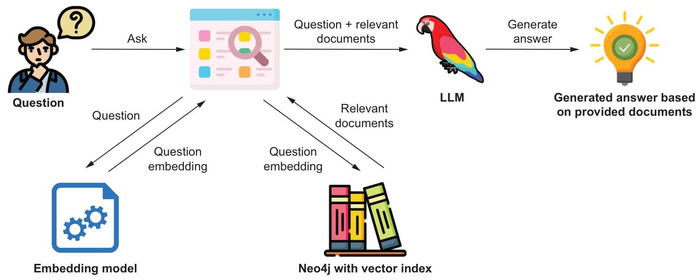
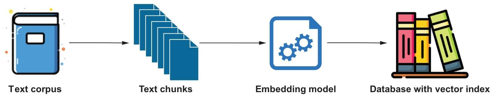
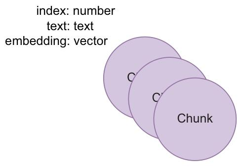

要实现一个基于向量相似度搜索的RAG应用，需要准备几个组件。我们将在本章逐一介绍这些组件。本章的目标是实现基于向量相似度搜索的RAG应用，以及如何利用检索器找到的信息生成回复。图2.1展示了完成后的RAG应用的数据流。



_Figure 2.1 The data flow for this RAG application using vector similarity search_

---

### 1. 应用数据设置

从前面的章节中我们了解到，需要对数据进行一些处理，才能将其放入嵌入模型的向量空间中，从而在运行时执行向量相似度搜索。所需的部分如下：

- 文本语料库
- 文本分块函数
- 嵌入模型
- 具备向量相似性搜索功能的数据库

我们将逐一讲解这些部分，并说明它们如何为应用程序数据设置中起到作用。

数据将被作为文本块存储在数据库中，向量索引则会填充文本块的嵌入向量。后续在运行时，当用户提出问题，该问题会使用与文本块相同的嵌入模型生成嵌入向量，随后借助向量索引查找相似的文本块。图2.2展示了应用数据设置的数据流。



_Figure 2.2 The pieces in the pipeline for the application data setup_

---

### 2. 文本语料库

本示例中我们将使用的文本是一篇题为《爱因斯坦的专利与发明》（乔杜里，2017）的论文。尽管大语言模型对阿尔伯特·爱因斯坦了如指掌，但我们通过提出非常具体的问题，并将从论文中得到的答案与从大语言模型中得到的答案进行对比，以此展示检索增强生成（RAG）的工作原理。

---

### 3. 文本分块

当大语言模型拥有足够大的上下文窗口时，我们可以将整篇论文作为一个单独的文本块。但为了获得更好的效果，我们会将论文拆分成更小的文本块，以每数百个字符作为一个文本块。能产生最佳效果的文本块大小需根据具体情况而定，因此务必尝试不同的文本块尺寸。

在这种情况下，我们也希望分块之间存在一定重叠。这是因为我们需要能够找到跨多个分块的答案。因此，我们将使用一个大小为500个字符、重叠部分为40个字符的滑动窗口。这会使索引稍大一些，但也会让检索器的准确性更高。

为了让嵌入模型更好地对每个文本块的语义进行分类，我们将仅在空格处进行切分，这样每个文本块的开头和结尾就不会出现不完整的单词。该函数接收一段文本、块大小（字符数）、重叠长度（字符数），以及一个可选参数（指定是按任意字符切分还是仅按空格切分），并返回文本块列表。

```
def chunk_text(text, chunk_size, overlap, split_on_whitespace_only=True):
    """
    文本分块函数：保证不拆分单个单词，仅在空格处分割
    :param text: 原始长文本
    :param chunk_size: 分块目标长度
    :param overlap: 分块重叠长度
    :param split_on_whitespace_only: 是否仅按空白符分割（保证单词完整）
    :return: 分块后的文本列表
    """
    chunks = []
    index = 0

    while index < len(text):
        if split_on_whitespace_only:
            # 向左查找重叠区域内的最后一个空格
            prev_whitespace = 0
            left_index = index - overlap
            while left_index >= 0:
                if text[left_index] == " ":
                    prev_whitespace = left_index
                left_index -= 1

            # 向右查找目标位置后的下一个空格
            next_whitespace = text.find(" ", index + chunk_size)
            if next_whitespace == -1:
                next_whitespace = len(text)

            # 截取分块并清理首尾空格
            chunk = text[prev_whitespace:next_whitespace].strip()
            chunks.append(chunk)
            index = next_whitespace + 1
        else:
            # 非仅空格分割模式
            start = max(0, index - overlap + 1)
            end = min(index + chunk_size + overlap, len(text))
            chunk = text[start:end].strip()
            chunks.append(chunk)
            index += chunk_size
            break

    return chunks


# 调用示例：500字符分块，40字符重叠
chunks = chunk_text(text, 500, 40)
print(len(chunks))  # 输出总块数，示例：89 chunks in total
```

---

### 4. 嵌入模型

在选择嵌入模型时，重要的是要考虑你想要匹配的数据类型。在本例中，我们需要匹配文本，因此将使用文本嵌入模型。在本书中，我们会使用来自 OpenAI 的嵌入模型和大语言模型（LLMs），但市面上还有许多其他替代方案。Hugging Face 的 Sentence Transformers 中的 all-MiniLM-L12-v2（https://mng.bz/nZZ2）是 OpenAI 嵌入模型的绝佳替代方案，它使用起来非常简单，还能在本地中央处理器（CPU）上运行。

确定嵌入模型后，我们需要确保在整个RAG应用中都使用同一模型。这是因为向量索引填充的是来自该嵌入模型的向量，因此如果更换嵌入模型，就需要重新填充向量索引。若要使用OpenAI的嵌入模型对文本分块进行嵌入，我们可以使用以下代码。

```
# 定义文本块嵌入函数
def embed(texts):
    # 调用 OpenAI 嵌入模型生成向量
    response = open_ai_client.embeddings.create(
        input=texts,
        model="text-embedding-3-small"
    )
    # 提取并返回所有向量
    return list(map(lambda n: n.embedding, response.data))

# 对文本块进行嵌入，得到向量列表
embeddings = embed(chunks)

# 打印向量列表长度（与文本块数量一致）
print(len(embeddings))  # 89, matching the number of chunks

# 打印单个向量的维度
print(len(embeddings[0]))  # 1536 dimensions
```

---

### 5. 带向量相似性搜索功能的数据库

现在我们已经获取了嵌入向量，需要将它们存储起来，以便后续进行相似性搜索。在本书中，我们将使用 Neo4j 作为数据库，因为它内置了向量索引且使用便捷；在本书后续内容中，我们还会利用 Neo4j 的图功能。

_Figure 2.3 The data model_

_图2.3 将用于演示如何通过向量相似性搜索实现RAG应用程序的简化数据模型。_

首先，我们来创建一个向量索引。需要记住的一点是，创建向量索引时，我们需要定义向量的维度数量。如果未来某个时候你更换了嵌入模型，而该模型输出的维度数量不同，你就需要重新创建向量索引。

正如我们在代码清单2.2中看到的，我们使用的嵌入模型输出的是1536维向量，因此在创建向量索引时，我们会将其用作维度数量。

```
driver.execute_query("""CREATE VECTOR INDEX pdf IF NOT EXISTS FOR (c:Chunk) ON c.embedding""")
```

我们将把向量索引命名为 pdf，它将用于通过余弦相似度搜索函数，根据 embedding 属性对 Chunk 类型的节点建立索引。

现在我们已经有了向量索引，就可以向其中填充嵌入向量了。我们将使用 Cypher 来完成这一操作，具体步骤是先为每个文本块创建一个节点，然后通过 Cypher 循环为该节点设置文本和嵌入向量属性。我们还会在每个:Chunk节点上存储一个索引，以便后续能够轻松找到对应的文本块。

```
cypher_query = '''
WITH $chunks as chunks, range(0, size($chunks)) AS index UNWIND index AS i
WITH i, chunks[i] AS chunk, $embeddings[i] AS embedding
MERGE (c:Chunk {index: i}) SET c.text = chunk, c.embedding = embedding
'''
driver.execute_query(cypher_query, chunks=chunks, embeddings=embeddings)
```

要查看数据库中的内容，我们可以运行这条 Cypher 查询来获取索引为 0 的 :Chunk 节点。

```
records, _, _ = driver.execute_query("MATCH (c:Chunk) WHERE c.index = 0 RETURN c.embedding, c.text")
print(records[0]["c.text"][0:30])
print(records[0]["c.embedding"][0:3])
```

---

### 6. 执行向量搜索

现在我们已经将嵌入向量填充到向量索引中，就可以执行向量相似性搜索了。首先，我们需要对想要解答的问题进行embedding。我们将使用与处理文本块时相同的嵌入模型，同时也会沿用处理文本块嵌入时的相同函数。

```
question = "At what time was Einstein really interested in experimental works?"
question_embedding = embed([question])[0]
```

已经将问题进行了 embedding，就可以使用 Cypher 执行向量相似度搜索了。

```
# Neo4j 向量检索查询（GraphRAG 核心检索逻辑）
query = '''
CALL db.index.vector.queryNodes('pdf', 2, $question_embedding)
YIELD node AS hits, score
RETURN hits.text AS text, score, hits.index AS index
'''

# 执行查询，获取相似文本块
similar_records, _, _ = driver.execute_query(
    query,
    question_embedding=question_embedding
)
```

该查询会返回相似度最高的两个文本块，我们可以打印结果来查看返回的内容。这段代码会打印出以下文本块及其相似度得分。

```
# 遍历所有相似记录并输出
for record in similar_records:
    print("======")       # 打印分隔线
    print(record["text"]) # 打印文本内容
    print(record["score"], record["index"]) # 打印相似度分数与索引

upbringing, his interest in inventions and patents was not unusual.
Being a manufacturer’s son, Einstein grew upon in an environment of  machines and instruments.
When his father’s company obtained the contract to illuminate Munich city during beer festival, he
was actively engaged in execution of the contract. In his ETH days
➥ Einstein was genuinely interested in experimental works. He wrote to his friend, “most of the time I worked
➥ in the physical laboratory,
fascinated by the direct contact with observation.” Einstein's
0.8185358047485352 42
======
instruments. However, it must also be
emphasized that his main occupation was theoretical physics. The inventions he worked upon were
his diversions. In his unproductive times he used to work upon on solving
mathematical problems (not
related to his ongoing theoretical investigations) or took upon some practical problem. As shown in
Table. 2, Einstein was involved in three major inventions; refrigeration system with Leo Szilard,
Sound reproduction system with Rudolf Goldschmidt and automatic camera
0.7906564474105835 44
======
```

从打印结果中，我们可以看到匹配的片段、它们的相似度分数以及索引。下一步是利用这些片段通过大语言模型（LLM）生成答案。

---

### 7. 使用大语言模型生成答案

在与大语言模型（LLM）交互时，我们可以传入所谓的“系统消息”，在其中为大语言模型指定需要遵循的指令。我们还会传入“用户消息”，该消息包含原始问题，在我们的场景中还包含该问题的答案。

在用户消息中，我们传入希望大语言模型（LLM）用于生成回答的文本块。具体做法是传入我们在2.8清单的相似性搜索中找到的相似文本块的text属性。

```
system_message = "You're an Einstein expert, but can only use the provided
documents to respond to the questions."
user_message = f""" Use the following documents to answer the question that will follow: {[doc["text"] for doc in similar_records]}
The question to answer using information only from the above documents:
{question}
"""
```

现在我们使用大语言模型来生成答案。

```
print("Question:", question)
stream = open_ai_client.chat.completions.create( model="gpt-4",
messages=[
{"role": "system", "content": system_message},
], {"role": "user", "content": user_message}
stream=True,
)
for chunk in stream: print(chunk.choices[0].delta.content or "", end="")
```

这会在大语言模型生成结果时流式输出结果，我们可以看到生成过程中的结果。

```

Question: At what time was Einstein really interested in experimental works?
During his ETH days, Einstein was genuinely interested in experimental works.
```

哇，你看！大语言模型能够根据检索器找到的信息生成答案。

---
