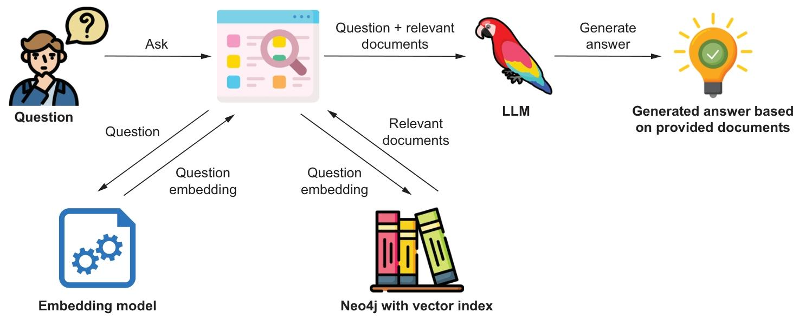
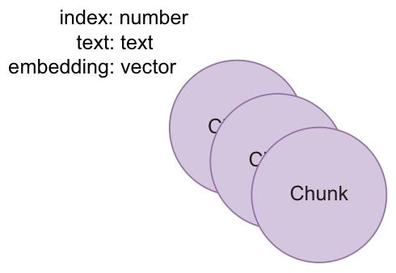

## 0. 章节简介

构建知识图谱往往是一个循序渐进、持续迭代的过程。很多时候，工作会从大量非结构化数据开始，随后再逐步为这些数据补充结构化表示。当你已经积累了相当规模的非结构化内容，并希望基于这些内容回答问题时，通常就会面临这样的起点。

本章将聚焦如何基于非结构化数据，利用 RAG 技术构建问答系统。你将学习如何通过向量相似性搜索与混合搜索定位相关信息，以及如何利用这些信息生成最终答案。在后续章节中，我们还会进一步讨论：当数据已经具备一定结构化特征时，可以采用哪些方法来优化检索器与生成器，从而获得更好的效果。

在数据科学和机器学习领域，嵌入模型与向量相似性搜索是处理复杂数据的重要工具。本章将介绍如何利用这些技术，把文本、图像等复杂数据转换为统一的嵌入向量（embedding）表示。

本章将系统介绍嵌入模型与向量相似性搜索的基础概念，说明它们为何重要、应如何使用，以及它们在 RAG 应用中能够解决哪些问题。若你希望跟随本章完成实操，需要准备一个正在运行且内容为空的 Neo4j 实例。该实例既可以是本地部署的，也可以是云端托管的，只需确保数据库为空即可。你也可以直接参考配套的 Jupyter Notebook 完成全部步骤，地址为：https://github.com/tomasonjo/kg-rag/blob/main/notebooks/ch02.ipynb。

---

## 1. RAG 应用的组件

一个 RAG 应用通常包含两个核心组件：检索器和生成器。检索器负责查找相关信息，生成器则基于这些信息生成回答。检索器常常依赖向量相似性搜索来定位相关内容，后文会对这一过程展开说明。下面我们先分别来看这两个组件。

### 1.1. 检索器

检索器是 RAG 应用的第一部分。它的职责是找到与用户问题最相关的信息，并将这些信息交给生成器。RAG 并不要求检索器必须采用某一种固定实现方式，但最常见、也最实用的方法之一，就是向量相似性搜索。要让检索器基于这种方法高效工作，我们需要先准备好一整套配套的数据处理流程。

- **向量索引（VECTOR INDEX）**

虽然向量索引并不是执行向量相似性搜索的绝对前提，但在实践中几乎总是值得使用。向量索引本质上是一种专门为“快速查找相似向量”设计的数据结构。借助向量索引，系统通常执行的是**近似最近邻搜索（Approximate Nearest Neighbor Search）**，而不是精确最近邻搜索。换句话说，它返回的结果不一定是数学意义上的最优近邻，但通常已经足够接近。这样做的本质，是用少量精度换取大幅度的性能提升。与暴力搜索相比，向量索引通常要快得多，只是精度会略有折损。

- **向量相似性搜索函数（VECTOR SIMILARITY SEARCH FUNCTION）**

向量相似性搜索函数的输入是一个向量，输出则是一组与之相似的向量。这个函数既可以借助向量索引来完成高效检索，也可以通过暴力方式逐一比较。无论底层采用哪种实现，其核心目的都一致：返回与查询向量语义上最接近的一组候选结果。

两种最常见的相似性度量方式是**余弦相似度（cosine similarity）**和**欧氏距离（Euclidean distance）**。在本书关注的大多数文本场景中，余弦相似度通常更实用。它衡量的是两个向量之间夹角的接近程度；在文本嵌入任务里，这种“夹角接近”通常可以理解为“语义更接近”。余弦相似度函数接收两个向量作为输入，并返回一个介于 0 到 1 之间的分数，其中 0 表示几乎完全不相似，1 表示高度相似。对于文本问答和聊天机器人场景而言，这一指标通常是更自然的选择，因此本书也将主要使用它。

- **嵌入模型（EMBEDDING MODEL）**

文本经过语义编码后得到的结果，就是 embedding。任何希望通过向量相似性搜索进行匹配的文本，都必须先被转换为 embedding，而这一过程由嵌入模型完成。需要特别注意的是：在同一个 RAG 应用中，嵌入模型应尽量保持一致。如果更换了嵌入模型，就意味着原有向量索引中的向量分布发生了变化，因此通常需要重新生成并写入所有嵌入。

embedding 本质上是一串数字构成的向量，这个向量的长度被称为嵌入维度。维度非常重要，因为它决定了向量可以承载的信息容量。维度越高，通常意味着表达能力越强，但与此同时，无论是生成 embedding 还是执行相似性搜索，所需的计算开销也会随之上升。

可以把 embedding 理解为一种把复杂数据映射到数字空间中的方式。它将原本难以直接计算的文本、图像或其他复杂对象，转化为计算机更容易处理的数值表示。

嵌入模型为不同类型的数据提供了一种统一表示方式。它的输入可以是任意复杂数据，输出则是固定格式的向量。例如，在文本场景下，嵌入模型会把单词、句子或段落转换为由数字组成的向量，而这些数字被训练用来尽可能保留原始文本的核心语义和上下文特征。

- **文本分块（TEXT CHUNKING）**

文本分块是指把长文本切分为更小片段的过程。这样做的目的，是提升检索器找到相关内容的概率。较小的文本块通常语义更集中、主题更明确，因此在生成 embedding 后，更容易与用户问题形成高质量匹配。

文本分块非常关键，但也并不容易设计好。你需要考虑文本应该如何切分：按句子、按段落、按语义边界，还是采用其他方式？应该使用固定长度，还是滑动窗口？块大小又应该如何设定？

这些问题并不存在放之四海而皆准的标准答案，最终选择取决于具体场景、数据特征和业务需求。真正重要的是，你需要意识到这些决策会直接影响检索效果，并通过实验找到适合自己场景的方案。

- **检索器管道（RETRIEVER PIPELINE）**

当这些组成部分都准备好之后，检索器管道本身其实很直接：它接收用户查询，先用嵌入模型将查询转换为向量，再利用向量相似性搜索函数找到最接近的文本块。在最朴素的实现中，检索器只需把这些命中的原始文本块直接传给生成器即可。但在大多数真实场景里，检索器通常还需要进行额外的后处理，以筛选出最适合作为上下文输入给大语言模型的内容。下一章中，我们会继续讨论更高级的检索策略。

### 1.2. 生成器

生成器是 RAG 应用的第二个核心组件。它负责基于检索器提供的信息生成最终回答。生成器通常就是一个大语言模型（LLM）。相较于依赖微调或完全依赖模型内部知识的方案，RAG 的一个重要优势在于：生成器未必需要做得非常大。这是因为相关知识已经由检索器补充进来，生成器不需要“记住所有事实”，而只需要学会如何利用给定材料组织出合理、自然且正确的回答。

换句话说，在 RAG 中，我们更看重语言模型的“表达能力”，而不是它的“记忆容量”。这意味着我们可以在很多场景下使用更小、更快、成本更低的模型。同时，由于回答建立在检索到的上下文之上，模型凭空编造内容、产生幻觉的概率也会明显下降。

---

## 2. 基于向量相似性搜索的检索增强生成

要实现一个基于向量相似性搜索的 RAG 应用，需要提前准备若干关键组件。本章会依次介绍这些组成部分，并最终实现一套能够基于向量检索结果生成回答的 RAG 流程。图 2.1 展示了整个应用完成后的数据流。



_图 2.1 基于向量相似性搜索的 RAG 应用数据流_

### 2.1. 应用数据设置

从前文可知，要让数据能够进入 embedding 模型的向量空间，并在运行时参与向量相似性搜索，必须先完成一系列预处理工作。所需组件包括：

- 文本语料库
- 文本分块函数
- Embedding模型
- 具备向量相似性搜索功能的数据库

接下来，我们会逐一介绍这些组成部分，并说明它们在整个应用数据准备阶段各自扮演的角色。

处理后的数据会以文本块的形式存储在数据库中，而向量索引则保存这些文本块对应的嵌入向量。之后，在运行时，当用户提出问题，系统会用与文本块相同的嵌入模型为问题生成向量，再借助向量索引找出最相似的文本块。图 2.2 展示了这一阶段的数据流。


_图 2.2 应用数据准备阶段的处理链路_

### 2.2. 文本语料库

本示例将使用一篇题为《爱因斯坦的专利与发明》（乔杜里，2017）的论文作为文本语料。虽然大语言模型对阿尔伯特·爱因斯坦这一主题通常已经掌握大量通用知识，但我们会通过提出非常具体的问题，并将“仅靠模型作答”的结果与“基于论文检索后作答”的结果进行对比，以展示 RAG 的实际价值。

### 2.3. 文本分块

如果大语言模型拥有足够大的上下文窗口，理论上可以把整篇论文作为一个单独文本块直接输入。但为了获得更好的检索效果，我们通常会将论文拆分成更小的文本块，例如每块数百个字符。最佳块大小并不存在统一答案，实际效果高度依赖具体任务，因此非常有必要尝试不同的分块尺寸。

在这个例子中，我们还希望相邻文本块之间保留一定重叠。这是因为答案有时可能跨越多个相邻片段。如果完全无重叠，检索器就可能错过关键信息。因此，我们采用一个大小为 500 个字符、重叠 40 个字符的滑动窗口。这样做虽然会让索引略大一些，但通常能提升检索准确率。

为了让嵌入模型更稳定地捕捉每个文本块的语义，我们只在空格处进行切分，避免块首或块尾出现被截断的单词。下面这个函数接收原始文本、块大小、重叠长度，以及一个可选参数（用于指定是否只按空白符切分），最终返回文本块列表。

```
def chunk_text(text, chunk_size, overlap, split_on_whitespace_only=True):
    """
    文本分块函数：保证不拆分单个单词，仅在空格处分割
    :param text: 原始长文本
    :param chunk_size: 分块目标长度
    :param overlap: 分块重叠长度
    :param split_on_whitespace_only: 是否仅按空白符分割（保证单词完整）
    :return: 分块后的文本列表
    """
    chunks = []
    index = 0

    while index < len(text):
        if split_on_whitespace_only:
            # 向左查找重叠区域内的最后一个空格
            prev_whitespace = 0
            left_index = index - overlap
            while left_index >= 0:
                if text[left_index] == " ":
                    prev_whitespace = left_index
                left_index -= 1

            # 向右查找目标位置后的下一个空格
            next_whitespace = text.find(" ", index + chunk_size)
            if next_whitespace == -1:
                next_whitespace = len(text)

            # 截取分块并清理首尾空格
            chunk = text[prev_whitespace:next_whitespace].strip()
            chunks.append(chunk)
            index = next_whitespace + 1
        else:
            # 非仅空格分割模式
            start = max(0, index - overlap + 1)
            end = min(index + chunk_size + overlap, len(text))
            chunk = text[start:end].strip()
            chunks.append(chunk)
            index += chunk_size
            break

    return chunks


# 调用示例：500字符分块，40字符重叠
chunks = chunk_text(text, 500, 40)
print(len(chunks))  # 输出总块数，示例：89 chunks in total
```

### 2.4. Embedding 模型

选择嵌入模型时，最重要的考虑因素之一，是你希望匹配的数据类型。在本例中，我们处理的是文本，因此会采用文本嵌入模型。本书将使用 OpenAI 提供的嵌入模型与大语言模型，但市场上也存在许多可替代方案。例如，Hugging Face Sentence Transformers 中的 all-MiniLM-L12-v2（https://mng.bz/nZZ2）就是 OpenAI 嵌入模型的一个优秀替代品，它易于使用，并且能够直接在本地 CPU 上运行。

在确定嵌入模型之后，务必在整个 RAG 应用中保持一致使用。原因很简单：向量索引中存储的是该模型生成的向量，如果中途更换模型，就意味着向量空间发生变化，原有索引通常需要重建。下面的示例展示了如何使用 OpenAI 的嵌入模型为文本块生成 embedding。

```
# 定义文本块嵌入函数
def embed(texts):
    # 调用 OpenAI 嵌入模型生成向量
    response = open_ai_client.embeddings.create(
        input=texts,
        model="text-embedding-3-small"
    )
    # 提取并返回所有向量
    return list(map(lambda n: n.embedding, response.data))

# 对文本块进行嵌入，得到向量列表
embeddings = embed(chunks)

# 打印向量列表长度（与文本块数量一致）
print(len(embeddings))  # 89, matching the number of chunks

# 打印单个向量的维度
print(len(embeddings[0]))  # 1536 dimensions
```

### 2.5. 带向量相似性搜索功能的数据库

现在，我们已经拿到了文本块对应的嵌入向量，下一步就是把它们存储起来，以便后续执行相似性搜索。在本书中，我们选择 Neo4j 作为数据库，因为它不仅内置了向量索引，而且使用起来相对直接；此外，后续章节还会进一步利用 Neo4j 的图数据库能力。

_图 2.3 数据模型_

_图 2.3 展示了一个简化的数据模型，用于说明如何借助向量相似性搜索构建 RAG 应用。_

首先，我们创建一个向量索引。这里有一点非常重要：创建向量索引时，需要显式指定向量维度。如果未来更换了嵌入模型，而新模型输出的维度数不同，就必须重新创建索引。

正如前面的代码所示，我们当前使用的嵌入模型输出 1536 维向量，因此索引也要按照这一维度进行定义。

```
driver.execute_query("""CREATE VECTOR INDEX pdf IF NOT EXISTS FOR (c:Chunk) ON c.embedding""")
```

这里我们把向量索引命名为 pdf，并让它基于 Chunk 节点的 embedding 属性执行余弦相似性搜索。

有了向量索引之后，就可以开始向数据库写入文本块及其 embedding。我们会使用 Cypher 完成这一操作：先为每个文本块创建节点，再为节点设置文本内容和嵌入向量属性。与此同时，我们还会给每个 :Chunk 节点保存一个索引值，方便后续定位和调试。

```
cypher_query = '''
WITH $chunks as chunks, range(0, size($chunks)) AS index UNWIND index AS i
WITH i, chunks[i] AS chunk, $embeddings[i] AS embedding
MERGE (c:Chunk {index: i}) SET c.text = chunk, c.embedding = embedding
'''
driver.execute_query(cypher_query, chunks=chunks, embeddings=embeddings)
```

如果你想查看数据库中写入的内容，可以运行下面这条 Cypher 查询，取出索引为 0 的 :Chunk 节点。

```
records, _, _ = driver.execute_query("MATCH (c:Chunk) WHERE c.index = 0 RETURN c.embedding, c.text")
print(records[0]["c.text"][0:30])
print(records[0]["c.embedding"][0:3])
```

### 2.6. 执行向量搜索

既然嵌入向量已经写入索引，我们就可以开始执行向量相似性搜索。第一步是把用户问题也转换为 embedding。这里必须使用与文本块相同的嵌入模型，通常也会直接复用前面生成文本块 embedding 的同一个函数。

```
question = "At what time was Einstein really interested in experimental works?"
question_embedding = embed([question])[0]
```

完成问题 embedding 之后，就可以使用 Cypher 执行向量相似性搜索了。

```
# Neo4j 向量检索查询（GraphRAG 核心检索逻辑）
query = '''
CALL db.index.vector.queryNodes('pdf', 2, $question_embedding)
YIELD node AS hits, score
RETURN hits.text AS text, score, hits.index AS index
'''

# 执行查询，获取相似文本块
similar_records, _, _ = driver.execute_query(
    query,
    question_embedding=question_embedding
)
```

这条查询会返回相似度最高的两个文本块。我们可以打印结果，查看具体命中的文本内容及其相似度得分。

```
# 遍历所有相似记录并输出
for record in similar_records:
    print("======")       # 打印分隔线
    print(record["text"]) # 打印文本内容
    print(record["score"], record["index"]) # 打印相似度分数与索引

upbringing, his interest in inventions and patents was not unusual.
Being a manufacturer’s son, Einstein grew upon in an environment of  machines and instruments.
When his father’s company obtained the contract to illuminate Munich city during beer festival, he
was actively engaged in execution of the contract. In his ETH days
➥ Einstein was genuinely interested in experimental works. He wrote to his friend, “most of the time I worked
➥ in the physical laboratory,
fascinated by the direct contact with observation.” Einstein's
0.8185358047485352 42
======
instruments. However, it must also be
emphasized that his main occupation was theoretical physics. The inventions he worked upon were
his diversions. In his unproductive times he used to work upon on solving
mathematical problems (not
related to his ongoing theoretical investigations) or took upon some practical problem. As shown in
Table. 2, Einstein was involved in three major inventions; refrigeration system with Leo Szilard,
Sound reproduction system with Rudolf Goldschmidt and automatic camera
0.7906564474105835 44
======
```

从输出结果中，我们可以看到命中的文本片段、相似度分数以及对应索引。下一步，就是把这些检索结果交给大语言模型，用它们来生成最终答案。

### 2.7. 使用大语言模型生成答案

在与大语言模型交互时，我们通常会传入一条“系统消息”，用于明确模型必须遵循的行为约束；同时还会传入一条“用户消息”，其中包含原始问题，以及在本例中用于回答该问题的检索内容。

在用户消息里，我们会把检索器找出的文本块一并传给模型，让它只能根据这些材料生成回答。具体来说，我们会把相似性搜索结果中的 text 属性作为上下文输入给模型。

```
system_message = "You're an Einstein expert, but can only use the provided
documents to respond to the questions."
user_message = f""" Use the following documents to answer the question that will follow: {[doc["text"] for doc in similar_records]}
The question to answer using information only from the above documents:
{question}
"""
```

接下来，就可以调用大语言模型生成答案。

```
print("Question:", question)
stream = open_ai_client.chat.completions.create( model="gpt-4",
messages=[
{"role": "system", "content": system_message},
], {"role": "user", "content": user_message}
stream=True,
)
for chunk in stream: print(chunk.choices[0].delta.content or "", end="")
```

这段代码会以流式方式输出模型生成的内容，因此你可以实时看到回答逐步生成的过程。

```

Question: At what time was Einstein really interested in experimental works?
During his ETH days, Einstein was genuinely interested in experimental works.
```

这说明，大语言模型已经能够基于检索器提供的信息生成与上下文一致的答案。

---

## 3. 为 RAG 应用添加全文搜索以实现混合搜索

上一节中，我们已经实现了一个基于向量相似性搜索的 RAG 应用。虽然纯向量检索已经比传统全文检索更进一步，也确实能解决很多问题，但在真实生产环境中，它往往仍不足以提供足够稳定的质量、准确性与性能。

因此，本节将进一步讨论如何改进检索器表现。具体来说，我们会为 RAG 应用补充全文检索能力，从而构建混合检索方案。

### 3.1. 全文检索索引

全文检索是一种历史悠久的数据库文本检索方式。它依赖关键词匹配，而不是在向量空间中比较语义相似度。也就是说，在全文检索中，要想成功匹配到结果，查询词通常必须与数据中的某个词项直接对应。

为了实现混合搜索，我们需要先在数据库中创建全文索引。大多数数据库都提供某种形式的全文检索能力，本书中我们将使用 Neo4j 的全文索引。

```
driver.execute_query("CREATE FULLTEXT INDEX PdfChunkFulltext FOR (c:Chunk)
ON EACH [c.text]")
```

这里，我们在 :Chunk 节点的 text 属性上创建了一个名为 PdfChunkFulltext 的全文索引。

---

### 3.2. 执行混合搜索

混合搜索的基本思路是：先分别执行向量相似性搜索和全文搜索，再将两路结果合并。为了让两种搜索返回的分数具备可比性，我们需要先做归一化处理，也就是把每一路搜索中的得分除以该路结果中的最高分。

```
hybrid_query = '''
CALL {
	// vector index
	CALL db.index.vector.queryNodes('pdf', $k, $question_embedding) YIELD node, score
	WITH collect({node:node, score:score}) AS nodes, max(score) AS max UNWIND nodes AS n
	// Normalize scores
	RETURN n.node AS node, (n.score / max) AS score
	UNION
	// keyword index
	CALL db.index.fulltext.queryNodes('ftPdfChunk', $question, {limit: $k}) YIELD node, score
	WITH collect({node:node, score:score}) AS nodes, max(score) AS max
	UNWIND nodes AS n
	// Normalize scores
	RETURN n.node AS node, (n.score / max) AS score
}
// deduplicate nodes
WITH node, max(score) AS score ORDER BY score DESC LIMIT $k
RETURN node, score
'''
```

这里我们通过一条联合 Cypher 查询，先执行向量相似性搜索，再执行全文搜索，最后对结果去重并返回前 k 个候选项。

```
similar_hybrid_records, _, _ = driver.execute_query(hybrid_query, question_embedding=question_embedding, question=question, k=4)
for record in similar_hybrid_records:
    print(record["node"]["text"])
    print(record["score"], record["node"]["index"])
    print("======")
```

得到的答案：

```
CH-Switzerland Considering Einstein’s upbringing, his interest in inventions and patents
was not unusual.
Being a manufacturer’s son, Einstein grew upon in an environment of
machines and instruments.
When his father’s company obtained the contract to illuminate Munich city
➥ during beer festival, he
was actively engaged in execution of the contract. In his ETH days
in experimental works. He wrote to his friend, “most of the time I worked Einstein was genuinely interested
fascinated by the direct contact with observation.” Einstein's 1.0 42 in the physical laboratory,
======
Einstein
left his job at the Patent office and joined the University of Zurich on October 15, 1909. Thereafter, he
continued to rise in ladder. In 1911, he moved to Prague University as a
was appointed as full professor at ETH, Zurich, his alma-mater. In 1914, full professor, a year later, he
he was appointed Director of
the Kaiser Wilhelm Institute for Physics (1914–1932) and a professor at
➥ the Humboldt University of
Berlin, with a special clause in his contract that freed him from
he was working for teaching obligations. In the meantime,
0.9835733295862473 31
======
```

从结果可以看出，由于经过了归一化处理，排名第一的结果得分为 1.0。这意味着它与对应搜索路径中的最佳命中保持一致。与此同时，第二条结果与纯向量搜索有所不同，说明全文搜索补充找到了一个比向量搜索更契合当前问题的候选项。

---

## 4. 章节总结

本章介绍了向量相似性搜索的基本概念、核心组成，以及它在 RAG 应用中的作用。随后，我们又加入了全文搜索能力，用于进一步提升检索器表现。

将向量相似性搜索与全文搜索结合起来，通常会比只使用其中一种方法获得更好的结果。然而，即便如此，这种方案本质上仍然是在非结构化数据中做检索，因此在质量、准确性和性能方面依旧存在明显上限。文本中的关键引用未必能够被完整捕捉，而返回的上下文也未必足以让大语言模型真正理解问题所需的语义背景，进而影响答案质量。

下一章中，我们将继续讨论如何进一步改进检索器，以获得更好的结果。

- RAG 应用由检索器和生成器组成。检索器负责定位相关信息，生成器负责基于这些信息生成回答。
- 文本嵌入能够在向量空间中保留文本语义，因此可以用于执行向量相似性搜索，查找内容相近的文本。
- 在 RAG 应用中加入全文检索后，可以形成混合搜索，从而提升检索器的整体表现。
- 向量相似性搜索与混合搜索在不少场景下都很有效，但随着数据复杂度提高，它们在质量、准确性和性能方面仍然存在明显限制。

---
