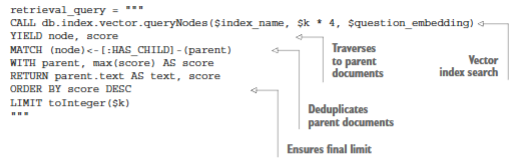
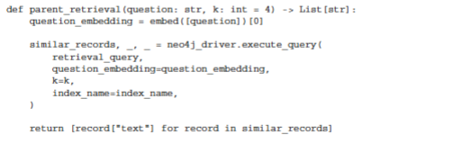
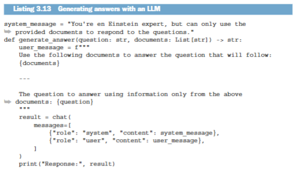
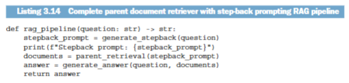
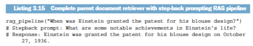

## 0. 章节简介

在第 2 章中，你已经学习了词嵌入与向量相似性搜索的基础知识。通过将文本转换为数值向量，我们能够让机器以更适合计算的方式处理语义信息。将词嵌入与向量相似性搜索结合起来，可以从海量文档中更高效、更准确地检索相关的非结构化文本，从而帮助 RAG 应用生成更准确、也更具时效性的答案。现在，假设你已经按照第 2 章的内容构建并部署了一套基础 RAG 系统，但在测试中发现，由于检索到的文档不够完整或相关性不足，最终答案的准确性仍然有限。于是，你需要进一步优化检索系统，以提升整体回答质量。

和任何技术一样，词嵌入与向量相似性搜索的基础实现也存在明显局限。最常见的问题，是检索精度与召回率不够理想。由于术语选择、表达方式或语境差异，用户问题生成的嵌入向量，并不总能与真正包含关键答案的文档向量高度对齐。这种偏差会导致与用户意图高度相关的文档被遗漏，因为查询向量没有准确捕捉用户真正想要的信息核心。

提升检索准确率与召回率的一种常见策略，是对用于检索文档的查询进行重写。查询重写的目的，是通过重新组织问题表达，使其在语言层面和语境层面更贴近目标文档，从而缩小用户问题与高价值信息之间的距离。经过优化的查询，更有可能命中真正相关的内容，进而提升对原始问题的回答质量。典型的查询重写方法包括假设性文档检索器（Gao 等，2022）以及后退提示法（Zheng 等，2023）。图 3.1 展示了后退提示法的整体流程。

图 3.1 展示了一个对用户查询进行转换、以优化文档检索结果的流程，这种技术被称为后退提示。在图示场景中，用户提出了一个关于埃斯特拉·利奥波德在某一特定时期教育经历的具体问题。随后，具备查询重写能力的 GPT-4 等模型会处理这个初始问题，并将其改写为一个关于其教育背景的更通用查询。这样做的目的，是在搜索阶段扩大检索覆盖面，因为更抽象、更通用的查询往往更容易与包含所需信息的多种文档建立匹配。

另一种提升检索效果的办法，是调整文档的嵌入策略。上一章中，我们直接对原始文本块进行嵌入，并在检索命中后将对应文本传递给大语言模型生成答案。但向量检索系统其实具有更强的灵活性。你并不一定只能对**原始文本本身**做嵌入，也可以对更能代表文档含义的内容进行嵌入，例如上下文更明确的段落、由模型生成的假设性问题，或经过改写的表达版本。这些替代表示有时更容易捕捉文档的核心主题，因此能够带来更准确、更相关的检索结果。图 3.2 展示了两种高级嵌入策略示例。

图 3.2 左侧展示的是假设性提问策略。采用这种“假设性问题嵌入”方法时，你需要先判断一篇文档能够回答哪些问题。例如，可以利用大语言模型自动生成一组假设性问题，也可以借助聊天机器人的历史对话，整理出文档可能回答的问题集合。其核心思想是：不直接嵌入原始文档，而是嵌入“这篇文档能够回答的问题”。例如在图 3.2 中，“利奥波德在加州大学学习了什么？”这个问题被编码为向量 [1,2,3,0,5]。当用户提出新问题时，系统会先生成查询向量，再在预先计算好的问题向量中寻找最接近的项，目标是找到那些与用户问题语义高度相似的假设性问题。随后，系统再回溯到真正包含答案的原始文档。归根结底，这种方法是在嵌入“文档可回答的问题空间”，而不是直接嵌入文档本身。

图 3.2 右侧展示的是父文档嵌入策略。在这种方法中，原始文档，也就是所谓的父文档，会先被切分为更小的子块，通常按照固定的 token 数量或字符数量完成切分。系统并不会对整个父文档只计算一次 embedding，而是为每个子块分别生成向量。例如，子块“利奥波德获得了植物学硕士学位”可能被编码为向量 [1, 0, 3, 0, 1]。当用户发起查询时，系统会先在这些子块向量中寻找最相关的匹配项；但最终返回的并不是单独的子块，而是该子块所属的整个父文档。这样做的好处是，检索阶段保留了细粒度匹配能力，而生成阶段又能为大语言模型提供更完整的上下文。

这一策略解决了长文档嵌入中的一个典型问题：如果直接对整篇长文档进行嵌入，不同主题和观点往往会在向量表示中被“平均化”，导致模型难以针对某个具体查询形成高质量匹配。相比之下，把文档拆成更小片段进行检索，既能提升匹配精度，又能在需要时把完整上下文返回给生成模型。

其他提升检索准确率的策略
除了调整文档嵌入策略之外，还有若干方法同样可以提升检索质量：

- 对文本嵌入模型进行微调。通过使用特定领域的数据对嵌入模型进行调整，可以增强其理解查询上下文的能力，从而与相关文档形成更贴合的语义匹配。需要注意的是，微调通常需要更多计算资源和基础设施支持；而且一旦模型发生变化，现有文档的 embedding 往往都需要重新计算，这在大规模文档库中代价很高。
- 重排序策略。在检索得到初始候选文档后，重排序算法会依据与用户意图的相关性，对结果进行二次排序。这类方法通常会引入更复杂的模型或评分机制，以进一步提升最终返回结果的质量。即便初始检索表现一般，重排序仍然可能把最相关的内容提升到更靠前的位置。
- 基于元数据的上下文过滤。许多文档都带有结构化元数据，例如作者、发布日期、主题标签或来源类型。基于这些元数据进行过滤，可以在语义检索之前先缩小候选范围，从而显著提升检索精度。例如，针对“近期政策更新”的问题，可以只在过去一年内发布的文档中进行检索。
- 混合检索（关键词 + 密集向量搜索）。将稀疏检索，例如关键词搜索，与密集向量检索，也就是语义搜索，结合起来，可以同时利用两者优势。关键词搜索擅长处理精确匹配和罕见术语，向量检索则更擅长捕捉整体语义。两类结果经过合并和重排后，通常可以同时提升召回率与准确率。

尽管这些策略都能提升检索质量，但除第 2 章已经介绍的混合检索外，其余方法的详细工程实现并不在本书的重点讨论范围之内。

在本章后续内容中，我们将从概念过渡到代码，并逐步实现这些策略中的具体能力。若你想跟着实操，需要准备一个正在运行且内容为空的 Neo4j 实例。该实例既可以是本地安装的，也可以是云端托管的。你也可以直接参考配套的 Jupyter Notebook 完成实现，地址如下：https://github.com/tomasonjo/kg-rag/blob/main/notebooks/ch03.ipynb。

设想一下，你已经实现了第 2 章中的基础 RAG 系统，但检索精度仍不理想。生成的回答可能相关性不足，也可能遗漏关键上下文。你怀疑问题出在检索阶段：系统没有真正找到最有价值的文档来支撑高质量回答。为了解决这一点，你决定在现有 RAG 流程中加入后退提示步骤，以改善查询质量；同时，还要把基础检索器替换为父文档检索器策略。这样做可以通过更小的文本块实现更细粒度、更精准的匹配，同时仍然向生成模型提供完整父文档作为上下文。

这两项改进的目标是一致的：同时提升检索内容的相关性与最终答案的整体准确性。

---

## 1. 后退提示（Step-back Prompting）

如前所述，后退提示是一种查询重写技术，其目标是提高向量检索的准确性。原始论文中的典型示例是：把“蒂埃里·奥德尔在 2007 至 2008 年效力于哪支球队？”这样的具体问题，改写为“蒂埃里·奥德尔职业生涯中效力过哪些球队？”这样的更高层次问题。这样做的目的是提升向量检索的有效性，进而提高最终答案的准确性。通过把问题从细节层面提升到更抽象的层面，后退提示降低了检索阶段对特定表述细节的依赖。它的核心逻辑在于：更宽泛的问题通常覆盖的信息面更广，因此更容易与相关文档形成稳定匹配。

研究人员使用大语言模型来完成这类查询重写任务，如图 3.3 所示。

大语言模型非常适合承担查询重写任务，因为它们在自然语言理解与生成方面表现出色。你不需要为每种重写任务单独训练或微调一个新模型，只需要通过提示词清晰描述任务即可。

“后退提示”论文的作者使用了一组系统提示来引导模型完成输入查询的改写，具体如后文所示。

清单 3.1 中的系统提示，首先向大语言模型发出一条简单指令：把用户问题改写为一个更通用、退一步的问题。仅靠这条指令本身，这种方式可以视为零样本提示，因为它不提供示例，只依赖模型自身的通用能力来理解任务。但为了进一步提高输出稳定性，并让模型更清楚预期的改写形式，研究人员又加入了若干理想示例。这种做法称为少样本提示，也就是在提示词中加入少量示例，通常是两到五个，以帮助模型更准确地掌握任务模式。通过把任务锚定在具体实例上，少样本提示往往能显著提高输出质量与一致性。

要实现查询重写，你需要做的其实很简单：把清单 3.1 中的系统提示与用户问题一起发送给大语言模型即可。下一段内容展示了这一任务的具体实现方式。

清单 3.3 的结果表明，后退提示生成步骤已经成功完成。通过把关于蒂埃里·奥德尔在 2007 至 2008 年所属球队的具体查询，转换成关于其整个职业生涯的更宽泛问题，系统实际上扩大了检索所覆盖的信息范围，因此也更有希望提升检索准确率与召回率。

## 2. 父文档检索器

父文档检索器策略的核心思路，是先把较大的文档拆分为更小的片段，对这些片段而不是整篇文档计算嵌入向量，并利用这些更细粒度的向量来更准确地匹配用户查询。待检索阶段命中最相关片段后，系统再返回其所属的完整父文档，以便为生成模型提供更丰富的上下文。但由于整份 PDF 往往无法直接作为一次输入交给大语言模型，因此你需要先将 PDF 拆分为父文档，再把这些父文档进一步切分为子文档，以便进行嵌入和检索。图 3.4 展示了父文档与子文档之间的关系结构。

图 3.4 展示了一种基于图结构来存储和组织父文档检索数据的方法。最上层的 PDF 节点代表整个文档，并带有标题和标识符等属性。该节点与多个父文档节点相连。在本示例中，由于上下文长度限制，整份 PDF 需要先被拆分为多个父文档；随后，每个父文档又进一步连接到若干子文档节点，而每个子节点都包含对应父文档中约 500 个字符的文本片段。真正参与向量检索的是这些子节点的嵌入向量。

我们将继续使用第 2 章中的同一篇文本，即阿西斯·库马尔·乔杜里（Asis Kumar Chaudhuri）撰写的《爱因斯坦的专利与发明》（Einstein’s Patents and Inventions）论文（https://arxiv.org/abs/1709.00666）。在把文档切分为更小单元之前，一个更稳妥的做法，是先依据段落或章节等自然结构进行拆分。这样可以更好地保留内容的连贯性与语义边界，因为段落和章节通常本身就对应着相对完整的主题。因此，我们首先会把 PDF 文本拆分为多个章节。

清单 3.4 中的 split_text_by_titles 函数通过正则表达式按章节切分文本。这个正则表达式利用了原文的结构特征：各章节通常以数字和可选字符开头，后接点号和标题。执行该函数后，文本被拆分为九个章节。若直接查看 PDF，会发现主要只有四个大章节；但如果将介绍具体专利的 3A 至 3D 子章节，以及引言摘要分别计入，总数正好是九个部分。

在继续实现父文档检索器之前，你需要先统计每个部分的 token 数量，以便了解它们的实际长度。这里我们会使用 OpenAI 提供的 tiktoken 包来完成统计。

大多数字章节都不长，最多约 600 个 token，足以适配大多数大语言模型的上下文窗口。但第三章的长度超过 4000 个 token，如果直接传给模型，很可能触发输入长度限制。因此，你还需要进一步把这些章节拆分为子文档，并把每个子文档的长度控制在最多 2000 个字符以内。这里可以直接复用上一章中的文本分块函数。

你并不需要先手动保存拆分后的子块，再在后续步骤中单独导入。相反，可以把“拆分”和“导入”合并为一个步骤完成。这样做可以避免引入额外的中间数据结构，使实现更直接。在正式导入图数据之前，首先需要定义对应的 Cypher 导入语句。用于导入父文档结构的查询本身并不复杂。

清单 3.7 中的 Cypher 查询首先合并一个 PDF 节点；随后，通过唯一 ID 合并父节点，并使用 HAS_PARENT 关系将父节点与 PDF 节点连接起来，同时写入 text 属性。最后，查询会遍历子文档列表，为每个子文档创建对应的子节点，设置 text 和 embedding 属性，并通过 HAS_CHILD 关系把它们与父节点关联起来。

至此，导入所需的一切都已准备就绪，你可以把父文档结构写入图数据库了。

清单 3.8 中的代码会先遍历父文档块，并通过 chunk_text 函数把每个父文档切分成多个子块。随后，代码调用 embed 函数为这些子块计算嵌入向量，并最终通过 execute_query 方法将结果写入 Neo4j 图数据库。

你可以在 Neo4j Browser 中运行下一段代码里的 Cypher 查询，以查看生成后的图结构。

清单 3.9 中的 Cypher 查询会生成图 3.5 所示的结构。图中，一个核心 PDF 节点连接多个父节点，直观展示了整篇文档与各个部分之间的层级关系；而每个父节点又进一步连接多个子节点，体现出文档被逐步拆解为更小单元的组织方式。

为了高效比较这些子文档 embedding，还需要为它们建立向量索引。

清单 3.10 中用于创建向量索引的代码，与第 2 章中的写法完全一致。这里的区别只是：索引建立在 Child 节点的 embedding 属性上。

### 2.1. 检索父文档策略数据

完成数据导入并创建向量索引之后，就可以进入检索实现阶段。为了从图中检索相关文档，你需要先定义下面所示的 Cypher 检索语句。

清单 3.11 中的 Cypher 查询首先会在图数据库中执行一次向量检索，找出与问题 embedding 最接近的子节点。你会注意到，初始检索的数量被设置为 $k * 4$。这样做的原因是：多个高相似度子节点可能实际上来自同一个父文档。因此，父文档级别的去重是必不可少的。如果不先扩大候选集合，去重之后就可能不足以保留最终所需的 $k$ 个父文档。也就是说，先取更大的子节点候选集，是为了给后续父文档去重留出安全缓冲；在查询末尾，再施加最终的 $k$ 值限制。

接下来的代码展示了如何封装这一 Cypher 查询，从数据库中检索父文档结果。

清单 3.12 中的 parent_retrieval 函数会先为输入问题生成 embedding，然后调用前面定义的 Cypher 查询，从数据库中取回最相关的父文档列表。

## 3. 完整的 RAG 管道

这条检索链路的最后一步，就是生成答案。

清单 3.13 中的代码与第 2 章中的生成步骤基本一致：你需要把问题与检索到的相关文档一起传给大语言模型，并要求它据此生成答案。

在实现了后退提示和父文档检索之后，就可以把这两部分整合到一条完整流程中。

清单 3.14 中的 rag_pipeline 函数会把一个问题作为输入，先生成对应的后退提示；接着，根据重写后的查询检索相关文档；最后，再将这些文档与原始问题一起传给大语言模型，生成最终答案。

现在，你就可以对 rag_pipeline 的实现进行测试了。

至此，你已经把查询重写与父文档检索结合起来，实现了一套更先进的向量检索策略。

## 4. 章节摘要

- 查询重写能够让用户问题在语言和语境上更贴近目标文档，从而提升文档检索的准确率。
- 假设性文档检索器与后退提示等技术，能够有效弥合用户意图与文档表达之间的差距，降低遗漏关键信息的概率。
- 除了嵌入原始文本，也可以通过嵌入与上下文相关的摘要、释义或假设性问题来提升检索系统效果。
- 假设性问题嵌入和父文档检索等策略，可以实现查询与文档之间更精准的语义匹配，进而提升检索结果的相关性与准确性。
- 将文档拆分为更小、更易处理的片段进行嵌入，有助于实现更细粒度的检索，并确保具体问题能够命中最相关的文档部分。
