## 1. 章节简介

在本书的第2章中，你学习了词嵌入和向量相似性搜索的基础知识。通过将文本转换为数值向量，你了解了机器如何理解内容的语义。结合词嵌入与向量相似性搜索技术，能够从海量文档中优化且精准检索相关的非结构化文本，从而让RAG应用生成更准确、时效性更强的答案。假设你已按照第2章的内容实现并部署了一个RAG应用，经过测试后，你和该应用的用户发现，由于检索到的文档信息不完整或不相关，生成答案的准确性存在不足。因此，你被赋予了优化检索系统的任务，以提升生成答案的准确性。

与任何技术一样，词嵌入和向量相似度搜索的基础实现可能会导致检索精度和召回率不足。由于术语或语境的差异，从用户查询生成的嵌入向量并非总能与包含所需关键信息的文档的嵌入向量高度匹配。这种差异可能导致与查询意图高度相关的文档被忽略，因为查询的词嵌入未能捕捉到所寻求信息的核心。

提升检索准确率和召回率的一种策略是重写用于查找相关文档的查询。查询重写方法旨在通过重新构建查询，使其更好地与目标文档的语言和语境相匹配，从而弥合用户查询与信息丰富的文档之间的差距。这种查询优化增加了找到包含相关信息的文档的可能性，进而提高了对原始查询的响应准确性。查询重写策略的示例包括假设性文档检索器（Gao 等人，2022）或回溯提示法（Zheng 等人，2023）。图 3.1 展示了回溯提示法的可视化过程。

图3.1概述了一个流程，在该流程中会对用户的查询进行转换以优化文档检索结果，这种技术被称为后退提示。在所示场景中，用户提出了一个关于埃斯特拉·利奥波德特定时间段内教育经历的详细问题。随后，具备查询重写能力的GPT-4等语言模型会处理这个初始问题，并将其改写为关于埃斯特拉·利奥波德教育背景的更通用的查询。这一步的目的是在搜索过程中扩大检索范围，因为重写后的查询更有可能与包含所需信息的各类文档相匹配。

另一种提升检索准确率的方法是更改文档嵌入策略。在上一章中，你对一段文本进行了嵌入，检索到该文本后将其作为输入传递给大语言模型（LLM）以生成答案。不过，向量检索系统具有灵活性，你并不局限于对**精确文本**进行嵌入进行检索。相反，你可以嵌入更能体现文档含义的内容，例如上下文相关性更强的段落、合成问题或改写版本。这些替代方案能更好地捕捉核心观点与主题，从而实现更准确、更相关的检索。图3.2展示了两种高级嵌入策略的示例。

图3.2的左侧展示了假设性提问策略。采用假设性提问-嵌入策略时，你需要确定文档中的信息能够回答哪些问题。例如，你可以使用大语言模型（LLM）生成假设性问题，也可以借助聊天机器人的对话历史来梳理出文档可回答的问题。其核心思路是，不对原始文档本身进行嵌入，而是对文档能够回答的问题进行嵌入。比如在图3.2中，“利奥波德在加州大学学习了什么？”这个问题由向量[1,2,3,0,5]进行编码。当用户提出问题时，系统会计算查询的嵌入向量，在预计算的问题嵌入中寻找近邻。其目标是找到与用户问题高度匹配且语义相似的问题。随后，系统检索包含能够回答这些相似问题的信息的文档。本质上，这种假设式问题嵌入策略是将文档能够回答的潜在问题进行嵌入，并利用这些嵌入来匹配和检索相关文档，以响应用户查询。

图3.2的右侧展示了父文档嵌入策略。在该方法中，原始文档（称为父文档）会被分割为更小的单元，即子块，分割通常基于固定的标记数量。并非将整个父文档作为一个单元进行嵌入，而是为每个子块单独计算嵌入向量。例如，子块“利奥波德获得了植物学硕士学位”可能被嵌入为向量[1, 0, 3, 0, 1]。当用户提交查询时，系统会将查询与这些子块嵌入向量进行比对，找到最相关的匹配项。但系统不会仅返回匹配的子块，而是检索该子块对应的整个原始父文档。这能让语言模型在完整的信息语境下进行运算，提高生成准确且完整答案的可能性。

该策略解决了长文档嵌入的一个常见局限：对完整的父文档进行嵌入时，生成的向量会因平均化而模糊不同的核心观点，从而难以有效匹配特定查询。相比之下，将文档拆分为更小的片段既能实现更精准的匹配，又能让系统在需要时返回完整的上下文。

其他提升检索准确率的策略
除了更改文档嵌入策略外，还有其他几种技术可以提升检索准确率：

- 对文本嵌入模型进行微调——通过在特定领域的数据上调整嵌入模型，能够提升其捕捉用户查询上下文的能力，从而与相关文档实现更贴合的语义匹配。需注意的是，微调通常需要更多的计算资源和基础设施支持。此外，一旦模型更新，所有现有的文档嵌入都必须重新计算以反映这些变化——对于大型文档库而言，这可能会消耗大量资源。
- 重排序策略——在检索到初始文档集后，重排序算法可根据与用户意图的相关性对文档重新排序。这一二次处理通常会采用更复杂的模型或评分启发式方法来优化结果。即便初始匹配效果不佳，重排序也能将最相关的内容呈现出来。
- 基于元数据的上下文过滤——许多文档包含结构化元数据，例如作者信息、发布日期、主题标签或来源类型。基于此类元数据应用过滤（无论是手动操作还是作为检索流程的一部分），可以在语义检索之前显著缩小候选文档的范围
- 匹配，提升精准度。例如，可将关于近期政策更新的查询限定在过去一年发布的文档范围内。混合检索（关键词+密集向量搜索）——将稀疏检索（如基于关键词的搜索）与密集向量检索（语义搜索）相结合，能兼顾两者优势。关键词搜索擅长精准匹配和检索罕见词汇，而密集检索则能捕捉更广泛的语义。混合系统可整合并重新排序两种方法的结果，从而同时最大化召回率与精准度。

尽管所有这些策略都能提升检索质量，但除了第二章介绍的混合检索之外，详细的实施指导超出了本书的范围。

在本章的剩余部分，我们将从概念转向代码，并逐步实现具体功能。要跟着操作，你需要访问一个正在运行的空白 Neo4j 实例。该实例可以是本地安装的，也可以是云托管的；只需确保它是空白的即可。你可以直接在配套的 Jupyter Notebook 中完成实现，访问地址如下：https://github.com/tomasonjo/kg-rag/blob/main/notebooks/ch03.ipynb。

想象一下，你已经实现了第2章中的基础RAG系统，但检索的准确性还不够理想。生成的回复缺乏相关性，或是遗漏了重要的上下文，你怀疑系统没有检索到最有用的文档来支撑高质量的回答。为解决这一问题，你决定在现有RAG流程中加入一步回溯提示步骤，以提升查询本身的质量。此外，你还会将基础检索器替换为父文档检索器策略。这种方法通过匹配更小的文本块实现更细粒度、更精准的信息检索，同时仍能提供完整的父文档作为上下文。

这些改进旨在同时提升检索内容的相关性以及生成答案的整体准确性。

---

## 2. 后退提示（Step-back Prompting）

如前所述，后退提示是一种查询重写技术，旨在提高向量检索的准确性。原始论文中的一个示例展示了这一过程：具体查询“蒂埃里·奥德尔2007至2008年效力于哪支球队？”被扩展为“蒂埃里·奥德尔职业生涯中效力过哪些球队？”，以提升向量搜索的精度，进而提高生成答案的准确性。通过将具体的问题转化为更宽泛、更高层次的查询，后退提示降低了向量搜索过程的复杂度。其核心思路是，更宽泛的查询通常能涵盖更全面的信息范围，让模型能更轻松地识别相关事实，而不会被具体细节所困扰。

研究人员使用大语言模型（LLM）完成查询重写任务，如图3.3所示。

大模型非常适合查询重写任务，因为它们在自然语言理解和生成方面表现出色。你无需为每个任务训练或微调新模型，而是可以在输入提示中提供任务指令。

“后退提示”论文的作者使用了下述列表中的系统提示，来指导大语言模型如何重写输入查询。

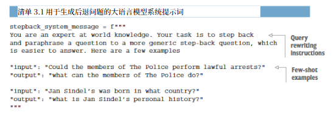

清单3.1中的系统提示词首先给大语言模型（LLM）下达了一条简单指令，要求将用户的问题改写为更通用、退一步的版本。单就这条指令而言，它被称为零样本提示，这种方式仅依赖大语言模型的通用能力和对任务的理解，不提供任何示例。不过为了更有效地指导模型并确保结果一致，研究人员选择通过添加若干理想改写行为的示例来扩展提示词。这种技术被称为少样本提示，即在提示词中加入少量示例（通常为两到五个）来阐释任务。少样本提示通过将大语言模型的任务锚定在具体实例中，帮助其更好地理解预期的转换方式，从而提升输出的质量和可靠性。

要实现查询重写，您需要做的就是将清单3.1中的系统提示连同用户的问题一起发送到LLM。下一个清单中概述了此任务的具体功能。

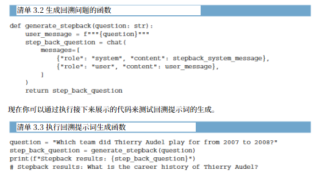

清单3.3中的结果展示了后退提示生成功能的成功执行。通过将关于蒂埃里·奥德尔2007至2008年所属球队的具体查询，转化为关于其整个职业生涯的更宽泛问题，该功能有效拓展了上下文，理应能提升检索的准确率和召回率。

## 3. 父文档检索器

父文档检索器策略包括将大型文档拆分为较小的片段，为每个片段而非整个文档计算嵌入向量，并利用这些嵌入向量更精准地匹配用户查询，最终为获取上下文丰富的回复，正在检索整个文档。但由于无法将整个 PDF 直接输入给大语言模型，你首先需要将 PDF 拆分为父文档，再将这些父文档进一步拆分为子文档，以便进行嵌入和检索。图 3.4 展示了父文档和子文档的关系图表示。

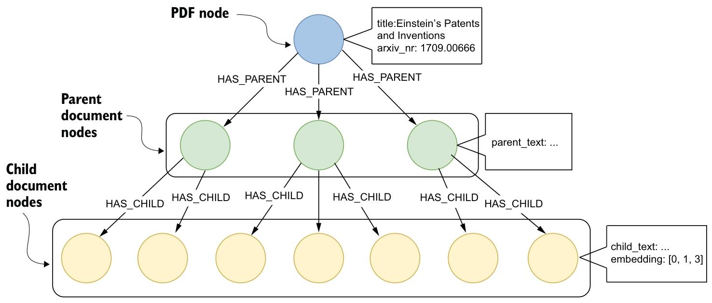

图3.4展示了一种基于图的方法，用于为父文档检索策略存储和组织文档。顶部的PDF节点代表整个文档，标注有标题和标识符。该节点与多个父文档节点相连。在本示例中，你将使用2000个字符的限制将PDF拆分为父文档。这些父文档节点又分别与子文档节点相连，每个子节点包含对应父节点文本中500个字符的片段。子节点拥有嵌入向量，用于表示文本子片段以实现检索。

我们将使用与第2章相同的文本，该文本来自阿西斯·库马尔·乔杜里（Asis Kumar Chaudhuri）撰写的题为《爱因斯坦的专利与发明》（Einstein’s Patents and Inventions）的论文（https://arxiv.org/abs/1709.00666）。此外，在将文档分割为更小的部分进行处理时，最好先根据段落或章节等结构元素拆分文本。这种方法能保持内容的连贯性和语境，因为段落或章节通常包含完整的观点或主题。因此，我们将先把PDF文本拆分为多个章节。

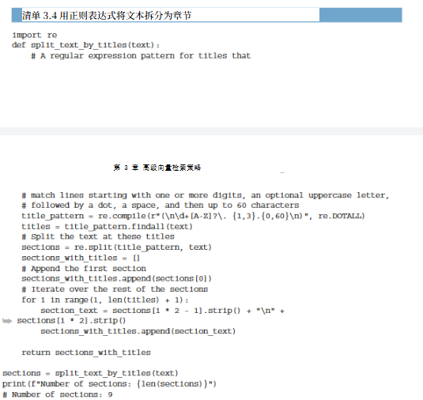

清单3.4中的split_text_by_titles函数使用正则表达式按章节分割文本。该正则表达式基于文本中的章节为编号列表这一事实，每个新章节均以数字和可选字符开头，随后是点号和章节标题。split_text_by_titles函数的输出包含九个章节。若查看PDF，你会发现仅有四个主章节。但其中还有四个描述部分专利的子章节（3A至3D），若将引言摘要单独算作一个章节，总计即为九个章节。

在继续处理父文档检索器之前，你需要统计每个部分的标记数量，以便更好地了解它们的长度。你将使用由 OpenAI 开发的 tiktoken 包来统计给定文本中的标记数量。

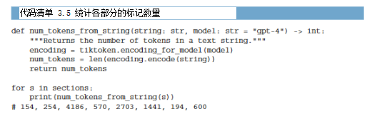

大多数章节的篇幅相对较小，最多包含600个标记，适配大多数大语言模型的上下文提示词。但第三章节的标记数超过4000个，这可能在大语言模型生成过程中引发标记数量限制错误。因此，你必须将章节拆分为子文档，每个文档的字符数最多为2000个。你将使用上一章节中的分块函数来完成这一操作。

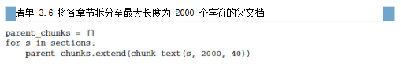

无需拆分子块并在后续步骤中导入，你将在单个步骤中完成拆分与导入。将这两个操作合并为一步执行，可让你省去存储中间结果的稍复杂数据结构。在导入图之前，你需要定义导入用的 Cypher 语句。用于导入父文档结构的 Cypher 语句相对简单直接。

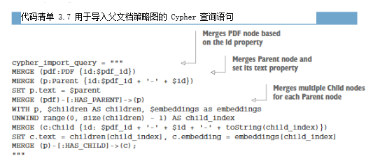

清单3.7中的Cypher语句首先合并一个PDF节点。接下来，它通过唯一ID合并父节点。然后，父节点通过HAS_PARENT关系与PDF节点关联，并设置text属性。最后，它遍历子文档列表，为列表中的每个元素创建一个子节点，设置text和embedding属性，并通过HAS_CHILD关系将其与父节点关联。

现在一切都已准备就绪，你可以将父文档结构导入图数据库中。

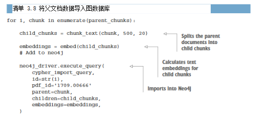

代码清单3.8中的代码首先遍历父文档块。每个父文档块通过chunk_text函数被划分为多个子块。随后，代码使用embed函数为这些子块计算文本嵌入向量。生成嵌入向量后，execute_query方法将数据导入Neo4j图数据库。

你可以在 Neo4j 浏览器中运行以下代码清单中展示的 Cypher 语句，来查看生成的图结构。

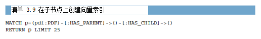

清单3.9中的Cypher语句生成了图3.5所示的图形。该图形可视化展示了一个核心PDF节点与多个父节点相连，直观呈现了文档与其各部分之间的层级关系。每个父节点还进一步与多个子节点相连，体现出文档结构中各部分被拆解为更小单元的关系。

为了确保高效地比较文档嵌入，你需要添加一个向量索引。

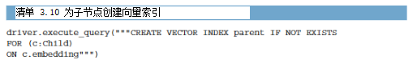

清单 3.10 中生成向量索引的代码与第 2 章中使用的代码完全相同。此处，你在 Child 的嵌入属性上创建了一个向量索引。

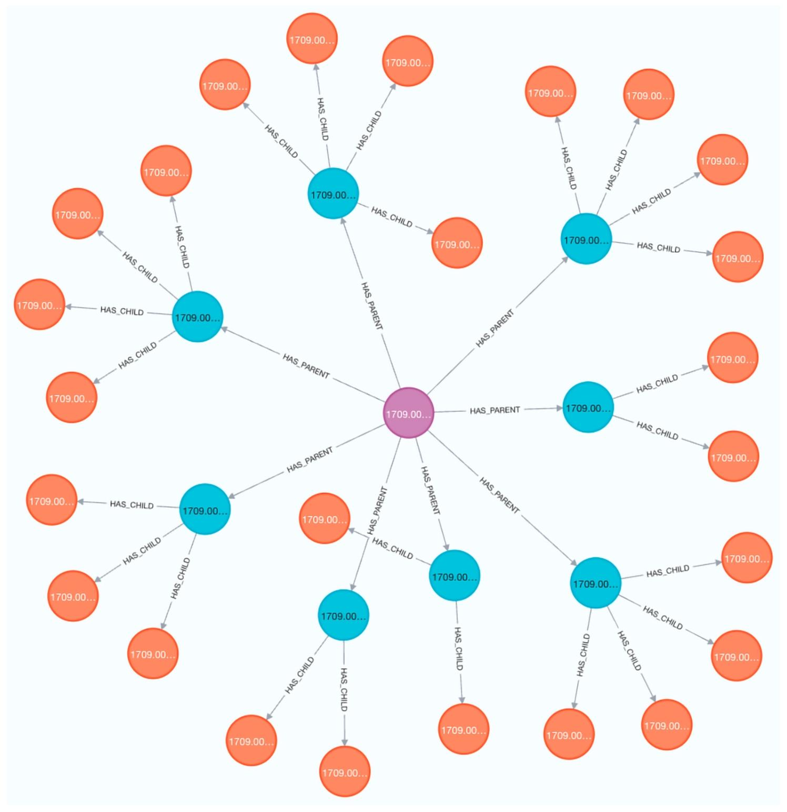
