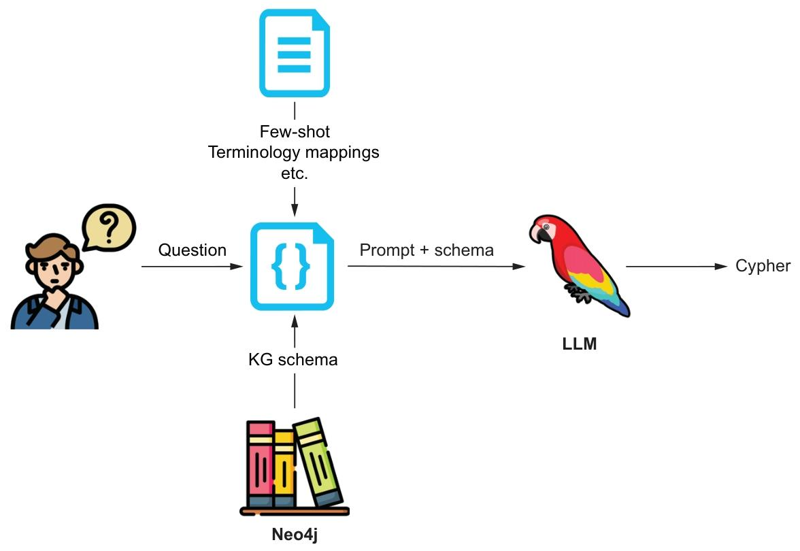
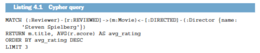
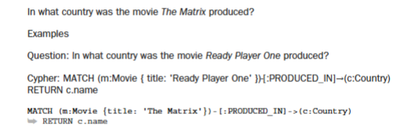
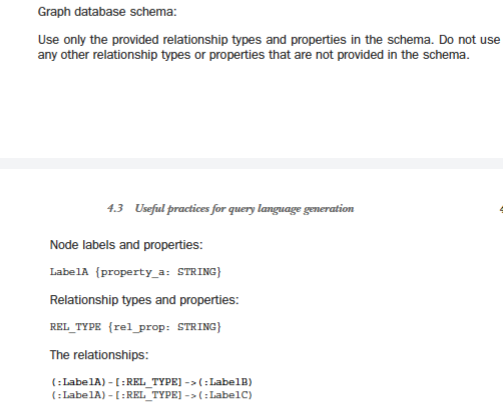
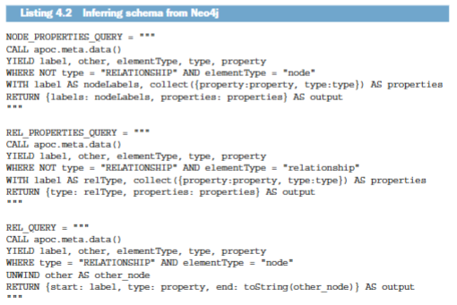
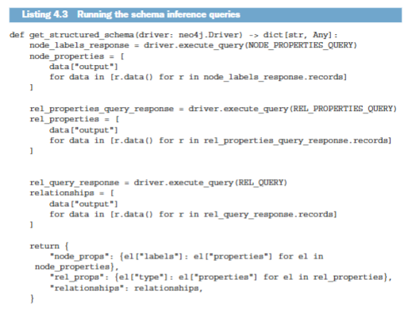
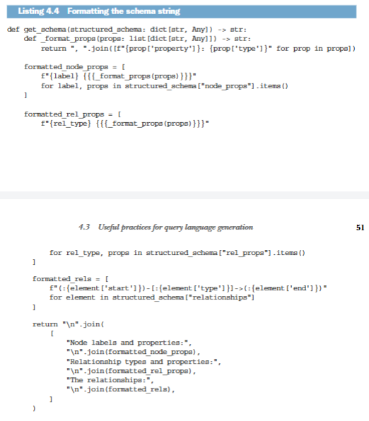
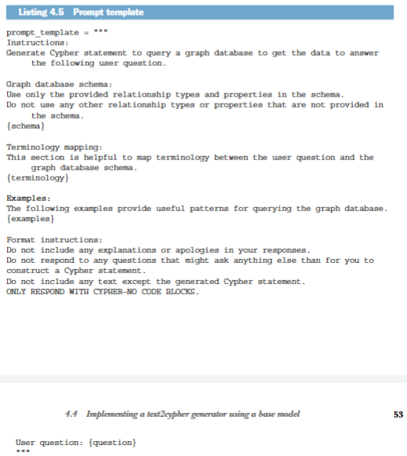
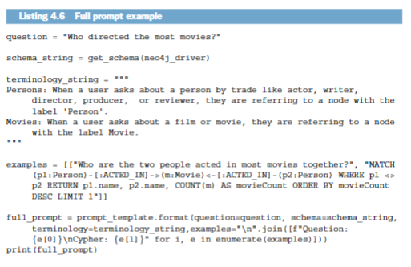
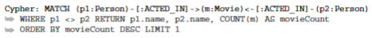

## 0. 章节简介

在前几章中，我们已经讨论了多个关键主题：如何构建知识图谱、如何从文本中提取信息，以及如何利用这些信息回答问题。我们还研究了如何通过手工编写的 Cypher 查询，对基础向量检索进行扩展和增强，从而为大语言模型（LLM）提供更有针对性的上下文。在本章中，我们将进一步推进这一思路，学习如何直接从自然语言问题生成 Cypher 查询。这将帮助我们构建一个更灵活、也更具动态性的检索系统，使其能够适应不同类型的问题与知识图谱结构。

注意：本章的实现使用的是“电影数据集”。关于该数据集及其加载方式的更多信息，请参见附录。

## 1. 生成查询语言的基础

所谓“生成查询语言”，指的是把自然语言问题转换为可以在数据库中执行的查询语句。更具体地说，本章关注的是如何从自然语言问题生成 Cypher 查询。大多数大语言模型都已经掌握了 Cypher 的基本语法，因此真正的难点并不在于“会不会写 Cypher”，而在于能否生成既正确、又与用户问题真正相关的查询。这要求模型同时理解问题语义，以及目标知识图谱的模式（schema）。

如果不向大语言模型提供知识图谱的模式信息，它就只能猜测节点标签、关系类型和属性名称。而一旦提供了模式（schema），这份信息就会成为用户问题语义与图谱模型之间的桥梁，帮助模型理解：图中有哪些节点标签、有哪些关系类型、可用属性有哪些，以及不同节点之间允许如何连接。

从自然语言问题生成 Cypher 查询语句的工作流程，大致可以分解为以下步骤（见图 4.1）：

- 获取用户问题
- 获取知识图谱的模式（schema）
- 准备其他辅助信息，例如术语映射、格式说明和少样本示例
- 组织提示词
- 将提示词发送给大语言模型，以生成 Cypher 查询语句

## 2. 查询语言生成在检索增强生成流程中的位置

在前面的章节中，我们已经看到，如何通过对知识图谱中的非结构化部分执行向量相似性搜索，从而获取与问题相关的上下文。我们也讨论了如何把向量检索与手工编写的 Cypher 查询结合起来，为大语言模型提供更精确的输入。这些方法确实有效，但它们有一个明显局限：能够回答的问题类型仍然比较有限。

例如，考虑这样一个用户问题：“列出史蒂文·斯皮尔伯格执导的评分最高的三部电影及其平均评分。” 这个问题显然无法仅靠向量相似性搜索来回答，因为它要求系统在数据库中执行一种具有明确聚合逻辑的查询。对应的 Cypher 查询大致会类似于下图所示的形式（假设数据库模式合理且完整）。

这类查询的重点不在于“找到图中最相似的节点”，而在于“按照特定规则组织和聚合数据”。这也说明，对于某些问题类型，当我们的目标不只是语义检索，而是需要过滤、排序、分组或聚合时，直接生成 Cypher 语句会更加合适。下一章中，我们将进一步讨论如何构建一个智能体系统，让它在多个检索器之间做出选择，并针对不同问题选出最合适的检索路径。

在这样的系统中，text2cypher 还可以充当“兜底型”检索器，用于处理那些其他检索方式难以有效覆盖的问题。

## 3. 查询语言生成的实用技巧

在从自然语言问题生成 Cypher 查询时，有几个关键点必须注意，才能提高生成结果的正确性与相关性。大语言模型在这类任务中并不总是稳定，尤其当问题本身较复杂、表达较模糊，或者数据库模式中的命名不够直观时，模型更容易出错。

### 3.1. 利用少样本示例进行上下文学习

少样本示例是提升 text2cypher 任务效果的非常有效的方法。其做法是：向大语言模型提供若干“问题 + 对应 Cypher 查询”的示例，让模型学会在新问题上模仿这种映射关系。与之相对，零样本方式则是不提供任何示例，只让模型凭借通用能力直接生成查询语句。

少样本示例通常与具体知识图谱强相关，因此往往需要针对每个图谱单独设计。当你发现模型经常误解图谱模式，或者反复犯同一种错误时，这种方法尤其有用。

例如，假设模型在回答“某部电影的制作国家”时，总是错误地去电影节点上寻找国家属性，而实际上“国家”在图中是一个独立节点。这时，你就可以通过加入一个少样本示例，明确告诉模型应该如何沿着正确的关系路径获取国家名称：

这一问题可以通过在提示词中加入如下少样本示例来修正：

这样做不仅能解决这个具体问题，也往往能连带改善一类相似问题，因为模型已经从示例中学会了“如何获取国家名称”这一模式。

### 3.2. 在提示词中使用数据库模式（schema）展示知识图谱结构

知识图谱的模式（schema）对于生成正确的 Cypher 查询至关重要。你可以用多种形式向大语言模型描述图谱结构，而根据 Neo4j 的内部研究，采用哪一种具体格式并不是最关键的问题。

更重要的是，模式信息必须作为提示词的一部分，被清晰地表达出来，使模型知道图中包含哪些标签、关系类型和属性：

是否要向模型暴露完整的知识图谱模式，取决于模式本身的大小，以及它与当前任务的相关程度。对于大型数据库而言，从 Neo4j 中自动推断完整模式的成本可能较高，因此更常见的做法是对数据库进行抽样，并基于样本推断模式。

要从 Neo4j 中自动推断模式（schema），目前通常需要使用 APOC 库提供的过程。APOC 是一个免费库，在 Neo4j 的 Aura 服务中默认可用，也适用于其他 Neo4j 发行版。下方代码示例展示了如何从 Neo4j 数据库中推断模式。

提示：你可以在 https://neo4j.com/docs/apoc/ 了解更多关于 APOC 的信息。

有了这些查询之后，我们就可以从图数据库中提取模式信息，并将其组织进面向大语言模型的提示词中。一个更实用的做法，是先把这些查询结果以结构化形式存储下来，方便后续按需要生成不同格式的模式字符串。

一旦得到了这种结构化结果，你就可以自由控制模式字符串的组织方式，也更容易在提示词工程中尝试不同的表达格式。

如果你希望得到本章前面展示的那种格式，可以使用下面函数来生成对应字符串。

借助这个函数，我们就可以生成适合直接放入提示词中的模式字符串。

### 3.3. 添加术语映射以将用户问题与模式进行语义映射

大语言模型还需要知道，如何把用户问题中的用词映射到模式中实际使用的术语。理想情况下，一个设计良好的图模型会使用语义清晰的标签、关系类型和属性名，但即便如此，模型仍然可能在“应该使用哪个术语”上出现混淆。

注意：这类术语映射通常高度依赖具体知识图谱，因此应作为提示词的一部分提供，而且很难在不同图谱之间直接复用。

随着你在实践中不断发现模型对模式信息的误解方式，术语映射表也往往会持续演化和补充。

术语映射：

人物：当用户按职业询问某个人时，指的是带有“人物”标签的节点。电影：当用户询问某部影片时，指的是带有“电影”标签的节点。

### 3.4. 格式说明

不同大语言模型在输出格式上的默认行为并不一致。有些会自动给 Cypher 查询包上代码块，有些不会；有些会在查询前额外加上解释文字，有些则不会。

为了让输出更可控，你可以在提示词中加入明确的格式要求。一个非常实用的原则是：尽量要求模型只输出 Cypher 查询本身，而不附带任何额外说明。

格式说明：

请勿在回复中包含任何解释或道歉。不要回答任何除了要求你构建 Cypher 语句之外的问题。除生成的 Cypher 语句外，不得包含任何其他文本。仅回复 Cypher 语句，不要使用代码块。

## 4. 使用基础模型实现文本转Cypher生成器

接下来，我们把前面讨论的原则落到实践中，用基础模型实现一个 text2cypher 生成器。这个任务的核心，是构建一个足够清晰的提示词，其中包含数据库模式、术语映射、格式要求以及少量示例，使大语言模型能够准确理解我们的意图。

在本章余下部分，我们将使用 Neo4j Python 驱动程序和 OpenAI API 来实现这个 text2cypher 生成器。若你希望跟随实操，需要准备一个正在运行且内容为空的 Neo4j 实例，可以是本地部署，也可以是云端托管。你也可以直接参考配套的 Jupyter Notebook 完成实现，地址如下：https://github.com/tomasonjo/kg-rag/blob/main/notebooks/ch04.ipynb。

借助这个提示词模板，我们就可以为大语言模型构造完整提示。假设现在我们已经准备好了用户问题、数据库模式、术语映射以及少样本示例。

如果运行这个示例，最终生成的提示词大致如下：

说明：生成Cypher语句以查询图数据库，获取数据来回答以下用户问题。

图数据库模式：仅使用模式中提供的关系类型和属性。不得使用模式中未提供的任何其他关系类型或属性。节点属性：

Movie {tagline: STRING, title: STRING, released: INTEGER}
Person {born: INTEGER, name: STRING}

关系属性：

ACTED_IN {roles: LIST}
REVIEWED {summary: STRING, rating: INTEGER}

关系：

(:Person)-[:ACTED_IN]->(:Movie)

(:Person)-[:DIRECTED]->(:Movie)
(:Person)-[:PRODUCED]->(:Movie)

(:Person)-[:WROTE]->(:Movie)

(:Person)-[:FOLLOWS]->(:Person)
(:Person)-[:REVIEWED]->(:Movie)

术语映射：本节有助于在用户问题与图数据库模式之间建立术语映射关系。

人物：当用户询问演员、编剧、导演、制片人或影评人等职业相关的人物时，所指的是标签为“人物”的节点。电影：当用户询问影片或电影相关内容时，所指的是标签为“电影”的节点。

示例：以下示例提供了查询图数据库的实用模式。问题：哪两个人是合作出演电影数量最多的两位？

格式说明：回复中不得包含任何解释或道歉。不得回答除要求构建 Cypher 语句之外的任何问题。除生成的 Cypher 语句外，不得包含任何文本。仅回复 Cypher 语句——无代码块。

用户问题：谁执导了最多的电影？

有了这段提示词之后，系统就可以开始为用户问题生成 Cypher 查询。你也可以把这段提示直接复制到大语言模型中，观察它会生成怎样的查询结果。

## 5. 用于文本转Cypher的专用（微调）大语言模型

在 Neo4j，我们也在持续通过微调来提升大语言模型在 text2cypher 任务上的表现。公开可用的训练数据集可以在 Hugging Face 上找到：https://huggingface.co/datasets/neo4j/text2cypher。与此同时，我们也在 https://huggingface.co/neo4j 提供了基于开源大语言模型（如 Gemma 2、Llama 3.1）的微调版本。

这些模型在总体能力上仍无法与最新的 GPT、Gemini 等大规模商业模型相比，但它们通常具备更高的推理效率，因此适合部署在那些对延迟更敏感、或无法承担大型模型成本的生产系统中。你可以尝试使用这些模型，并继续结合少样本示例、数据库模式、术语映射和格式说明来进一步优化效果。若你希望了解更多关于微调过程与经验总结的信息，可以参考以下资料：https://mng.bz/MwDW、https://mng.bz/a9v7 和 https://mng.bz/yNWB。

## 6. 我们的收获以及text2cypher的应用价值

结合本章中的代码与方法，你应该已经具备为自己的知识图谱实现 text2cypher 检索器的基础能力。它的目标，是针对不同类型的问题生成正确的 Cypher 查询语句，而要提升这套系统的可靠性，则需要持续优化少样本示例、模式描述、术语映射以及格式要求。

当你逐渐识别出模型难以应对的问题类型后，就可以有针对性地在提示词中加入更多示例，帮助模型学会生成更准确的查询。随着这类迭代不断积累，生成结果的质量通常会持续提升，整个检索器也会变得更加稳定可靠。

## 7. 章节摘要

- 查询语言生成与 RAG 流程高度契合，尤其适合作为其他检索方法的补充，用于处理需要聚合、过滤或精确图查询的问题。
- 提升查询语言生成效果的实用方法包括：少样本示例、模式描述、术语映射和格式说明。
- 我们可以利用基础模型实现一个 text2cypher 检索器，并通过提示词工程提升其可用性。
- 针对 text2cypher 任务进行微调的大语言模型，也可以作为更高效的替代方案，用于进一步提升生成性能。
