## 0. 章节简介

在之前的章节中，我们已经了解了多种向量相似性搜索方法，以及它们如何帮助我们定位相关信息。相似性搜索非常适合处理非结构化数据，但结构化数据通常更具价值，因为数据之间的组织方式本身就承载着额外语义。

为数据引入结构往往是一个渐进过程。我们可以先从较为简单的结构出发，再逐步补充更丰富的语义关系。上一章已经展示了这一思路：我们先使用基础图结构，再在此基础上引入更复杂的模式与查询方式。

智能体式检索增强生成系统（见图 5.1）指的是一类配备多种检索智能体的系统，这些智能体协同工作，用于获取回答用户问题所需的数据。系统通常以检索路由模块作为入口，其核心职责是为当前任务选择最合适的一个或多个检索器。

构建智能体式检索增强生成系统的一种常见方式，是利用大语言模型的工具使用能力，也就是常说的函数调用。并非所有大语言模型都原生具备这种能力，但 OpenAI 的 GPT-3.5 和 GPT-4 已经提供了相应支持，这也是本章采用的实现方式。许多其他大语言模型也可以借助 ReAct 方法实现类似能力，详见 https://arxiv.org/abs/2210.03629。就当前的发展趋势来看，工具调用很可能会逐步成为大语言模型的标准能力之一。

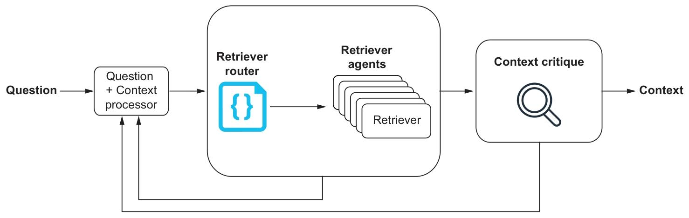

## 1. 什么是智能体式检索增强生成？

智能体系统的复杂程度可以相差很大，但其核心思想始终一致：系统能够代表用户执行一系列任务。本章讨论的是一种相对基础的智能体系统，它需要完成两件事：选择合适的检索器，以及判断检索到的上下文是否足以回答问题。更复杂的系统还会进一步拆解任务、制定执行计划并动态调整策略。对 RAG 场景而言，掌握这些基础能力通常已经足够实用。

智能体式检索增强生成（Agentic RAG）是指系统中存在多种检索智能体，可按需调用，以获取回答用户问题所需的数据。一个有效的智能体式检索增强生成系统通常包含以下几个基础组件：

- 检索器路由器——一种接收用户问题并返回要使用的最佳检索器的函数
- 检索器智能体——可用于检索回答用户问题所需数据的实际检索器
- 答案评判器——一个接收检索器返回的答案并检查原始问题是否被正确回答的函数

### 1.1. 检索器智能体

检索器智能体是实际执行检索任务的工具，用于获取回答用户问题所需的数据。这些检索器既可以非常通用，例如向量相似性搜索；也可以非常具体，例如接收明确参数的硬编码数据库查询模板。后者往往就是某类高频问题的专用检索器。

在大多数智能体式检索增强生成系统中，都会存在一些通用检索器，例如向量相似性搜索和 text2cypher。前者适用于非结构化数据，后者更适合访问图数据库中的结构化信息。但在真实的生产环境里，仅依赖这类通用检索器，往往很难持续稳定地达到用户期望的效果。

这正是专用检索器的重要价值所在。它们的适用范围虽然更窄，却能在特定任务上提供更高的准确率和更稳定的表现。随着我们逐步识别出通用检索器的短板，就可以围绕这些薄弱点不断补充新的专用检索器。

### 1.2. 检索器路由器

为了给每个问题选择合适的检索器，我们需要一个名为检索器路由器的组件。检索器路由器本质上是一个函数：它接收用户问题，并返回最适合执行该任务的检索器。路由决策的实现方式可以有多种，但最常见的做法是借助大语言模型来完成判断。

假设我们有这样一个问题：“法国的首都是什么？”。再假设我们编写了两个可用的检索智能体（它们都能从数据库中检索到答案）：

- capital_by_country：接收国家名称，并返回该国的首都
- country_by_capital：接收首都名称，并返回该首都所属的国家

这两个检索器都可以实现为硬编码的数据库查询，并分别接收国家或首都作为参数。

检索器路由器可以由一个大语言模型来驱动，它负责读取用户问题并返回最佳检索器。在这个例子中，大语言模型可能会选择 `capital_by_country`，并从问题中抽取“法国”作为参数。于是，系统最终执行的实际调用就是 `capital_by_country("France")`。

这只是一个最简单的示例。现实场景中的可选检索器往往更多，路由逻辑也会更复杂，而大语言模型正适合承担这种“理解问题并选择工具”的工作。

### 1.3. 答案评判器

答案评判器接收检索器返回的结果，用于核查原始问题是否已经得到正确回答。它相当于系统中的质量闸门：如果答案不正确或不完整，就不应直接返回给用户。

一旦发现回答存在缺失或错误，答案评判器就应生成一组新的问题，以驱动系统进入下一轮检索。与此同时，我们还必须为这一循环设置明确的退出条件，因为有些问题的答案可能根本不存在于当前数据源中。在这种情况下，系统应能够识别这一事实，并向用户返回“无法获取答案”的说明。

## 2. 为什么需要智能体式检索增强生成（Agentic RAG）？

智能体式检索增强生成的一个典型应用场景，是系统同时面对多种数据源，需要根据问题特征选择最合适的数据访问方式。另一个常见场景是，数据源规模巨大或结构复杂，以至于通用检索方法难以稳定获取正确结果，此时就需要引入专用检索器。

正如前文所述，向量相似性搜索这类通用检索器非常适合处理非结构化数据；而在面对图数据库这类结构化数据源时，则可以使用第 4 章介绍的 text2cypher 等方法。问题在于，当数据结构变得足够复杂时，text2cypher 未必总能生成正确的查询语句。此时，更可行的方案通常是补充专用检索器，例如某类问题专用的 text2cypher 提示模板，或直接接收参数的硬编码数据库查询。

随着系统持续运行，我们会逐步发现 text2cypher 在哪些问题上容易失效，并据此补充新的专用检索器；而在不存在匹配专用检索器的情况下，text2cypher 仍然可以作为通用方案兜底。

这正是智能体式检索增强生成发挥价值的地方。系统中存在多种检索器可供选择，需要有一个机制为当前任务挑选最佳方案，并在最终返回答案之前进行质量评估。在生产环境中，这种设计对于维持系统性能和答案质量的稳定性尤其重要。

## 3. 如何实现智能体式检索增强生成

在本节中，我们将逐步实现智能体式检索增强生成系统的基础组件。你可以直接在配套的 Jupyter Notebook 中跟随实现，地址如下：https://github.com/tomasonjo/kg-rag/blob/main/notebooks/ch05.ipynb。

注意：在本章的实现中，我们使用了所谓的“电影数据集”。有关该数据集以及加载它的各种方法，请参阅附录。

### 3.1. 实现检索器工具

在把用户输入路由到合适的检索器之前，我们首先要把可选检索器准备好。这些检索器既可以是较为通用的能力，例如向量相似性搜索；也可以是高度定制化的查询模板，例如接收特定参数的硬编码数据库查询。

在这个示例中，我们只使用一个简化的检索器集合：其中两个检索器通过 Cypher 模板，分别按电影标题和演员姓名查询电影信息；另一个检索器则在其他场景下调用 text2cypher。正如前文所述，系统最终采用哪些检索器，应根据实际需求逐步扩展和调整。

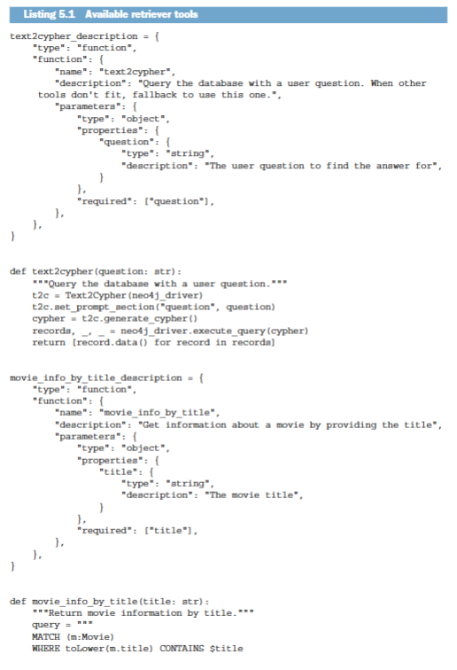

请注意，`neo4j_driver` 和 `text2cypher` 都是导入模块，其具体实现可以在本书的代码仓库中找到。

注意：在本书写作时，前面的检索器定义遵循的是 OpenAI 的工具格式。

这里的关键在于如何向大语言模型描述检索器。描述必须足够清晰，让模型既能理解每个检索器的用途，也能判断在什么情况下调用它们。参数说明同样重要，因为这会直接影响模型是否能够生成正确的工具调用。

还需要强调一点：大语言模型并不会真正执行你的检索器。它只能决定“该用哪个检索器”以及“应传入哪些参数”；真正的函数调用仍然需要由外围系统来完成。下一节我们就会看到这种调用流程。

在智能体式检索增强生成系统中，通常还会包含一个通用检索工具。当问题的答案其实已经包含在问题本身，或出现在已有上下文中时，就可以调用这个工具直接提取答案，而不必再访问外部数据源。

例如，当问题是“戴夫·史密斯的姓氏是什么？”时，这个通用检索工具的作用可能如下所示。

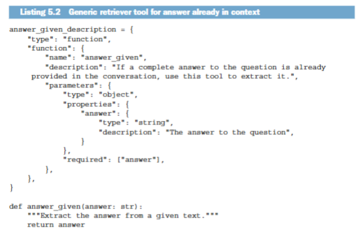

### 3.2. 实现检索器路由

检索器路由是智能体式检索增强生成系统的核心。它负责接收用户问题，并返回最适合执行当前任务的检索器。

在实现检索器路由时，我们将借助一个大语言模型来完成决策。具体做法是：向模型提供一组可用检索器以及用户提出的一个或多个问题，然后让模型为每个问题选择最合适的检索器。为简化实现，我们使用具备官方工具调用支持的大语言模型，例如 OpenAI 的 GPT-4o。其他模型同样可以完成这项任务，只是实现细节可能有所不同。

在展开路由逻辑之前，我们还需要先补齐几个构建智能体式检索增强生成系统所必需的部分，包括：

- 处理工具调用
- 持续查询更新
- 将问题路由至相关的检索器

处理大语言模型返回的工具调用

当大语言模型返回“应该调用哪个检索器”后，系统就需要负责真正执行这一调用。通常可以编写一个统一函数，接收检索器名称和参数，再分发到对应的实际函数。下面的代码示例展示了这种函数的大致形态。

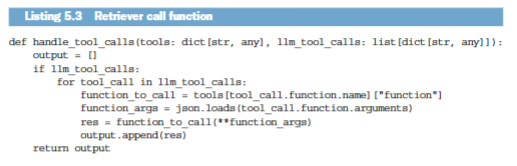

这里传入的 `tools` 是一个字典，其中键是工具名称，值是实际要调用的函数。`llm_tool_calls` 则表示大语言模型返回的工具调用列表，以及每次调用对应的参数。对于单个问题，大语言模型也可能决定依次发起多次函数调用。`llm_tool_calls` 的结构如下所示：

持续更新后续问题

在后面介绍检索器路由函数时，你会看到我们会按顺序、逐个把问题发送给大语言模型。这是一个有意为之的设计，因为这种方式更有利于模型单独处理每个问题，也更方便它为每个问题选择对应的检索器。

顺序处理的另一个好处是，我们可以用前一个问题的答案来改写后续问题。如果后续问题依赖前文结果，这种机制会非常有效。

例如，考虑下面这个问题：“谁获得的奥斯卡奖最多，且此人是否在世？”它可以拆解为“谁获得的奥斯卡奖最多？”和“此人是否在世？”。显然，第二个问题依赖第一个问题的答案。

因此，在得到第一个问题的答案之后，我们希望用新增信息去更新剩余问题。这项工作可以交给一个查询更新器完成，流程如下所示。

查询更新器会接收原始问题以及检索器返回的答案，并据此改写尚未回答的问题。

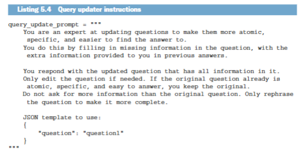

查询更新器以原始问题和检索器给出的答案作为输入，输出更新后的问题列表。这里我们要求大语言模型以 JSON 格式返回结果。关键约束在于：模型只能利用已有信息改写问题，不能凭空补充超出原始问题范围的新内容。

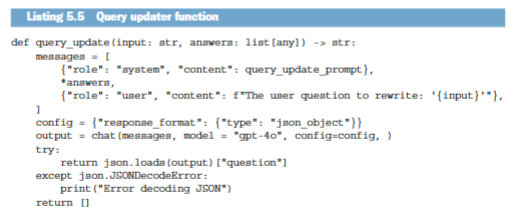

通过这种方式，我们就能在检索过程中不断补全问题表述，使后续问题更加完整，也更容易得到准确答案。

将问题路由到正确的检索器

检索器路由的最后一步，才是真正意义上的“问题分发”。这一过程通过向大语言模型传入问题和可用工具来实现，由模型返回每个问题最适合使用的检索器。

首先，我们要把工具整理成字典形式。这样既便于把工具描述传递给大语言模型，也便于系统在需要执行时快速定位到对应的函数。下面先定义可用工具。

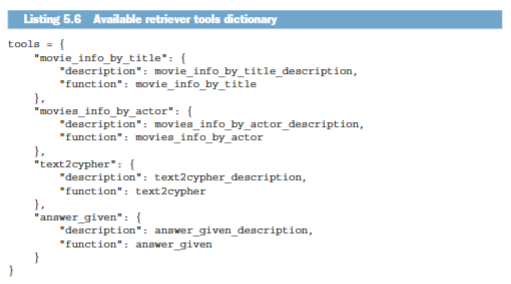

这里我们把工具描述和实际函数统一保存在一个字典中，便于后续同时完成“让模型理解工具”和“真正调用工具”这两件事。接下来，我们向大语言模型发送提示，明确说明它的任务。

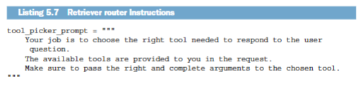

这个提示虽然很短，但结合内置的工具调用能力，已经足以指导大语言模型选择合适的检索器。接下来，我们再看看实际调用大语言模型的函数。

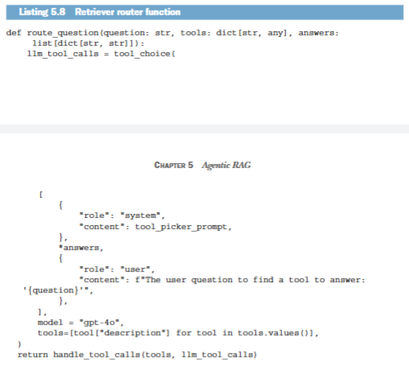

这个函数接收单个问题、可用工具以及前面问题的答案。随后，它会携带这些信息调用大语言模型，而模型则返回该问题应使用的最佳检索器。函数的最后一步会调用前面介绍过的 `handle_tool_calls`，由它负责真正执行检索器。

检索路由实现的最后一步，是把前面所有组件整合起来，形成从用户输入到最终答案的完整流程。这里需要一个循环来依次处理所有问题，并在过程中持续利用新信息更新后续问题。

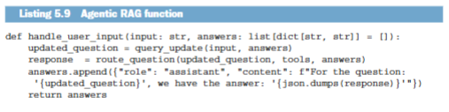

这里需要注意的一点是，handle_user_input 函数可选择性地接收一个答案列表。我们将在 5.3.3 节中对此进行详细说明。

完成这一步后，我们就得到了一个完整的智能体式检索增强生成系统。它能够接收用户输入、选择合适的检索器，并返回相应答案。同时，这种实现方式也便于后续继续扩展新的检索器。

我们还需要实现最后一个部分来完善整个系统，那就是答案评判器。

### 3.3. 实现答案评判器

答案评判器的职责，是接收检索器返回的全部答案，并检查原始问题是否已经被正确回答。由于大语言模型本身具有非确定性，在问题重写、问题更新以及路由分配的过程中都可能出现偏差，因此这个检查步骤非常必要，它可以帮助我们确认系统最终拿到的确实是所需答案。

下面的代码清单展示了提供给答案评判器的大语言模型指令。

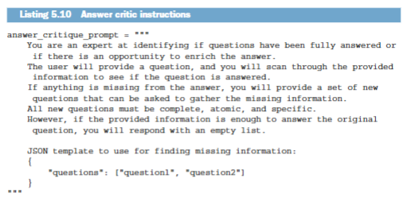

这里仍然沿用前面相同的设计模式：要求模型按照 JSON 格式返回结果，并配合明确的指令完成判断。

接下来，我们来看看调用大语言模型的函数。

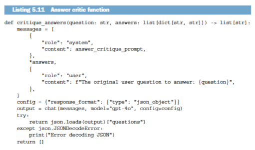

该函数接收原始问题和检索器返回的答案，再调用大语言模型来判断原始问题是否已经得到正确回答。如果答案仍然不充分，模型就会返回一组新的问题，用于补充缺失信息。

如果模型返回了一组新问题，我们就可以再次通过检索器路由去收集缺失信息。当然，这个循环必须设置退出条件，以避免系统在无法获得答案时无休止地重复尝试。

### 3.4. 整合所有部分

到这里为止，我们已经实现了检索智能体、检索器路由和答案评判器。最后一步，就是把这些组件整合进一个主函数，由它统一接收用户输入，并在可能的情况下返回答案。

下面的代码清单展示了主函数的一种可能实现。我们先从提供给大语言模型的指令开始。

要求大语言模型只依据提示中提供的信息回答问题，这一点至关重要。这样做可以确保系统行为保持一致，也有助于提升答案的可信度。

接下来，我们来看看主函数。

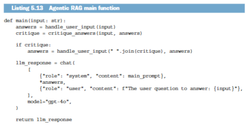

主函数会通过智能体式检索增强生成系统处理用户输入，并将最终答案返回给用户。如果答案不完整或存在错误，评判器会返回一组新问题，用于继续补充缺失信息。

在这个实现中，我们只执行一次答案评估。若经过这一轮补充后答案仍然不完整或不正确，系统就会将当前结果原样返回，并由大语言模型明确指出其中仍然缺失的部分。

## 4. 章节摘要

- 智能体式检索增强生成是一类系统，其中存在多种检索智能体，用于获取回答用户问题所需的数据。
- 智能体式检索增强生成系统通常以检索器路由器作为入口，用于为当前任务选择最合适的一个或多个检索器。
- 这类系统的基础组件包括检索智能体、检索器路由器和答案评判器。
- 系统中的关键能力通常可以借助具备工具调用支持的大语言模型来实现。
- 检索器既可以是通用型，也可以是专用型，应根据系统运行中暴露出的需求逐步补充和完善。
- 答案评判器负责检查检索结果是否真正回答了原始问题，并决定是否需要继续检索。
