## 0. 章节简介

在本章中，你将学习如何利用大语言模型（LLMs）从文本等非结构化数据源构建知识图谱。本章重点介绍如何让大语言模型从原始文本中提取并组织结构化数据，并将其转换为可用于构建知识图谱的格式。

在前面的章节中，你已经学习了文档分块、嵌入和检索的基本技巧（第 2 章），以及提升检索准确率的更高级方法（第 3 章）。但正如第 4 章所示，在需要回答涉及筛选、计数或聚合的问题时，仅依赖文本嵌入会遇到明显限制。为克服这一问题，你将学习如何借助大语言模型（LLMs）自动提取数据，把非结构化文本转换为适合构建知识图谱的结构化表示。学完本章后，你将能够从原始文本中提取结构化信息，为这些数据设计知识图谱模型，并将其导入图数据库。

你将首先考察法律文档检索中的一个常见挑战：如何管理多份合同及其条款，并理解结构化数据提取为何能提供更可靠的解决方案。随后，你会跟随一个完整示例，逐步学习从非结构化文本构建知识图谱的工作流。

## 1. 从文本中提取结构化数据

互联网以及企业内部的大量信息都以文档等非结构化形式存在。然而，在某些场景中，仅依赖文本嵌入的简单检索效果并不好，法律文书就是典型例子之一。

例如，如果你要查询与 ACME 公司签订的某份合同中的付款条款，就必须确保返回的内容确实来自目标合同，而不是其他合同。当你只是对多份法律文档进行分块并检索时，返回的前 k 个文本块可能来自不同且彼此无关的文档，这会造成混淆，如图 6.1 所示。

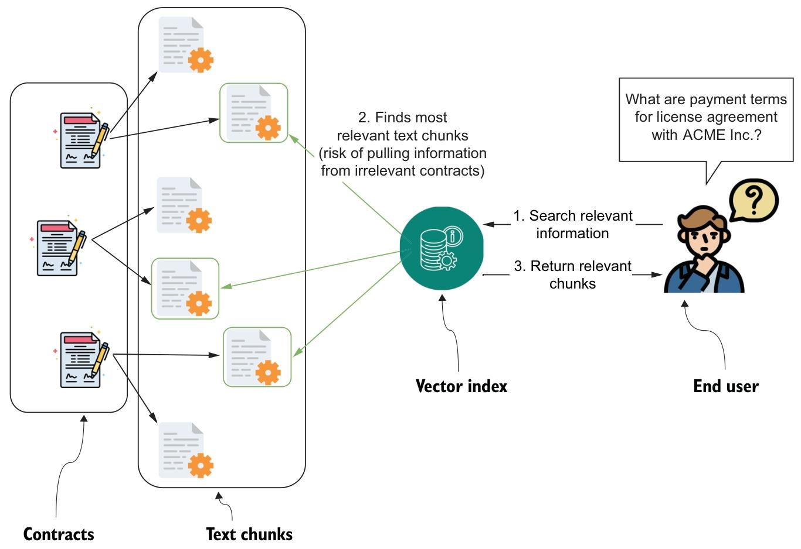

图 6.1 展示了合同文档如何被拆分为文本块，并使用文本嵌入进行索引。当终端用户提出某个具体问题时，例如查询某一特定合同的付款条款，系统会检索最相关的文本片段。然而，如果多份合同都包含不同的付款条款，检索过程就可能误把不同文档中的信息混在一起，把目标合同的相关片段与其他合同的无关片段一并返回。出现这种情况的原因在于，系统只是基于相似度返回排名靠前的文本片段，却无法始终判断这些片段是否来自正确的合同。最终，包含“付款”“条款”等关键词、却属于不同合同的片段可能被同时纳入，导致条款信息碎片化甚至前后矛盾。当大语言模型尝试把这些混杂片段整合成连贯答案时，输出不准确或具有误导性的风险就会显著上升。

再考虑另一个问题：我们目前与 ACME 公司有多少份有效合同？要回答这个问题，首先需要根据合同状态筛选出所有有效合同，然后再进行计数。这类查询更接近传统商业智能问题，而文本嵌入方法在这方面并不擅长。

文本嵌入主要用于检索语义相似的内容，而不是执行数据筛选、排序或聚合。要完成这些操作，就需要结构化数据，因为仅靠文本嵌入并不适合解决这类问题。

在某些领域，构建 RAG 应用时对数据进行结构化处理至关重要。幸运的是，大语言模型（LLMs）对自然语言有深刻理解，擅长从文本中提取结构化数据，并准确识别相关信息。你可以通过微调模型，或借助专门的提示词引导模型定位并提取所需数据点，把非结构化信息转换为表格、键值对等结构化格式。在处理大批量文档时，使用大语言模型进行结构化数据提取尤其有价值，因为人工识别和整理这些信息既费时又费力。通过自动化这一流程，大语言模型可以帮助企业把非结构化信息转化为可落地的结构化数据，进而用于后续分析或 RAG 应用。

设想你在一家公司担任软件工程师，所在团队负责开发一款能够基于公司法律文档回答问题的聊天机器人。由于这是一个大型项目，团队分成两个小组：一组负责数据准备，另一组负责实现第 4 章和第 5 章中介绍的检索系统。你被分配到数据准备小组，任务是处理法律文档并提取结构化信息。这些信息将用于构建知识图谱，整体流程如图 6.2 所示。

图 6.2 展示的工作流从合同文档输入开始，通过大语言模型（LLM）对文档进行处理并提取结构化信息。在法律领域，可提取的信息包括相关方、日期、条款等。

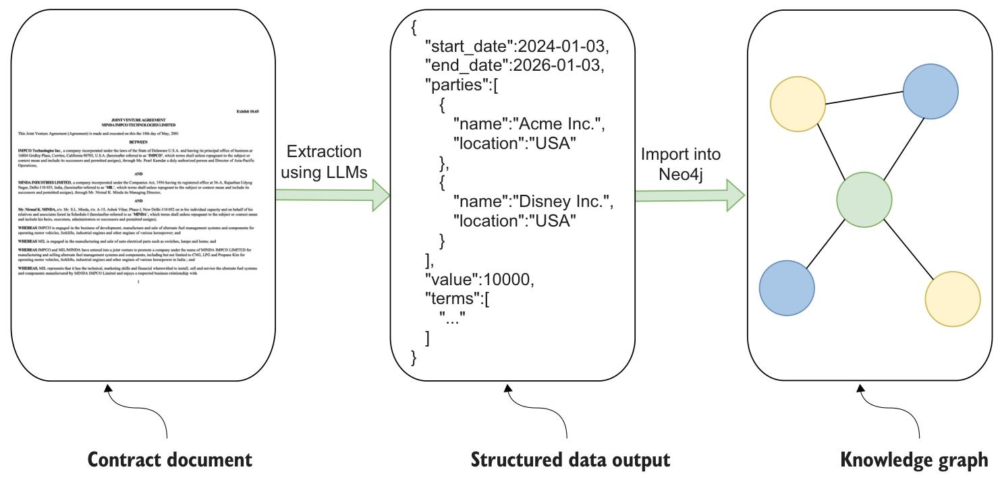

这里的结构化输出以 JSON 格式呈现，随后会被存储到 Neo4j 中，作为法律聊天机器人执行数据检索的基础。

这两个例子都说明了简单文本嵌入在处理特定结构化查询时的局限性，例如查询合同中的付款条款，或统计有效合同的数量。在这两种情况下，准确答案都依赖结构化数据，不能只靠对非结构化文本做语义相似度检索。在本章后续内容中，我们将进一步讨论如何利用大语言模型（LLMs）从复杂文档中有效提取结构化数据，以及这种结构化输出如何支撑面向高级检索任务的可靠知识图谱。若要跟随本教程操作，你需要准备一个正在运行且内容为空的 Neo4j 实例，可以是本地部署，也可以是云端托管。你也可以直接参考配套的 Jupyter Notebook，地址如下：https://github.com/tomasonjo/kg-rag/blob/main/notebooks/ch06.ipynb。

### 1.1. 结构化输出模型定义

从文本中提取结构化数据并不是一个新想法，多年来它一直是数据处理中的重要任务。从历史上看，这一过程通常被称为信息抽取，需要构建复杂系统，且往往依赖多个相互协作的机器学习模型。这类系统的构建和维护成本通常很高，需要熟练的工程师和领域专家共同参与。正因为如此，过去往往只有资源充足的大型组织才有能力部署此类解决方案。高昂的成本和技术门槛，也使许多原本能够从中受益的企业和个人难以采用这类方案。不过，大语言模型的进步极大简化了这一流程。如今，用户只需向大语言模型发出指令，就可以提取结构化信息，显著降低了技术门槛，也不再需要开发和训练多个专用模型。这一变化为结构化数据提取打开了更广泛的应用空间。

利用大语言模型提取结构化数据，已经成为极为常见的应用场景。为此，OpenAI 在其 API 中提供了结构化输出功能，用于简化并标准化这一过程。该功能允许开发者预先定义期望的输出格式，确保模型响应遵循指定结构。结构化输出并不是独立库，而是 OpenAI API 的内置能力，可通过函数调用或模式定义实现。例如，在 Python 中，开发者通常会使用 Pydantic 等库来定义数据模式，再将这些模式传递给模型，引导其生成与指定格式匹配的输出，如下所示。

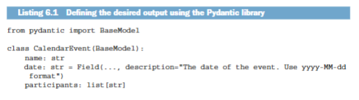

清单 6.1 中的 CalendarEvent 类提供了一种结构化记录事件详情的方式。它包含事件名称、发生日期以及参与者列表。通过明确定义这些属性，可以确保所有事件数据都符合这一结构，从而更可靠、更一致地提取和处理事件信息。可用的属性类型包括：

- 字符串
- 数字
- 布尔值
- 整数
- 对象（object）
- 数组（array）
- 枚举（enum）
- anyOf（多个模式中任选其一）

我们来看看 `date` 属性的定义。

```
date: str = Field(..., description="The date of the event. Use yyyy-MM-dd format")
```

清单 6.2 中的代码说明了如何为 `date` 属性提供提取约束。将该属性命名为 `date`，本身就在提示模型关注与日期相关的信息。

这里使用 `str` 类型，表示提取结果应以字符串形式返回，因为目前没有原生的 `datetime` 类型。此外，描述中明确要求使用 `yyyy-MM-dd` 格式。这一点很重要，因为虽然模型知道它处理的是字符串，但只有通过这条说明，才能确保日期遵循特定格式。若没有这条约束，仅靠 `str` 类型并不足以完整表达期望的输出结构。

结构化输出功能通过确保大语言模型的响应符合预定义模式，显著简化了开发流程。这样可以减少后处理和额外校验的工作，让开发者把注意力放在数据如何被系统使用上。该功能还具备类型安全性，能保证响应格式稳定，同时无需依赖过于复杂的提示词即可获得一致输出，因此整体上更高效，也更可靠。

从法律文书中提取结构化输出的第一步，是定义需要提取的合同数据模型。由于你是软件工程师而不是法律专家，应当咨询具备领域知识的人员，以确定哪些信息最值得提取。此外，直接了解终端用户希望解答哪些问题，也会带来有价值的输入。

在完成这些前期讨论后，你整理出了如下代码清单所示的合同数据模型。

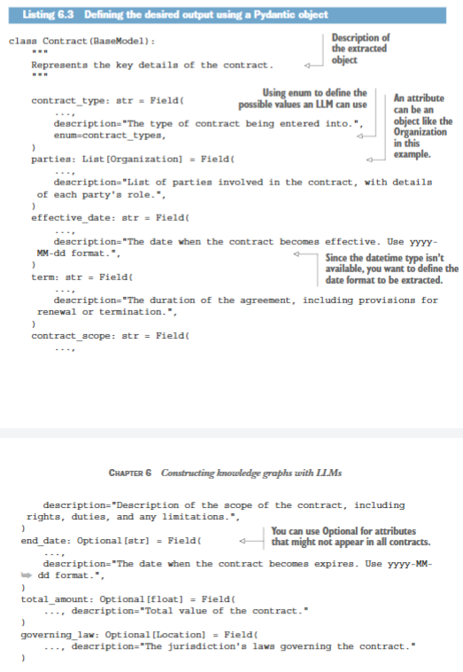

类名 Contract 以及简洁的文档字符串“表示合同的关键细节”，向大语言模型（LLM）传达了高层次意图，即输出应覆盖合同的核心信息。这会引导模型聚焦于合同类型、相关方、日期和财务信息等关键细节的提取与组织。

通常，属性可以分为必填属性和可选属性。当某个属性是可选属性时，需要使用可选类型（Optional）进行标注，以表明该信息可能存在，也可能不存在。当信息可能缺失时，把属性标记为可选尤为重要，否则某些大语言模型可能会虚构数值来填补空缺。例如，总金额（total_amount）是可选属性，因为有些合同并不涉及金钱交易。相反，生效日期（effective_date）则是必填属性，因为我们假定每份合同都有一个起始日期。

请注意，每个属性都带有一个 `description`，用于为大语言模型提供清晰指引，确保其准确提取所需信息。即便某些属性看起来已经很直观，这仍然是值得坚持的实践。在某些情况下，你还可能希望为特定属性限定允许值，这可以通过 `enum` 参数实现。例如，`contract_type` 属性就使用了 `enum` 参数，告知大语言模型应采用哪些具体类别。下面的代码清单展示了 `contract_type` 参数的可用值。

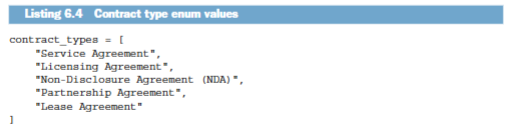

显然，清单 6.4 中的列表并不穷尽所有可能的合同类型，还可以继续扩展。

部分属性可能更复杂，可以定义为自定义对象。例如，`parties` 属性是 Organization 对象的列表。之所以使用列表，是因为合同往往涉及多个参与方；而使用自定义对象，则可以在提取简单字符串之外，进一步提取更丰富的信息。下面的代码清单定义了 Organization 对象。

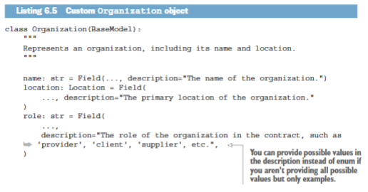

清单 6.5 中的 Organization 对象用于捕获合同相关组织的关键细节，包括名称、主要所在地和角色。`location` 属性是一个嵌套的 Location 对象，可以把位置信息进一步拆分为城市、州和国家等字段。这里可以看到，我们支持嵌套对象，但通常仍建议避免过深的嵌套层级，以保持较好的性能。对于 `role` 属性，代码中给出了“供应商”和“客户”等示例，但没有使用枚举，以免限制其取值范围。这种灵活性很重要，因为具体角色可能变化较大，也未必能事先完整列出。通过这种方式定义组织对象，大语言模型就能更准确地提取相关参与方的详细结构化信息。

最后，你还需要定义 Location 对象。

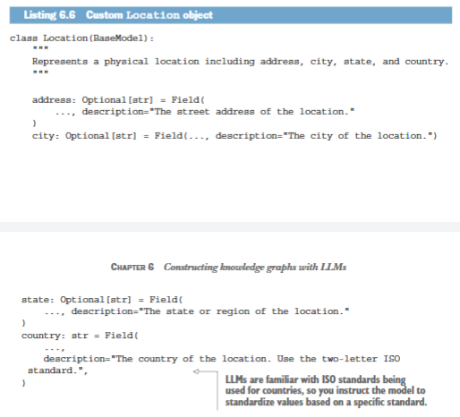

Location 对象表示一个物理地址，包含街道地址、城市、州或地区以及国家等详细信息。除国家外，其他属性都被定义为可选属性，以便在无法获得完整地址时仍然可以使用。对于国家属性，我们要求大语言模型使用两位字母的 ISO 标准，以保证一致性，并便于在不同系统中处理和复用。这样一来，大语言模型既能提取标准化、可直接使用的信息，又能够在必要时容忍部分字段缺失。

到这里，你已经定义好了合同数据模型。该模型可用于从公司合同中提取相关信息，并作为指导大语言模型执行结构化数据提取的蓝图。明确数据结构后，下一步就是设计提示词，高效引导大语言模型提取所需信息。

### 1.2. 结构化输出提取请求

定义好合同数据模型后，你就拥有了可供大语言模型（LLM）遵循的数据结构定义，可以据此提取结构化信息。下一步是确保大语言模型知道应以一致的格式输出这些数据。这正是 OpenAI 结构化输出功能发挥作用的地方。借助这一功能，你可以进一步约束大语言模型的行为，使其在沿用前文介绍的对话模板的同时，输出严格符合合同数据模型的数据。

通过系统消息，你可以进一步引导大语言模型聚焦当前任务。如下代码清单所示，清晰的系统消息能够有效约束模型行为。

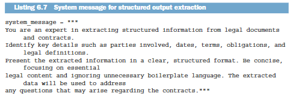

为系统提示词写出足够精准的指令并不容易。可以确定的是，你需要明确应用领域，并向大语言模型说明输出结果将如何被使用。除此之外，往往还需要通过反复试验不断调整。

最后，你需要定义一个函数，它接收任意文本作为输入，并输出符合合同数据模型定义的字典。

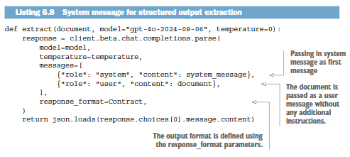

清单 6.8 中的 `extract` 函数会处理文本文档，并按照合同数据模型返回一个字典。文中采用的是撰写时可用的最新 GPT-4o 模型，该模型支持结构化输出。函数会先发送系统消息来引导大语言模型，然后把用户提供的原始文本文档原样传入。最终响应会按照合同数据模型完成格式化，并以字典形式返回。

为了更直观地展示这一过程，下面来看它如何应用在真实数据集上。由于专有合同通常难以公开获取，因此这里使用一个名为 Contract Understanding Atticus Dataset（CUAD）的公共数据集。

### 1.3. CUAD 数据集

虽然几乎所有公司都会持有合同和法律文件，但由于这些文件包含敏感信息，通常不会对外公开。为完成本次演示，我们将使用 CUAD 数据集中的一份文本文档（亨德里克斯等人，2021 年）。CUAD 是一个专门构建的语料库，用于训练人工智能模型理解和审阅法律合同。

下面的代码清单展示了一个整理后的版本。该合同文本可在本书配套的 GitHub 代码仓库中获取，因此无需下载整个数据集。这段代码负责打开文件并读取其内容。

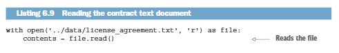

现在，你可以通过执行下面的代码来处理这份合同。

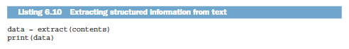

结果如下所示。

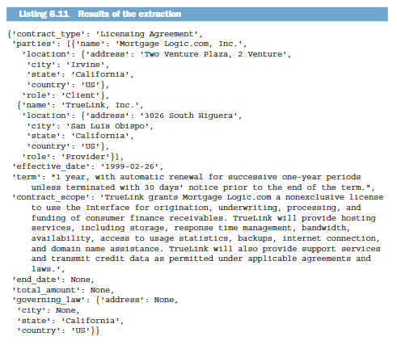

提取后的合同数据已经整理为结构化字段，但并非所有属性都会被完整填充。例如，`end_date`、`total_amount` 等字段被标记为 `None`，表示相关信息缺失或文档中没有明确给出。与此同时，`contract_scope` 等属性则包含更详细的描述性文本，用来概括协议的服务内容和双方责任。整体结构清晰地区分了参与方、其角色以及所在位置。合同还明确给出了生效日期和续约条件，但其他财务或终止相关细节由于原合同未提及，因此未被填充。

在本节中，你已经利用 CUAD 数据集和前面定义的合同数据模型，从合同文档中提取出了结构化数据。大语言模型（LLM）被引导去识别合同中的关键细节，并以结构化形式输出，使你能够系统化整理合同类型、签约方和条款等重要信息。这个过程展示了大语言模型（LLMs）如何高效地把非结构化法律文档转换为可直接使用的数据。

既然你已经了解了如何从法律合同中提取结构化信息，下一部分将进一步介绍如何把这些数据整合到知识图谱中。

## 2. 构建知识图谱

作为本章的最后一步，你需要将提取出的结构化输出导入 Neo4j。这与导入结构化数据的常规流程一致。首先，需要设计一个合适的图模型，用来表示数据中的实体与关系。图建模本身并不是本书的重点，但你可以借助大语言模型（LLMs）辅助定义图模式，也可以参考 Neo4j Graph Academy 等学习资料。

图 6.3 展示了一个合同图模型示例，本节将沿用该模型。这个图模型围绕合同、组织和位置三个核心实体展开。合同节点存储编号、类型、生效日期、期限、总金额、适用法律和合同范围等详细信息。

组织通过 HAS_PARTY 关系与合同相连，每个组织又通过 HAS_LOCATION 关系连接到位置节点，位置节点记录地址、城市、州和国家等信息。将位置建模为独立节点，是为了适应同一组织可能拥有多个地址的场景。

既然图模型已经确定，下一步就是进入知识图谱的构建流程。这一流程包含多个关键步骤，后续小节会逐一展开。首先，你需要定义唯一约束和索引，以确保数据完整性并提升性能。接着，使用 Cypher 语句将结构化的合同数据导入 Neo4j 数据库。数据加载完成后，还需要对图谱进行可视化，确认实体和关系都已正确呈现。最后，我们还会讨论一些重要的数据优化任务，例如实体消歧，以及如何在图谱中同时处理结构化与非结构化数据。

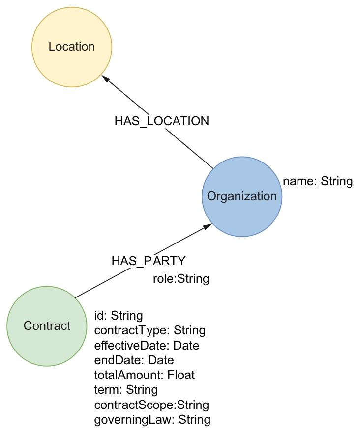

### 2.1. 数据导入

在合适的位置定义唯一约束和索引是一项最佳实践，因为这不仅能保证图数据的完整性，也能提升查询性能。下面的代码清单为 Contract、Organization 和 Location 节点定义了唯一约束。

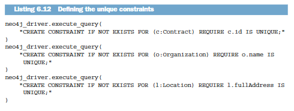

接下来，需要准备一条用于导入的 Cypher 语句。该语句会接收字典形式的输出，并按照图 6.3 中定义的图模式将其加载到 Neo4j 中。下面的代码清单展示了这条导入语句。

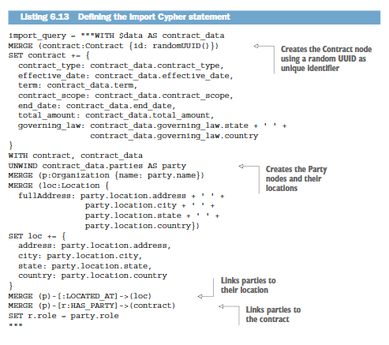

解释 Cypher 语句（例如清单 6.13 中这条语句）的细节超出了本书范围。不过，如果你需要，大语言模型（LLMs）可以帮助你梳理其中的逻辑。这里需要特别说明的是，清单 6.13 中的查询为合同 ID 调用了 `randomUUID()` 函数，因此这条查询不是幂等的。这意味着如果你多次执行同一导入语句，数据库中就会生成重复的合同条目，而且每个条目都会拥有不同的唯一 ID。

现在，一切都已准备就绪，你可以执行下面的代码清单，把合同导入 Neo4j。

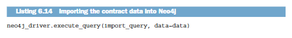

导入成功后，你可以打开 Neo4j Browser 查看生成的图谱，其可视化结果应与图 6.4 高度相似。

图 6.4 的可视化结果显示，一个核心的“许可协议”节点（代表一份合同）通过 HAS_PARTY 关系连接到两个组织：“Mortgage Logic.com, Inc.” 和 “TrueLink, Inc.”。每个组织又通过 LOCATED_AT 关系连接到表示其所在地的“美国”节点。

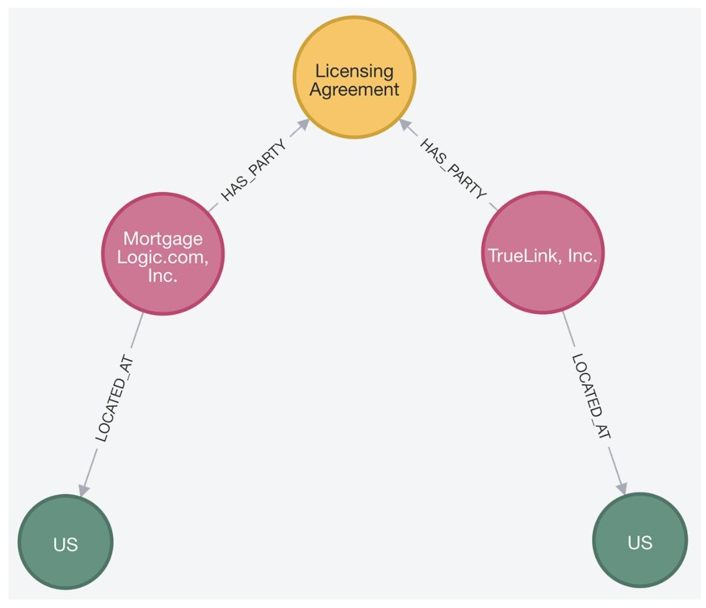

### 2.2. 实体消歧

图谱虽然已经成功导入，但工作还没有结束。在大多数情况下，尤其是在处理自然语言或由大语言模型驱动的数据时，一定程度的数据清洗都是不可避免的。其中最关键的步骤之一，就是实体消歧。实体消歧指的是：在数据集或知识图谱中识别并合并同一现实世界实体的不同表示形式。在处理大型且多样化的数据集时，由于拼写差异、命名规范不同，或数据格式存在细微偏差，同一实体以多种形式出现的情况非常常见。图 6.5 就展示了三个表示同一实体不同写法的节点，它们分别是：

- UTI Asset Management Company
- UTI Asset Management Company Limited
- UTI Asset Management Company Ltd

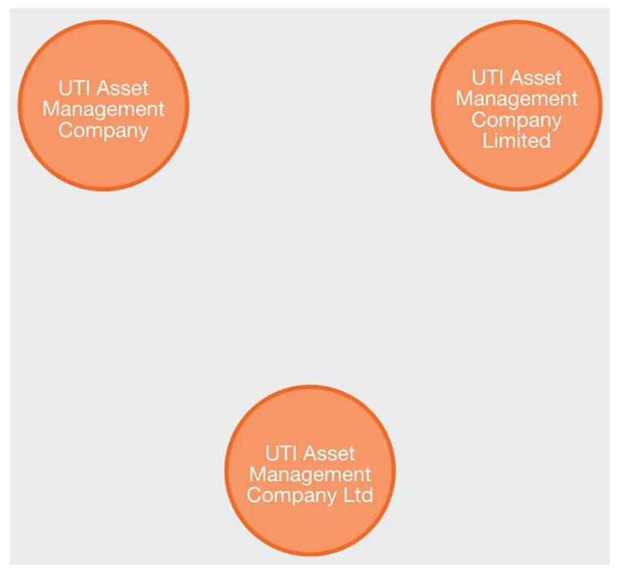

在这里，实体消歧的含义是：尽管命名存在细微差异，例如 “Limited” 与 “Ltd”，系统仍能识别这些变体指向同一个现实世界中的组织。实体消歧的目标，是将这些不同引用统一为图中的一个单一且一致的节点。这不仅能提高数据完整性，也能增强图结构进行推理和建立关联的能力。常见的实体消歧技术包括字符串匹配、聚类算法，以及利用实体上下文识别和解决重复问题的机器学习方法。

需要强调的是，实体消歧高度依赖具体用例和领域。通用的“一刀切”方案通常效果有限，因为每个领域都有其独特的命名规范、数据结构，以及实体表示方式上的细微差异。例如，适用于金融数据集中机构实体消歧的方法和阈值，在医疗场景下处理生物实体时，可能就不会产生理想结果。因此，更有效的策略往往是开发贴合特定数据场景的领域本体或规则。此外，让领域专家参与定义匹配标准，并通过迭代反馈循环验证和修正潜在匹配结果，也能显著提升准确率。将领域知识与上下文感知的机器学习或聚类技术结合起来，通常可以构建出更稳健、更灵活的实体消歧方案，从而捕捉那些在特定数据环境中至关重要的细微差别。

### 2.3. 图中添加非结构化数据

知识图谱越来越多地同时承载结构化数据和非结构化数据，而大语言模型的兴起进一步推动了这一趋势。在这种背景下，大语言模型可以从文本等非结构化来源中提取结构化数据。与此同时，把原始非结构化文档与提取后的结构化数据一起存入图中，既能保留原始数据的丰富语义，又便于对提取结果进行更精确的查询和分析。图 6.6 展示了这种融合结构化与非结构化信息的扩展图架构。

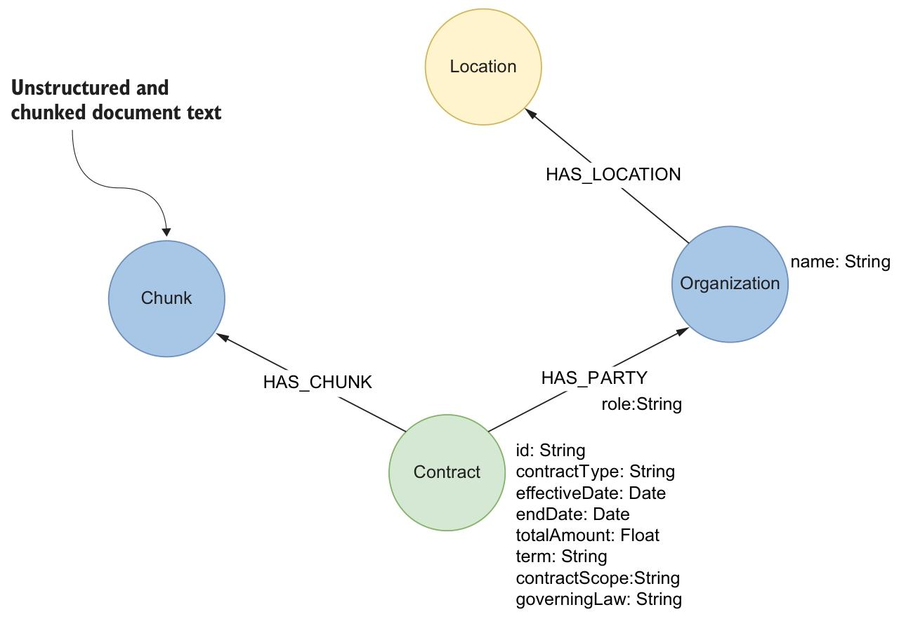

在把非结构化数据整合进图中时，通常会先采用基于 token 数量或单词长度的简单分块策略，将文本拆分成可处理的片段。这种朴素方法适用于通用场景，但在法律合同等特定领域，更专业的分块方式往往效果更好。例如，按照合同条款进行拆分，可以保留更多语义结构，并提升下游分析质量。这种更智能的处理方式，能够让图捕捉更有意义的关联，从而支持更深入的洞察和更准确的推理。

本章介绍了如何利用大语言模型从非结构化数据中构建知识图谱。你了解了文本嵌入在处理结构化查询时的局限，也看到了结构化数据提取如何弥补这一不足。通过定义数据模型、向大语言模型发出提取请求，并将结果导入图数据库，你学会了如何把原始文本转换为适合知识图谱使用的数据。除此之外，本章还讨论了实体消歧，以及在同一图谱中整合结构化与非结构化数据等关键任务。掌握这些内容后，你就可以在实际场景中应用结构化数据提取。

## 3. 章节摘要

- 仅对文档进行分块并用于检索，可能会产生不准确或相互混杂的结果，尤其是在法律文档这类文档边界至关重要的场景中。
- 需要过滤、排序和聚合的检索任务依赖结构化数据，因为单靠文本嵌入并不适合执行这些操作。
- 大语言模型能够有效从非结构化文本中提取结构化数据，并将其转换为表格或键值对等可用格式。
- 结构化输出功能允许开发者预先定义模式，确保响应遵循特定格式，并减少后处理工作。
- 清晰的数据模型应包含合同类型、参与方和日期等关键属性，这对于引导大语言模型准确提取信息至关重要。
- 实体消歧对于统一同一实体的不同表示、提升知识图谱中的数据一致性和准确性至关重要。
- 在知识图谱中结合结构化与非结构化数据，既能保留源数据的丰富性，也能实现更精确的查询。
