## 0. 章节简介

在第6章中，你学习了如何从法律文档中提取结构化信息以构建知识图谱。在本章中，你将探索一种略有不同的提取与处理流程，该流程采用了微软的GraphRAG方法（Edge等人，2024年）。这个端到端的示例仍会构建知识图谱，但更侧重于对实体及其关系进行自然语言摘要生成。整个流程如图7.1所示。

微软 GraphRAG（微软 GraphRAG：https://github.com/microsoft/graphrag）的一项核心创新在于，其借助大语言模型（LLM）通过两阶段流程构建知识图谱。在第一阶段，研究人员从源文档中提取并总结实体与关系，以此作为知识图谱的构建基础，如图7.1中知识图谱构建之前的步骤所示。微软 GraphRAG 的独特之处在于，知识图谱构建完成后，

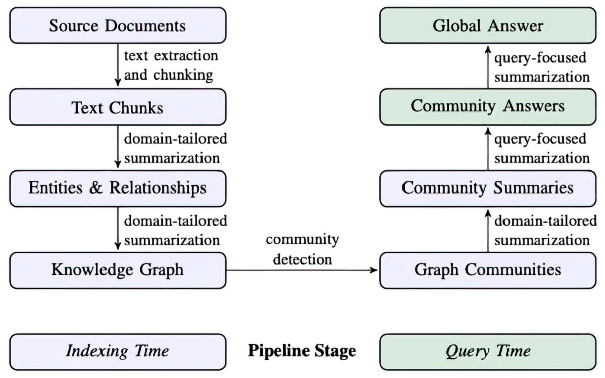检测图形社区，并为密切相关的实体组生成特定领域的摘要。这种分层方法将各种文本块中的碎片化信息转换为关于特定实体、关系和社区的信息的连贯和有组织的表示。

然后，可以使用这些实体和社区级别的摘要来提供相关信息，以响应RAG应用程序中的用户查询。使用这样的结构化知识图，可以应用多种检索方法。在本章中，您将探索MS GraphRAG论文中描述的全局和本地搜索检索方法。

## 1. 数据集选择

MS GraphRAG旨在通过提取关键实体并生成跨多个文本块连接信息的摘要来处理非结构化文本文档。为了确保有意义的见解，我们的数据集不仅应包含丰富的实体信息，还应包含分布在多个块中的实体数据。由于实体类型是MS GraphRAG的可配置方面，因此必须提前定义它们。相关实体通常包括人员、组织和位置，但也可以扩展到特定领域的概念，例如医学中的基因和途径或法律中的法律条款。

为了对实体类型做出明智的决定，探索数据集并确定您想要回答的问题类型非常重要。实体类型的选择塑造了整个下游过程，影响提取、链接和摘要质量。

例如，MS GraphRAG论文使用了来自播客和新闻文章的数据集。在这两种情况下，人员、组织和位置等实体通常已提及。此外，根据主题（如播客内容涉及游戏或健康生活方式），你可能需要纳入特定领域的实体，例如游戏名称、健康状况或营养相关概念，以确保全面的信息提取与分析。

我们以《奥德赛》为例来评估MS GraphRAG，因为这部作品拥有丰富的叙事内容，包含人物、神祇、神秘武器等元素。此外，尤利西斯等关键实体会出现在多个文本块中，使其成为测试实体提取和跨块摘要的合适数据集。

在本章的剩余部分，你将实现 MS GraphRAG 方法。要跟着操作，你需要访问一个正在运行的空白 Neo4j 实例。这可以是本地安装的实例，也可以是云托管的实例；只需确保它是空的即可。你可以直接在配套的 Jupyter 笔记本中完成实现，该笔记本的地址为 https://github.com/tomasonjo/kg-rag/blob/main/notebooks/ch07.ipynb。

让我们开始吧。

## 2. 图索引

在这里，你将构建知识图谱并生成实体与社区摘要。在整个构建过程中，你会探索每一步的关键考量因素，包括实体选择、图谱连通性，以及这些选择如何影响摘要与查询的质量。

首先从古腾堡计划（https://www.gutenberg.org/ebooks/1727）加载《奥德赛》。

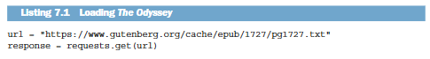

文本准备就绪后，你现在可以逐步完成 MS GraphRAG 流程了。

### 2.1. 分块

《奥德赛》由24卷不同篇幅的内容组成。你的首要任务是删除序言和脚注，然后将文本划分为单独的卷，如下方代码清单所示。这种方法遵循了叙事的自然划分，为文本构建提供了具有语义意义的方式。

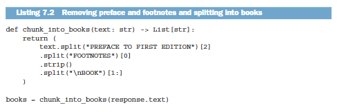

现在你需要检查每本书的标记数量，以确定是否需要进一步分块。以下代码清单提供了各本书标记数量的基本统计信息。

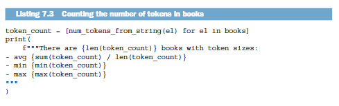

24本书中的代币数量差异很大，平均为6,515个代币，最低为4,459个，最高为10,760个。鉴于这个范围，需要进一步分块以确保没有单个部分超过合理的代币限制。

但是什么是合理的块大小？MS GraphRAG背后的研究人员比较了不同的块大小，并分析了它们对提取实体总数的影响。这种比较的结果如图7.2所示。

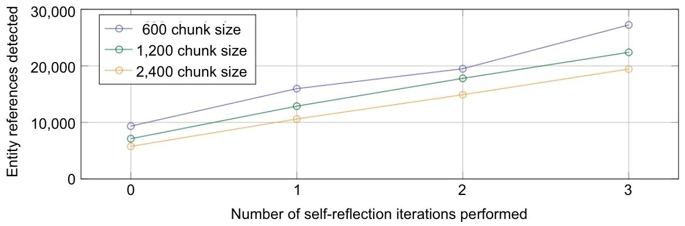

图7.2中的结果表明，较小的块大小倾向于提取更多的实体引用。表示600个标记的块大小的行始终是最高的，而2,400个标记的块大小是最低的。这表明，与使用较大的块相比，将文本分解为较小的块可以让LLM检测到更多的实体。此外，图7.2显示，增加自反射迭代的数量，这意味着在同一文档上进行额外的提取传递，会导致在所有块大小中检测到更多的实体引用。这种模式表明，重复传递使LLM能够提取更多在早期迭代中可能遗漏的实体。

假设你已决定按1000词的限制（基于空格拆分）对书籍进行分块，且重叠40个词，如下所示。

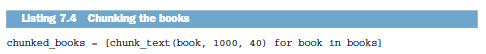

书籍已完成分块，你可以进入下一步了。

### 2.2. 实体与关系提取

第一步是提取实体和关系。我们可以借鉴其论文附录中的 MS GraphRAG 提示词。实体与关系提取提示词的指令部分展示于《实体与关系提取说明》中。

实体与关系提取说明

-目标

给定一份可能与本活动相关的文本文档以及一组实体类型，从文本中识别出这些类型的所有实体，并找出已识别实体之间的所有关系。

1 识别所有实体。针对每个已识别的实体，提取以下信息：

- 实体名称：实体的名称，首字母大写
- 实体类型：以下类型之一：[{entity_types}]
- 实体描述：对实体的属性和活动的全面说明

将每个实体格式化为（"实体"{元组分隔符}"实体名称"{元组分隔符} <实体类型>{元组分隔符}<实体描述>）

2 从步骤1识别出的实体中，找出所有彼此存在明确关联的（源实体，目标实体）对。针对每一对关联实体，提取以下信息：

- 源实体：在步骤1中识别出的源实体名称
- 目标实体：在步骤1中识别出的目标实体名称
- relationship_description：解释你认为源实体与目标实体之间存在关联的原因
- relationship_strength：一个数字分数，用于表示源实体与目标实体之间关系的强度

将每个关系格式化为（"关系"{元组分隔符}<源实体> {元组分隔符}<目标实体>{元组分隔符}<关系描述> {元组分隔符}<关系强度>）

3 以英文输出，以列表形式呈现步骤1和步骤2中识别的所有实体和关系。使用{record_delimiter}作为列表分隔符。

4 完成后，输出{完成分隔符}

实体与关系抽取的说明聚焦于通过识别指定类型的实体及其关系，从文本文档中提取结构化知识。实体类型列表作为变量 entity_types 传入。该提示词指示大语言模型（LLM）抽取实体、按类型对其分类并提供详细描述。随后，模型需识别明确相关的实体对，解释其关联关系并分配关系强度分数。最后，以结构化、带分隔符的格式返回所有抽取的实体和关系。这只是完整提示词的一部分，完整提示词还包含少样本示例和输出示例，但这些内容篇幅过长，无法收录在本书中。

要从《奥德赛》中提取有意义的实体，假设你决定使用以下实体类型：

- PERSON
- ORGANIZATION
- LOCATION
- GOD
- EVENT
- CREATURE
- WEAPON_OR_TOOL

一些实体类型，如人物（PERSON）和神祇（GOD），相对明确，因为它们指代的是定义清晰的人类和神灵类别。然而，另一些实体类型，如事件（EVENT）和地点（LOCATION），则更为模糊。事件（EVENT）可以指代从单一行为到整场战争的任何事物，这使得为其分类划定严格界限变得困难。同样，地点（LOCATION）可以指代国家这样的宽泛类别、特定城市，甚至是城市内的某个具体命名地点。这种变异性使得一致性分类更具挑战性，但也为大语言模型（LLM）留下了更多的灵活性。

基于这些预定义的实体类型，你现在将实现提取函数。

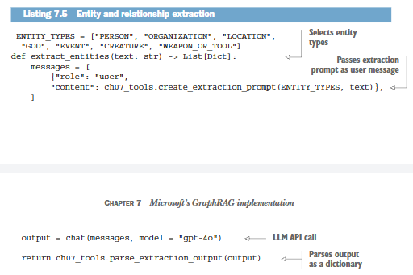

清单7.5中的代码通过先定义要识别的实体类型来提取实体和关系。随后，它利用这些类型和输入文本生成提取提示词，将提示词发送给大语言模型（LLM），并将响应处理为结构化的字典格式。

使用清单7.5中的函数，你将仅为《奥德赛》的第一卷提取实体和关系。如有需要，你可以增加卷数，以分析文本的更大篇幅。此提取的代码如下一清单所示。

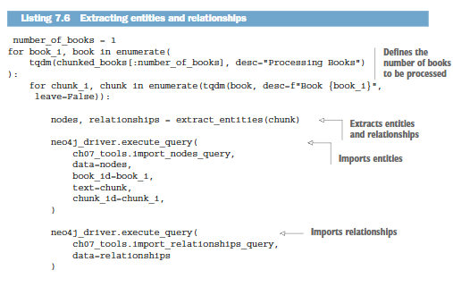

清单7.6中的函数会处理指定数量的书籍，从每个文本块中提取实体和关系。随后将实体导入Neo4j，再导入它们的关系，从而构建出文本的结构化图形表示。

首先回顾提取的实体和关系。你可以使用以下代码清单中的代码统计实体和关系的总数。

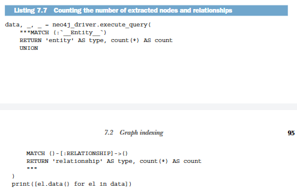

该图包含66个实体和182个关系，不过这些数值在不同执行过程中可能会有所变化。MS GraphRAG 专注于提取实体及其关系的详细描述。例如，我们来查看为角色奥瑞斯特斯提取的描述信息。

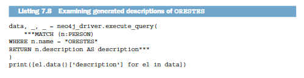

查看为角色奥瑞斯特斯提取的描述内容（如代码清单7.8所示），结果可能如下：

- 俄瑞斯忒斯是阿伽门农之子，他杀死了埃癸斯托斯。
- 俄瑞斯忒斯是那个被期望向埃癸斯托斯复仇的人。
- 俄瑞斯忒斯因杀死埃癸斯托斯为父报仇而受到赞扬。
- 俄瑞斯忒斯是杀死了埃癸斯托斯的阿伽门农之子。
- 俄瑞斯忒斯是一个被期望向埃癸斯托斯复仇的人。
- 俄瑞斯忒斯因杀死埃吉斯托斯为父报仇而受到称赞。

尽管部分描述会重复相同的事实，但它们整体上包含了所有关键细节，并确保特定实体的不同文本片段中不会丢失任何重要信息。

同样，一对实体之间可以存在多种关系。你可以使用下方代码清单中的代码来探究关系数量最多的那对实体。

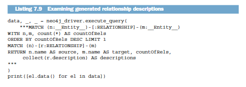

关系数量最多的实体对是忒勒玛科斯与密涅瓦，二者共有14种关系。他们的互动贯穿叙事中的多个关键时刻，凸显了密涅瓦作为忒勒玛科斯的神圣指引者与导师的角色。

以下是提取出的五条关系描述：

- 忒勒玛科斯在宴会上轻声对密涅瓦说话。
- 密涅瓦乔装打扮，为忒勒玛科斯出谋划策、鼓励他，赋予他勇气，并让他思念自己的父亲。
- 密涅瓦让忒勒玛科斯的母亲入睡，展现了她的神性影响力。
- 密涅瓦正与忒勒玛科斯交谈，为他提供指引与安慰。
- 密涅瓦伪装成门特斯，在门口受到忒勒玛科斯的迎接。

尽管部分描述存在细节重叠，但这些内容都强化了密涅瓦作为导师和神圣守护者的角色，逐步塑造着忒勒玛科斯的旅程。

### 2.3. 实体与关系总结

为避免提取的知识出现不一致、冗余和碎片化问题，MS GraphRAG 利用大语言模型（LLM）对同一实体或关系的多个描述进行合并，生成简洁的摘要。该模型不再单独处理每条描述，而是整合所有描述中的信息，确保关键上下文细节被保留在单一且更丰富的表征中。这种方法提升了内容的清晰度，减少了重复信息，还能让人们更全面地理解实体及其之间的关系。

你可以再次使用论文中的摘要提示词，如“实体与关系摘要说明”所示。

实体与关系汇总说明

你是一位乐于助人的助手，负责为以下提供的数据生成全面的摘要。给定一两个实体，以及一系列均与同一实体或实体组相关的描述，请将所有这些内容整合为一段完整、全面的描述。确保包含从所有描述中收集到的信息。如果提供的描述存在矛盾，请解决矛盾并给出一段连贯、统一的摘要。内容需以第三人称撰写，并包含实体名称，以便我们获取完整的上下文信息。

#######

- 数据

实体：{entity_name}

描述列表：{描述列表}

#######

输出：

“实体与关系摘要说明”中的提示词指导大语言模型通过合并某一实体或一对实体的多个描述，生成一份连贯的摘要。它确保纳入所有相关细节，同时解决矛盾、剔除冗余内容。输出内容采用第三人称书写，并明确提及实体名称，以保持清晰性和语境感。

使用“实体与关系汇总说明”中的提示词，你可以为所有拥有多个描述的实体生成汇总信息。用于汇总实体描述的代码可在以下列表中找到。

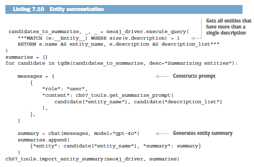

清单7.10中的代码会查询Neo4j数据库，找出拥有多个描述的实体，然后使用大语言模型（LLM）生成统一的摘要。你可以运行以下清单中的代码，查看ORESTES的摘要描述。

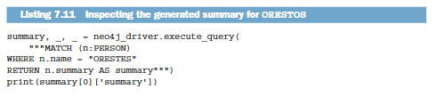

结果展示在“ORESTES 的生成摘要”中。为俄瑞斯忒斯生成的摘要

俄瑞斯忒斯是阿伽门农之子，因杀死埃癸斯托斯为父报仇而闻名。人们本指望他向埃癸斯托斯复仇，正是此人策划了阿伽门农的谋杀案。俄瑞斯忒斯不负所望，成功杀死了杀害父亲的凶手埃癸斯托斯，因此备受赞誉。

摘要生成流程已成功生成出对某一实体的连贯且丰富的描述，正如“为 ORESTES 生成的摘要”所示。通过融合多个描述，我们在保留关键细节的同时减少了冗余信息。

接下来，我们将把相同的摘要方法应用到关系上，将多个关系描述整合为一份全面的摘要。结果如下所示。

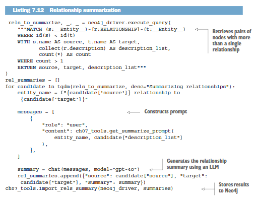

清单7.12中的代码会识别数据库中存在多重关系的实体对，并借助大语言模型将它们的描述整合为一份单一摘要。通过合并关系描述，该流程能全面捕捉实体间的关键交互，同时消除冗余信息。生成的汇总关系会被重新存储回数据库中。

你可以评估生成的忒勒马科斯与密涅瓦之间的关系，如下所示。

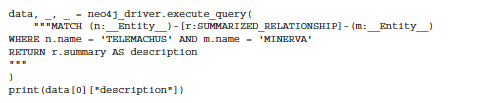

代码清单7.13的结果可在“忒勒玛科斯与密涅瓦关系的生成摘要”中查看。

忒勒玛科斯与密涅瓦关系生成摘要

密涅瓦在忒勒玛科斯的人生中扮演着至关重要的角色，在他踏上寻找父亲尤利西斯的征程时，为他提供指引与支持。在一场宴会上，忒勒玛科斯轻声与密涅瓦交谈，这体现出二人之间亲密且相互信任的关系。密涅瓦常常化身他人，比如以门特斯的形象出现，为忒勒玛科斯出谋划策、给予鼓励，让他拥有探寻父亲下落的勇气与决心。她就忒勒玛科斯计划的航行提供建议，彰显了对他事业的支持。此外，密涅瓦施展神力让忒勒玛科斯的母亲陷入沉睡，这一行为也充分体现了她在忒勒玛科斯生活中守护与支持的角色。

结合实体和关系的整合摘要，你已成功完成 MS GraphRAG 索引的第一阶段。通过合并不同文本块中的信息，你为提取的知识构建了更连贯、更丰富的表征。

实体与关系摘要的注意事项:

在处理更大规模的数据集时，你可能会遇到所谓的超级节点。超级节点是指出现在众多分块中且关联数量极多的实体。例如，若要处理整个古希腊历史，像雅典这样的节点会积累大量的关联和描述信息。如果没有排序机制，对这类节点进行总结可能会导致输出内容过长，更糟的是，部分描述甚至可能无法放入提示词中。为解决这一问题，你需要制定筛选或排序策略，优先呈现最相关的描述，确保总结内容简洁且信息丰富。

现在你可以继续进行下一阶段的操作了。

### 2.4. 社区检测与摘要

图索引流程的第二阶段聚焦于社区检测与汇总。社区指的是一组实体，它们彼此之间的连接密度高于与图中其余部分的连接密度。社区检测结果如图7.3所示。

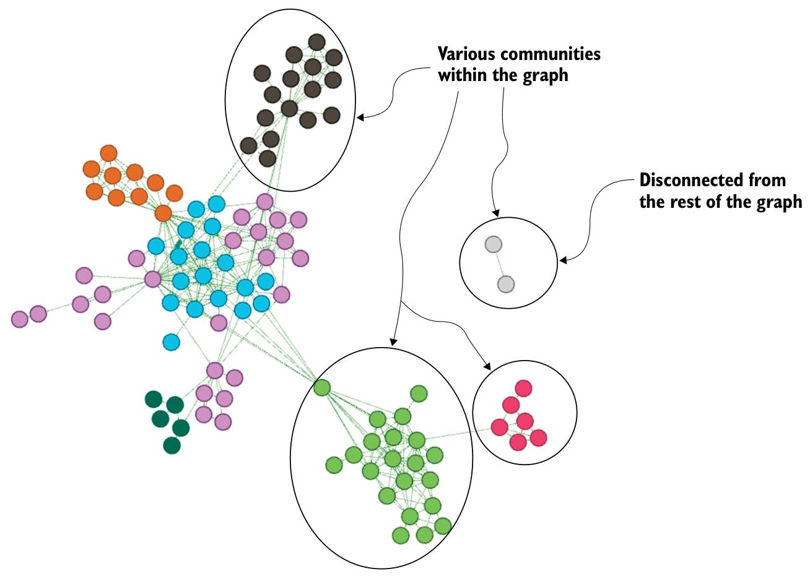

图7.3展示了一张图表，其中节点被划分为不同的社区，每个社区代表一组连接紧密且内部关联更强的实体。部分社区与整个图表的融合度较高，而另一些则显得较为孤立，形成了不相连的子图。识别这些簇有助于揭示数据集中的潜在结构、主题或关键群体。例如，在《奥德赛》这样的叙事作品中，可能会围绕参与某一特定事件或身处某一特定地点的人物形成一个社区。通过检测并总结这些社区，我们能够捕捉到超越单个实体连接的更高层次关系与洞见。

代码清单7.14中的代码应用了卢万方法（一种社区检测算法）来识别图中连接紧密的实体组。（原论文实现中使用的是莱登算法，该算法也在图数据科学库（GDS）中提供）检测到的社区随后会被存储为节点属性，用于后续的处理流程。

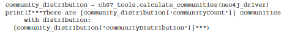

采用卢万方法在该图中检测出9个社区，其节点数量介于2至13个之间。从代码清单7.14中检测到的社区数量和规模会随图的结构变化，比如所提取的实体和关系的数量。此外，卢万算法不具备确定性，这意味着即便输入相同，由于算法的优化过程，不同运行中检测到的社区也可能存在细微差异。

层级社区结构:

MS GraphRAG 论文利用 Louvain 算法的分层特性来捕捉不同粒度层级的社区结构。这使得研究人员能够分析大型图中的宽泛社区和细粒度社区。不过，由于我们处理的是规模较小的图，因此我们将聚焦于单一层级的社区检测，略去分层部分。

现在你可以应用摘要提示词来为每个检测到的社群生成简洁概述。提示词的说明部分可在“社区汇总说明”中查看。

社区汇总说明

目标：

根据给定的社区实体列表、实体间关系以及可选的相关主张，撰写一份关于该社区的综合报告。该报告将用于向决策者提供与社区相关的信息及其潜在影响的参考。报告内容包括社区核心实体概述、实体的合规性、技术能力、声誉以及值得关注的主张。

报告结构：

- 标题：代表社区关键实体的社区名称——标题应简短且具体。尽可能在标题中纳入具有代表性的命名实体。
- 摘要：该社区整体结构、各实体间相互关系以及与各实体相关的重要信息的执行摘要。
- 影响严重程度评分：0-10 之间的浮点分数，代表社区内实体所造成影响的严重程度。影响是对社区重要性的评分。
- 评分说明：用一句话解释影响严重程度评分。
- 详细研究结果：列出5-10条关于该社区的关键见解。每条见解均需包含简短摘要，随后依据下述依据规则撰写多段解释性内容，内容需全面详尽。

“社区汇总说明”中的提示词指导AI助手生成所检测社区的结构化摘要，确保摘要涵盖关键实体、关系以及重要见解。其目标是生成高质量摘要，以便在下游有效用于检索增强生成（RAG）。

用于社区摘要的完整提示词包含输出说明和少量示例，以确保生成的摘要保持一致性和相关性。

确定了各个社区并制定了结构化的总结提示词后，我们现在可以为每个检测到的社区生成全面的总结。这些社区总结整合了关键实体、关系和重要见解。

以下代码清单中的代码会处理检测到的社区，并应用摘要提示词以生成有意义的描述。

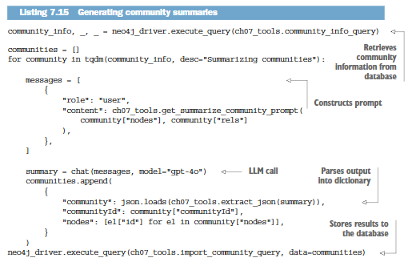

你现在可以查看使用清单 7.16 中所示代码生成的社区摘要示例。这将提供一个具体示例，展示摘要过程如何捕捉社区内的关键实体、关系和见解。

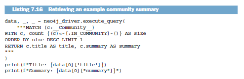

结果可在特勒马科斯与密涅瓦之间关系的“生成摘要”中查看。

生成的社区摘要:

密涅瓦、忒勒玛科斯与伊萨卡家庭
故事围绕密涅瓦、忒勒玛科斯以及尤利西斯的家庭展开，其中充满了神谕指引、家族忠诚与求婚者带来的挑战等重要互动。密涅瓦在为忒勒玛科斯出谋划策方面发挥着关键作用，忒勒玛科斯决心找到父亲并恢复家中秩序。这些角色与家庭之间的关系凸显了智慧、勇气与坚韧的主题。

在大型图中处理大型社区:

处理较大的图谱时，社区可能会变得过于庞大，无法高效处理。如果一个社区包含过多实体和关系，将所有这些都纳入摘要提示词可能会超出令牌限制，或生成过长的摘要。为解决这一问题，应实施一种排序机制，仅选择最相关的实体和关系。这能确保摘要保持简洁、信息丰富，且对下游检索增强生成（RAG）应用程序具有实用价值。

恭喜！你已成功完成图索引步骤。

## 3. 图检索器

随着图索引流程完成，我们进入图检索阶段。该阶段的重点是从结构化图中检索相关信息，以有效回答查询。尽管存在多种可行的检索策略，我们将重点介绍两种主要方法：局部搜索和全局搜索。局部搜索从检测到的社区内紧密关联的实体中获取信息，而全局搜索则考量整个图结构，以找到最相关的信息。

### 3.1. 全局检索

GraphRAG 中的全局搜索以社区摘要作为中间响应，高效回答需要在整个数据集上聚合信息的查询。该方法不再基于向量相似度检索单个文本片段，而是利用预计算的社区级摘要生成结构化响应。图 7.4 展示了全局搜索的示意图。

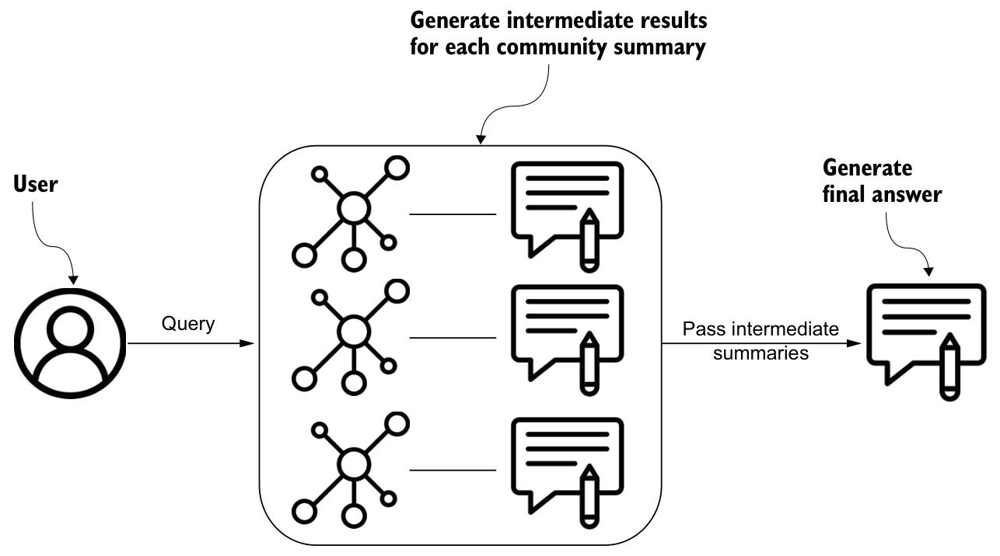

图7.4中的流程遵循映射归约（map-reduce）方法：

- 映射步骤——给定用户查询以及（可选的）对话历史，GraphRAG 从图的社区层级结构中的指定层级检索由大模型生成的社区报告。在你的实现中，图被构建为单层社区结构，即所有检测到的群组都处于同一层级深度。这些报告被分割为可处理的文本块，每个块均由大模型处理以生成中间结果。每个结果都包含一组要点，每个要点都配有一个数值重要性评分。
- 精简步骤——筛选并汇总所有中间回复中的核心要点。这些经过提炼的见解随后将作为大语言模型（LLM）的最终上下文，由其为用户查询整合出逻辑连贯的答案。通过将数据集构建为语义上有意义的聚类，GraphRAG 即便面对宽泛的主题类查询，也能实现高效且逻辑连贯的信息检索。

map步骤使用以下系统提示，如“检索器的map部分的系统提示”中所示。

社区层级结构：

回复的质量取决于用于获取社区报告的社区层级等级。较低层级的社区会提供详细的报告，从而生成更全面的回复，但同时也会增加大语言模型的调用次数和处理时间。较高层级的社区拥有更抽象的摘要，效率可能更高，但存在丢失细节的风险。平衡细节与效率是优化全局搜索性能的关键。

—角色—

你是一位乐于助人的助手，需要综合多位分析师的观点来回答有关数据集的问题。

—目标—

生成符合目标长度和格式的回复，以回答用户的问题，并汇总所有聚焦于数据集不同部分的多位分析师的报告内容。

请注意，以下提供的分析师报告按重要性从高到低排序。

如果你不知道答案，或者提供的报告中没有足够的信息来给出答案，直接说明即可。不要编造任何内容。

最终回复需剔除分析师报告中的所有无关信息，并将整理后的信息整合为一份全面的答案，结合回复的篇幅与格式要求，对所有核心要点及相关影响作出阐释。

根据篇幅和格式要求，为回复内容添加章节与注释说明，并以 Markdown 格式排版。

本回复应保留“应”“可”“将”等情态动词的原意及用法。

该回复还应保留分析师报告中先前包含的所有数据参考，但不得提及多名分析师在分析过程中的作用。

单个引用中列出的记录ID不得超过5个。请列出前5个最相关的记录ID，并添加“+more”以表示还有更多记录ID。

例如：

“X先生是Y公司的所有者，且面临多项不当行为指控【数据来源：报告（2、7、34、46、64及更多）】。他同时也是X公司的首席执行官【数据来源：报告（1、3）】”

其中1、2、3、7、34、46和64代表相关数据记录的编号（而非索引）。

不得包含无佐证信息的内容。

—目标回复长度与格式—

{response_type}

reduce 系统提示指示大语言模型（LLM）从多份分析师报告中提炼关键要点，并按重要性对要点进行排序。回复必须采用 Markdown 格式，根据目标长度和格式进行合理结构化处理，且剔除无关细节。模型需保留所有引用数据，同时避免给出推测性答案。最终输出会整合并优化报告中的核心见解，形成逻辑连贯、内容全面的回复。

现在我们可以将映射和归约提示词整合为一个全局搜索函数。

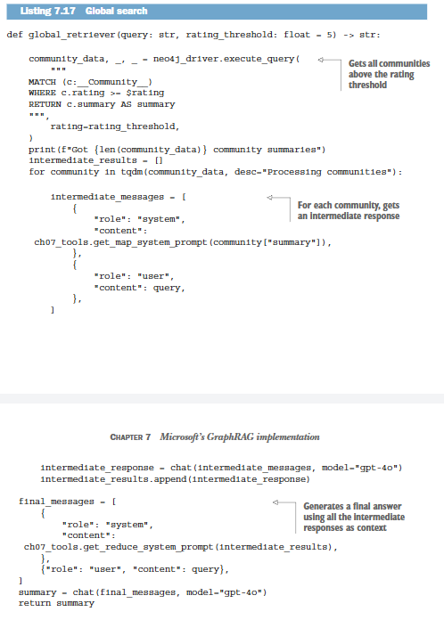
