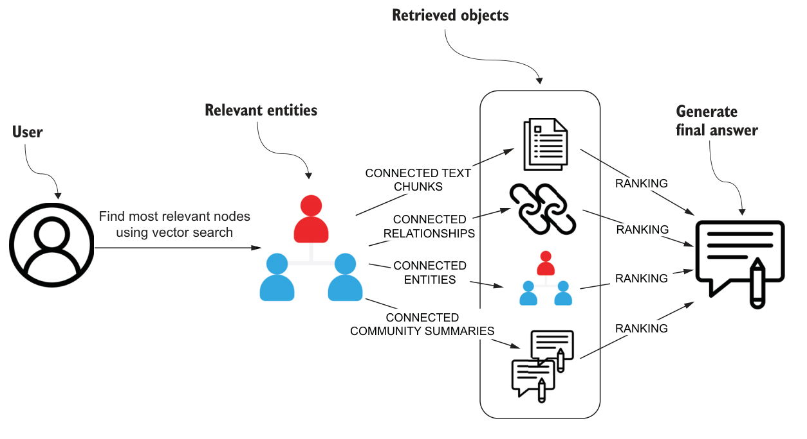

## 0. 章节简介

在第 6 章中，你学习了如何从法律文档中提取结构化信息以构建知识图谱。在本章中，你将探索一种略有不同的提取与处理流程，它采用了微软 GraphRAG 方法（Edge 等人，2024）。这个端到端的示例仍然会构建知识图谱，但更侧重于对实体及其关系进行自然语言摘要。整个流程如图 7.1 所示。

微软 GraphRAG（项目地址：https://github.com/microsoft/graphrag）的一项核心创新，在于借助大语言模型（LLM）通过两阶段流程构建知识图谱。在第一阶段，系统会从源文档中提取并总结实体与关系，以此作为构建知识图谱的基础，对应图 7.1 中知识图谱构建之前的各个步骤。微软 GraphRAG 的独特之处在于：在知识图谱构建完成之后，系统还会进一步在图上检测社区，并为彼此紧密关联的实体组生成特定领域的摘要。


_图 7.1 微软 GraphRAG 的处理流程。（图片来自 Edge 等人，2024，依据 CC BY 4.0 许可使用）_

这种分层方法能够把分散在各个文本块中的碎片化信息，整合为围绕特定实体、关系与社区组织起来的、连贯而有条理的表示。随后，这些实体级与社区级摘要即可用于为 RAG 应用中的用户查询提供相关信息。借助这样一个结构化的知识图谱，我们可以应用多种检索方法。在本章中，你将学习微软 GraphRAG 论文中描述的两种检索方法：全局搜索与局部搜索。

## 1. 数据集选择

微软 GraphRAG 的目标，是通过提取关键实体、并生成跨多个文本块整合信息的摘要，来处理非结构化文本文档。为了获得有价值的洞见，所选数据集不仅要包含丰富的实体信息，还应当让同一实体的数据分布在多个文本块之中。由于实体类型是微软 GraphRAG 中可配置的一项，因此必须提前定义。常见的实体类型通常包括人物、组织和地点，但也可以扩展到特定领域的概念，例如医学中的基因与通路，或法律中的合同条款。

要合理确定实体类型，先充分探索数据集、并明确你希望回答的问题类型，是非常重要的一步。实体类型的选择会塑造整个下游流程，直接影响实体提取、实体链接与摘要生成的质量。

例如，微软 GraphRAG 论文所使用的数据集来自播客和新闻文章。在这两类文本中，人物、组织和地点等实体通常都会频繁出现。此外，视具体主题而定，例如播客内容围绕游戏或健康生活方式展开时，你可能还需要纳入特定领域的实体，如游戏名称、健康状况或营养相关概念，以确保信息提取与分析足够全面。

本章以《奥德赛》为例来评估微软 GraphRAG。这部作品叙事内容丰富，包含人物、神祇、神秘武器等多种元素；更重要的是，尤利西斯等关键实体会反复出现在多个文本块中，因此非常适合用来检验实体提取与跨文本块摘要的效果。

在本章余下部分，你将动手实现微软 GraphRAG 方法。若你希望跟随实操，需要准备一个正在运行且内容为空的 Neo4j 实例，可以是本地部署，也可以是云端托管，只需确保数据库为空即可。你也可以直接参考配套的 Jupyter Notebook 完成实现，地址如下：https://github.com/tomasonjo/kg-rag/blob/main/notebooks/ch07.ipynb。

下面我们正式开始。

## 2. 图索引

在这里，你将构建知识图谱并生成实体与社区摘要。在整个构建过程中，你会探索每一步的关键考量因素，包括实体选择、图谱连通性，以及这些选择如何影响摘要与查询的质量。

首先从古腾堡计划（https://www.gutenberg.org/ebooks/1727）加载《奥德赛》。


文本准备就绪后，你现在就可以逐步走完整个微软 GraphRAG 流程了。

### 2.1. 分块

《奥德赛》由 24 卷篇幅各异的内容组成。你的首要任务是移除序言和脚注，再把全文按卷切分，如下方代码清单所示。这种做法顺应了叙事本身的自然分界，因此能以更具语义意义的方式来组织文本。


接下来，你需要统计每一卷的 token 数量，以判断是否还需要进一步分块。下面的代码清单会给出各卷 token 数量的基本统计信息。


24 卷的 token 数量差异很大：平均约 6,515 个 token，最少为 4,459 个，最多为 10,760 个。鉴于跨度如此之大，就需要进一步分块，以确保没有任何一个片段超出合理的 token 上限。

那么，多大的块才算合理？微软 GraphRAG 的研究人员对比了不同的块大小，并分析了它们对提取到的实体总数的影响，结果如图 7.2 所示。


_图 7.2 块大小与自反思迭代次数对实体提取的影响。（图片来自 Edge 等人，2024，依据 CC BY 4.0 许可使用）_

图 7.2 中的结果表明，较小的块往往能够提取出更多的实体引用。代表 600 个 token 块大小的曲线始终最高，而 2,400 个 token 块大小的曲线则最低。这说明，相较于较大的块，把文本切分成更小的块能够让大语言模型识别出更多实体。此外，图 7.2 还显示，增加自反思迭代（self-reflection）的轮次，也就是在同一文档上执行额外的提取遍历，会在所有块大小下都带来更多的实体引用。这一规律表明，重复遍历能够帮助大语言模型提取出早期轮次中可能遗漏的实体。

假设你已经决定按 1000 词的上限（基于空格切分）对各卷进行分块，并保留 40 个词的重叠，如下所示。


各卷文本已完成分块，你可以进入下一步了。

### 2.2. 实体与关系提取

第一步是提取实体和关系。这里我们可以直接借鉴微软 GraphRAG 论文附录中提供的提示词。实体与关系提取提示词的指令部分展示于《实体与关系提取说明》中。

实体与关系提取说明

-目标

给定一份可能与本活动相关的文本文档以及一组实体类型，从文本中识别出这些类型的所有实体，并找出已识别实体之间的所有关系。

1 识别所有实体。针对每个已识别的实体，提取以下信息：

- 实体名称：实体的名称，首字母大写
- 实体类型：以下类型之一：[{entity_types}]
- 实体描述：对实体的属性和活动的全面说明

将每个实体格式化为（"实体"{元组分隔符}"实体名称"{元组分隔符} <实体类型>{元组分隔符}<实体描述>）

2 从步骤1识别出的实体中，找出所有彼此存在明确关联的（源实体，目标实体）对。针对每一对关联实体，提取以下信息：

- 源实体：在步骤1中识别出的源实体名称
- 目标实体：在步骤1中识别出的目标实体名称
- relationship_description：解释你认为源实体与目标实体之间存在关联的原因
- relationship_strength：一个数字分数，用于表示源实体与目标实体之间关系的强度

将每个关系格式化为（"关系"{元组分隔符}<源实体> {元组分隔符}<目标实体>{元组分隔符}<关系描述> {元组分隔符}<关系强度>）

3 以英文输出，以列表形式呈现步骤1和步骤2中识别的所有实体和关系。使用{record_delimiter}作为列表分隔符。

4 完成后，输出{完成分隔符}

实体与关系抽取的说明聚焦于通过识别指定类型的实体及其关系，从文本文档中提取结构化知识。实体类型列表作为变量 entity_types 传入。该提示词指示大语言模型（LLM）抽取实体、按类型对其分类并提供详细描述。随后，模型需识别明确相关的实体对，解释其关联关系并分配关系强度分数。最后，以结构化、带分隔符的格式返回所有抽取的实体和关系。这只是完整提示词的一部分，完整提示词还包含少样本示例和输出示例，但这些内容篇幅过长，无法收录在本书中。

要从《奥德赛》中提取有意义的实体，假设你决定使用以下实体类型：

- PERSON
- ORGANIZATION
- LOCATION
- GOD
- EVENT
- CREATURE
- WEAPON_OR_TOOL

一些实体类型，如人物（PERSON）和神祇（GOD），相对明确，因为它们指代的是定义清晰的人类和神灵类别。然而，另一些实体类型，如事件（EVENT）和地点（LOCATION），则更为模糊。事件（EVENT）可以指代从单一行为到整场战争的任何事物，这使得为其分类划定严格界限变得困难。同样，地点（LOCATION）可以指代国家这样的宽泛类别、特定城市，甚至是城市内的某个具体命名地点。这种多样性让一致的分类更具挑战性，但同时也为大语言模型（LLM）保留了更大的判断灵活度。

基于这些预定义的实体类型，你现在将实现提取函数。


清单7.5中的代码通过先定义要识别的实体类型来提取实体和关系。随后，它利用这些类型和输入文本生成提取提示词，将提示词发送给大语言模型（LLM），并将响应处理为结构化的字典格式。

借助清单 7.5 中的函数，这里只对《奥德赛》的第一卷提取实体和关系。如有需要，你可以增加处理的卷数，以覆盖更大篇幅的文本。该提取过程的代码见下方代码清单。


清单 7.6 中的函数会处理指定数量的卷，从每个文本块中提取实体和关系，随后先将实体导入 Neo4j，再导入它们之间的关系，从而构建出文本的结构化图表示。

首先回顾提取的实体和关系。你可以使用以下代码清单中的代码统计实体和关系的总数。


该图包含 66 个实体和 182 个关系，不过这些数值在不同运行中可能会有所变化。微软 GraphRAG 侧重于提取实体及其关系的详细描述。例如，我们来查看为俄瑞斯忒斯这一角色提取出的描述信息。


查看为俄瑞斯忒斯这一角色提取出的描述内容（如代码清单 7.8 所示），结果可能如下：

- 俄瑞斯忒斯是阿伽门农之子，他杀死了埃癸斯托斯。
- 俄瑞斯忒斯是那个被期望向埃癸斯托斯复仇的人。
- 俄瑞斯忒斯因杀死埃癸斯托斯为父报仇而受到赞扬。
- 俄瑞斯忒斯是杀死了埃癸斯托斯的阿伽门农之子。
- 俄瑞斯忒斯是一个被期望向埃癸斯托斯复仇的人。
- 俄瑞斯忒斯因杀死埃吉斯托斯为父报仇而受到称赞。

尽管部分描述会重复相同的事实，但它们整体上包含了所有关键细节，并确保特定实体的不同文本片段中不会丢失任何重要信息。

同样，一对实体之间可以存在多种关系。你可以使用下方代码清单中的代码来探究关系数量最多的那对实体。


关系数量最多的实体对是忒勒玛科斯与密涅瓦，二者共有14种关系。他们的互动贯穿叙事中的多个关键时刻，凸显了密涅瓦作为忒勒玛科斯的神圣指引者与导师的角色。

以下是提取出的五条关系描述：

- 忒勒玛科斯在宴会上轻声对密涅瓦说话。
- 密涅瓦乔装打扮，为忒勒玛科斯出谋划策、鼓励他，赋予他勇气，并让他思念自己的父亲。
- 密涅瓦让忒勒玛科斯的母亲入睡，展现了她的神性影响力。
- 密涅瓦正与忒勒玛科斯交谈，为他提供指引与安慰。
- 密涅瓦伪装成门特斯，在门口受到忒勒玛科斯的迎接。

尽管部分描述存在细节重叠，但这些内容都强化了密涅瓦作为导师和神圣守护者的角色，逐步塑造着忒勒玛科斯的旅程。

### 2.3. 实体与关系摘要

为避免提取出的知识出现不一致、冗余和碎片化问题，微软 GraphRAG 会利用大语言模型（LLM）对同一实体或关系的多条描述进行合并，生成简洁的摘要。该模型不再单独处理每条描述，而是整合所有描述中的信息，确保关键上下文细节被保留在单一且更丰富的表征中。这种方法提升了内容的清晰度，减少了重复信息，还能让人们更全面地理解实体及其之间的关系。

你可以再次使用论文中的摘要提示词，如“实体与关系摘要说明”所示。

实体与关系摘要说明

你是一位乐于助人的助手，负责为以下提供的数据生成全面的摘要。给定一两个实体，以及一系列均与同一实体或实体组相关的描述，请将所有这些内容整合为一段完整、全面的描述。确保包含从所有描述中收集到的信息。如果提供的描述存在矛盾，请解决矛盾并给出一段连贯、统一的摘要。内容需以第三人称撰写，并包含实体名称，以便我们获取完整的上下文信息。

#######

- 数据

实体：{entity_name}

描述列表：{描述列表}

#######

输出：

“实体与关系摘要说明”中的提示词指导大语言模型通过合并某一实体或一对实体的多个描述，生成一份连贯的摘要。它确保纳入所有相关细节，同时解决矛盾、剔除冗余内容。输出内容采用第三人称书写，并明确提及实体名称，以保持清晰性和语境感。

使用“实体与关系摘要说明”中的提示词，你就可以为所有带有多条描述的实体生成汇总摘要。用于汇总实体描述的代码见下方代码清单。


清单7.10中的代码会查询Neo4j数据库，找出拥有多个描述的实体，然后使用大语言模型（LLM）生成统一的摘要。你可以运行以下清单中的代码，查看ORESTES的摘要描述。


结果展示在“ORESTES 的生成摘要”中。为俄瑞斯忒斯生成的摘要

俄瑞斯忒斯是阿伽门农之子，因杀死埃癸斯托斯为父报仇而闻名。人们本指望他向埃癸斯托斯复仇，正是此人策划了阿伽门农的谋杀案。俄瑞斯忒斯不负所望，成功杀死了杀害父亲的凶手埃癸斯托斯，因此备受赞誉。

摘要生成流程已成功生成出对某一实体的连贯且丰富的描述，正如“为 ORESTES 生成的摘要”所示。通过融合多个描述，我们在保留关键细节的同时减少了冗余信息。

接下来，我们将把相同的摘要方法应用到关系上，将多个关系描述整合为一份全面的摘要。结果如下所示。


清单7.12中的代码会识别数据库中存在多重关系的实体对，并借助大语言模型将它们的描述整合为一份单一摘要。通过合并关系描述，该流程能全面捕捉实体间的关键交互，同时消除冗余信息。生成的汇总关系会被重新存储回数据库中。

你可以查看生成的忒勒玛科斯与密涅瓦之间的关系摘要，如下所示。


代码清单7.13的结果可在“忒勒玛科斯与密涅瓦关系的生成摘要”中查看。

忒勒玛科斯与密涅瓦关系生成摘要

密涅瓦在忒勒玛科斯的人生中扮演着至关重要的角色，在他踏上寻找父亲尤利西斯的征程时，为他提供指引与支持。在一场宴会上，忒勒玛科斯轻声与密涅瓦交谈，这体现出二人之间亲密且相互信任的关系。密涅瓦常常化身他人，比如以门特斯的形象出现，为忒勒玛科斯出谋划策、给予鼓励，让他拥有探寻父亲下落的勇气与决心。她就忒勒玛科斯计划的航行提供建议，彰显了对他事业的支持。此外，密涅瓦施展神力让忒勒玛科斯的母亲陷入沉睡，这一行为也充分体现了她在忒勒玛科斯生活中守护与支持的角色。

至此，通过整合实体与关系的摘要，你已成功完成微软 GraphRAG 索引的第一阶段。通过合并不同文本块中的信息，你为提取的知识构建了更连贯、更丰富的表征。

实体与关系摘要的注意事项:

在处理更大规模的数据集时，你可能会遇到所谓的超级节点。超级节点是指出现在众多分块中且关联数量极多的实体。例如，若要处理整个古希腊历史，像雅典这样的节点会积累大量的关联和描述信息。如果没有排序机制，对这类节点进行总结可能会导致输出内容过长，更糟的是，部分描述甚至可能无法放入提示词中。为解决这一问题，你需要制定筛选或排序策略，优先呈现最相关的描述，确保总结内容简洁且信息丰富。

现在你可以继续进行下一阶段的操作了。

### 2.4. 社区检测与摘要

图索引流程的第二阶段聚焦于社区检测与汇总。社区指的是一组实体，它们彼此之间的连接密度高于与图中其余部分的连接密度。社区检测结果如图7.3所示。


_图 7.3 社区检测结果示例_

图 7.3 展示的图中，节点被划分为不同的社区，每个社区代表一组连接紧密且内部关联更强的实体。部分社区与整个图表的融合度较高，而另一些则显得较为孤立，形成了不相连的子图。识别这些簇有助于揭示数据集中的潜在结构、主题或关键群体。例如，在《奥德赛》这样的叙事作品中，可能会围绕参与某一特定事件或身处某一特定地点的人物形成一个社区。通过检测并总结这些社区，我们能够捕捉到超越单个实体连接的更高层次关系与洞见。

代码清单 7.14 中的代码使用 Louvain（卢万）算法这一社区检测算法，来识别图中连接紧密的实体组。（原论文的实现采用的是 Leiden（莱登）算法，该算法同样可在图数据科学库（GDS）中使用。）检测到的社区随后会被存储为节点属性，供后续处理流程使用。


在该图上运行 Louvain 算法，共检测出 9 个社区，各社区的节点数量介于 2 至 13 个之间。代码清单 7.14 检测到的社区数量与规模，会随图的结构而变化，例如所提取实体和关系的数量。此外，Louvain 算法不具备确定性：即便输入相同，由于其优化过程的特性，不同运行得到的社区划分也可能存在细微差异。

层级社区结构:

微软 GraphRAG 论文利用 Louvain 算法的分层特性来捕捉不同粒度层级的社区结构。这使得研究人员能够分析大型图中的宽泛社区和细粒度社区。不过，由于我们处理的是规模较小的图，因此我们将聚焦于单一层级的社区检测，略去分层部分。

现在你可以应用摘要提示词，为每个检测到的社区生成简洁的概述。提示词的说明部分可在“社区摘要说明”中查看。

社区摘要说明

目标：

根据给定的社区实体列表、实体间关系以及可选的相关主张，撰写一份关于该社区的综合报告。该报告将用于向决策者提供与社区相关的信息及其潜在影响的参考。报告内容包括社区核心实体概述、实体的合规性、技术能力、声誉以及值得关注的主张。

报告结构：

- 标题：代表社区关键实体的社区名称——标题应简短且具体。尽可能在标题中纳入具有代表性的命名实体。
- 摘要：该社区整体结构、各实体间相互关系以及与各实体相关的重要信息的执行摘要。
- 影响严重程度评分：0-10 之间的浮点分数，代表社区内实体所造成影响的严重程度。影响是对社区重要性的评分。
- 评分说明：用一句话解释影响严重程度评分。
- 详细研究结果：列出5-10条关于该社区的关键见解。每条见解均需包含简短摘要，随后依据下述依据规则撰写多段解释性内容，内容需全面详尽。

“社区摘要说明”中的提示词指导大语言模型为检测到的社区生成结构化摘要，确保摘要涵盖关键实体、关系以及重要见解。其目标是生成高质量的摘要，以便在下游的检索增强生成（RAG）中得到有效利用。

用于社区摘要的完整提示词包含输出说明和少量示例，以确保生成的摘要保持一致性和相关性。

确定了各个社区并制定了结构化的总结提示词后，我们现在可以为每个检测到的社区生成全面的总结。这些社区总结整合了关键实体、关系和重要见解。

以下代码清单中的代码会处理检测到的社区，并应用摘要提示词以生成有意义的描述。


你现在可以查看使用清单 7.16 中所示代码生成的社区摘要示例。这将提供一个具体示例，展示摘要过程如何捕捉社区内的关键实体、关系和见解。


结果如下方“生成的社区摘要”所示。

生成的社区摘要:

密涅瓦、忒勒玛科斯与伊萨卡家庭
故事围绕密涅瓦、忒勒玛科斯以及尤利西斯的家庭展开，其中充满了神谕指引、家族忠诚与求婚者带来的挑战等重要互动。密涅瓦在为忒勒玛科斯出谋划策方面发挥着关键作用，忒勒玛科斯决心找到父亲并恢复家中秩序。这些角色与家庭之间的关系凸显了智慧、勇气与坚韧的主题。

在大型图中处理大型社区:

处理较大的图时，社区可能会变得过于庞大，难以高效处理。如果一个社区包含过多实体和关系，将它们全部纳入摘要提示词，可能会超出 token 上限，或生成过长的摘要。为解决这一问题，应引入一种排序机制，只选取最相关的实体和关系。这样才能确保摘要既简洁、信息量又充足，从而对下游的检索增强生成（RAG）应用真正具有实用价值。

恭喜！你已成功完成图索引步骤。

## 3. 图检索器

随着图索引流程完成，我们进入图检索阶段。该阶段的重点是从结构化图中检索相关信息，以有效回答查询。尽管存在多种可行的检索策略，我们将重点介绍两种主要方法：局部搜索和全局搜索。局部搜索从检测到的社区内紧密关联的实体中获取信息，而全局搜索则考量整个图结构，以找到最相关的信息。

### 3.1. 全局搜索

GraphRAG 中的全局搜索以社区摘要作为中间响应，高效回答需要在整个数据集上聚合信息的查询。该方法不再基于向量相似度检索单个文本片段，而是利用预计算的社区级摘要生成结构化响应。图 7.4 展示了全局搜索的示意图。


_图 7.4 全局搜索_

图 7.4 中的流程遵循映射-归约（map-reduce）方法：

- 映射（map）步骤——给定用户查询以及（可选的）对话历史，GraphRAG 会从图的社区层级结构中的指定层级检索由大语言模型生成的社区报告。在本章的实现中，图被构建为单层社区结构，即所有检测到的社区都处于同一层级深度。这些报告会被切分为便于处理的文本块，每个文本块都由大语言模型处理以生成中间结果。每个中间结果都包含一组要点，且每个要点都配有一个数值化的重要性评分。
- 归约（reduce）步骤——从所有中间结果中筛选并汇总核心要点。这些经过提炼的见解随后会作为大语言模型（LLM）的最终上下文，由其为用户查询整合出逻辑连贯的答案。通过把数据集组织为语义上有意义的聚类，GraphRAG 即便面对宽泛的主题类查询，也能实现高效且连贯的信息检索。

映射（map）步骤使用如下系统提示，如“检索器映射部分的系统提示”中所示。

检索器映射部分的系统提示

—角色—

你是一位乐于助人的助手，负责回答与所提供表格数据相关的问题。

—目标—

生成一份由要点列表构成的回复，用于回答用户的问题，并对输入数据表格中的所有相关信息加以概括。

你应以下方数据表格中提供的数据作为生成回复的主要依据。如果你不知道答案，或者输入数据表格中的信息不足以给出答案，直接说明即可，不要编造任何内容。

回复中的每个要点都应包含以下元素：

- 描述：对该要点的全面说明。
- 重要性评分：一个介于 0 到 100 之间的整数，用于表示该要点对回答用户问题的重要程度。“我不知道”这类回复的评分应为 0。

回复应采用如下 JSON 格式：{{ "points": [ {{"description": "要点 1 的描述 [Data: Reports (report ids)]", "score": score_value}}, {{"description": "要点 2 的描述 [Data: Reports (report ids)]", "score": score_value}} ] }}

回复应保留“应”“可”“将”等情态动词的原意及用法。

有数据支撑的要点应按如下方式列出相关报告作为引用：“这是一句由数据引用支撑的示例句子 [Data: Reports (report ids)]”。

单个引用中列出的记录 ID 不得超过 5 个。请列出最相关的前 5 个记录 ID，并添加“+more”以表示还有更多记录。

例如：“X 先生是 Y 公司的所有者，且面临多项不当行为指控 [Data: Reports (2, 7, 64, 46, 34, +more)]。他同时也是 X 公司的首席执行官 [Data: Reports (1, 3)]”，

其中 1、2、3、7、34、46 和 64 代表所提供表格中相关数据报告的 ID（而非索引）。

不得包含缺乏佐证信息的内容。

—数据表格—

{context_data}

映射系统提示指示大语言模型（LLM）从所提供的上下文中提取要点，以回答用户的查询。每个要点都包含一段描述和一个重要性评分（0–100），用于反映其与查询的相关程度。回复以 JSON 格式返回，并附带对支撑数据报告 ID 的引用。若信息不足，则回复必须如实说明，而不得凭空臆测。

社区层级结构：

回复的质量取决于用于获取社区报告的社区层级等级。较低层级的社区会提供详细的报告，从而生成更全面的回复，但同时也会增加大语言模型的调用次数和处理时间。较高层级的社区拥有更抽象的摘要，效率可能更高，但存在丢失细节的风险。平衡细节与效率是优化全局搜索性能的关键。

接下来，你将查看检索器的归约（reduce）步骤，如“检索器归约部分的系统提示”中所示。

检索器归约部分的系统提示

—角色—

你是一位乐于助人的助手，需要综合多位分析师的观点来回答有关数据集的问题。

—目标—

生成符合目标长度和格式的回复，以回答用户的问题，并汇总所有聚焦于数据集不同部分的多位分析师的报告内容。

请注意，以下提供的分析师报告按重要性从高到低排序。

如果你不知道答案，或者提供的报告中没有足够的信息来给出答案，直接说明即可。不要编造任何内容。

最终回复需剔除分析师报告中的所有无关信息，并将整理后的信息整合为一份全面的答案，结合回复的篇幅与格式要求，对所有核心要点及相关影响作出阐释。

根据篇幅和格式要求，为回复内容添加章节与注释说明，并以 Markdown 格式排版。

本回复应保留“应”“可”“将”等情态动词的原意及用法。

该回复还应保留分析师报告中先前包含的所有数据参考，但不得提及多名分析师在分析过程中的作用。

单个引用中列出的记录ID不得超过5个。请列出前5个最相关的记录ID，并添加“+more”以表示还有更多记录ID。

例如：

“X先生是Y公司的所有者，且面临多项不当行为指控【数据来源：报告（2、7、34、46、64及更多）】。他同时也是X公司的首席执行官【数据来源：报告（1、3）】”

其中1、2、3、7、34、46和64代表相关数据记录的编号（而非索引）。

不得包含无佐证信息的内容。

—目标回复长度与格式—

{response_type}

归约（reduce）系统提示指示大语言模型（LLM）从多份分析师报告中提炼关键要点，并按重要性对要点进行排序。回复必须采用 Markdown 格式，根据目标长度和格式进行合理结构化处理，且剔除无关细节。模型需保留所有引用数据，同时避免给出推测性答案。最终输出会整合并优化报告中的核心见解，形成逻辑连贯、内容全面的回复。

现在我们可以将映射和归约提示词整合为一个全局搜索函数。


清单 7.17 中的 `global_retriever` 函数利用社区摘要生成结构化回复，实现了全局搜索方法。它遵循一个三步流程：

1. 检索相关社区——该函数查询 Neo4j 数据库，取出评分达到或超过指定阈值的社区摘要。这样可以确保只有最相关的社区才会对最终答案作出贡献。
2. 生成中间结果——针对每个社区，使用映射（map）系统提示生成一份中间结果。模型会结合社区摘要与用户查询，从中提取关键要点。
3. 汇总并生成最终答案——随后应用归约（reduce）系统提示，把所有中间结果整合为一份逻辑连贯的最终答案，确保最重要的要点得以保留，并被合理地组织起来。

现在，我们可以用一个示例来测试这个函数。

```python
print(global_retriever("What is this story about?"))
```

清单 7.18 的运行结果可在“使用全局搜索回答‘这个故事讲了什么？’”中查看。

使用全局搜索回答“这个故事讲了什么？”

这个故事围绕一个社区错综复杂的动态关系展开，其中的关键人物包括密涅瓦、忒勒玛科斯以及尤利西斯一家。核心主题涵盖神谕指引、家族忠诚，以及求婚者带来的挑战。密涅瓦在为忒勒玛科斯出谋划策方面发挥着关键作用——忒勒玛科斯决心找到自己的父亲尤利西斯，并重整家中秩序。这些人物之间的关系凸显了智慧、勇气与坚韧的主题。

此外，叙事还着重刻画了门特斯的角色。门特斯是塔福斯人的首领，被认为是安基阿罗斯之子。他正前往以铁货闻名的特墨萨，并自称拥有对塔福斯人的统治权 [Data: Reports (1)]。故事同样以希腊神话中的关键人物奥德修斯为中心，讲述了他与阿开亚人、拉厄耳忒斯以及诸神等重要实体之间的联系。这些关系凸显了神明干预对人类事务的影响，展现出诸神如何左右希腊英雄的命运 [Data: Reports (1, 2, 3, 4, 5)]。

叙事还进一步探讨了涉及奥林匹斯的乔武、埃癸斯托斯、阿伽门农、俄瑞斯忒斯与墨丘利的神话元素，凸显了神明干预、背叛与复仇等主题。奥林匹斯的乔武谈及埃癸斯托斯的行径——此人因背叛并谋杀阿伽门农而臭名昭著；而俄瑞斯忒斯则不顾墨丘利的警告，杀死埃癸斯托斯，为父报仇 [Data: Reports (1, 2, 3, 4, 5)]。这些彼此交织的故事编织出一幅丰富的神话与英雄图景，凸显了这些传奇人物留下的持久影响及其所面临的挑战。

“使用全局搜索回答‘这个故事讲了什么？’”中由全局搜索方法生成的回复，通过综合来自多个文本块的关键主题与关系，为整个故事提供了一份结构化的概述。它突出了密涅瓦、忒勒玛科斯和尤利西斯这几位核心人物及其在叙事中的角色，并着重呈现了神谕指引、家族忠诚，以及尤利西斯一家所面临的挑战。

> 练习 7.2
>
> 尝试使用全局搜索函数运行不同类型的查询。提出那些需要综合多份社区摘要信息的宽泛问题，例如“这个故事中的核心冲突有哪些？”。

### 3.2. 局部搜索

局部搜索方法通过将结构化的知识图谱数据与源文档中的非结构化文本相结合，来增强大语言模型的回复。这种方法尤其适合以实体为核心的查询，例如“洋甘菊有哪些疗愈功效？”——这类问题需要对某个特定实体及其关系有深入理解。局部搜索的整体流程如图 7.5 所示。

当用户提交查询时，图 7.5 所示的系统会首先借助向量搜索，在知识图谱中找出语义相关的实体。这些实体充当检索相关信息的入口，用于获取与之直接相连的实体、关系，以及来自社区报告的摘要。此外，系统还会抽取与这些实体关联的输入文档文本块。检索到的数据会经过排序和筛选，以便装入受限的上下文窗口，从而确保只有最相关的信息才会被纳入最终回复。



_图 7.5 局部搜索：先通过向量搜索找到最相关的实体，再沿图结构扩展，获取相连的文本块、关系、实体以及社区摘要，经排序后交给大语言模型生成最终答案。_

要实现局部搜索，我们首先需要为实体计算文本嵌入，并创建一个向量索引。这样才能根据用户查询高效地检索出最相关的实体。通过把实体描述与关系嵌入到向量空间中，我们就可以利用相似性搜索来判断哪些实体与输入内容最为接近。一旦找到这些相关实体，它们便可作为入口，用于检索更多结构化与非结构化数据。计算这些嵌入向量并构建向量索引的代码如下方清单所示。

```python
entities, _, _ = neo4j_driver.execute_query(
    """
MATCH (e:__Entity__)
RETURN e.summary AS summary, e.name AS name
"""
)
data = [{"name": el["name"], "embedding": embed(el["summary"])[0]} for el in entities]
neo4j_driver.execute_query(
    """
UNWIND $data AS row
MATCH (e:__Entity__ {name: row.name})
CALL db.create.setNodeVectorProperty(e, 'embedding', row.embedding)
""",
    data=data,
)
neo4j_driver.execute_query(
    """
CREATE VECTOR INDEX entities IF NOT EXISTS
FOR (n:__Entity__)
ON (n.embedding)
""",
    data=data,
)
```

清单 7.19 中的代码会从数据库中取出所有实体及其摘要，基于每个实体的摘要计算文本嵌入，再把嵌入向量写回数据库。最后，它创建一个向量索引，以便对实体嵌入执行高效的相似性搜索。

局部搜索最终通过一条 Cypher 语句来实现：它将经由向量搜索找出的初始相关节点集合，扩展到与之相连的实体、文本块、摘要和关系。该 Cypher 语句如下方清单所示。

```cypher
local_search_query = """
CALL db.index.vector.queryNodes('entities', $k, $embedding)
YIELD node, score
WITH collect(node) as nodes
WITH collect {
    UNWIND nodes as n
    MATCH (n)<-[:HAS_ENTITY]->(c:__Chunk__)
    WITH c, count(distinct n) as freq
    RETURN c.text AS chunkText
    ORDER BY freq DESC
    LIMIT $topChunks
} AS text_mapping,
collect {
    UNWIND nodes as n
    MATCH (n)-[:IN_COMMUNITY]->(c:__Community__)
    WITH c, c.rank as rank, c.weight AS weight
    RETURN c.summary
    ORDER BY rank, weight DESC
    LIMIT $topCommunities
} AS report_mapping,
collect {
    UNWIND nodes as n
    MATCH (n)-[r:SUMMARIZED_RELATIONSHIP]-(m)
    WHERE m IN nodes
    RETURN r.summary AS descriptionText
    ORDER BY r.rank, r.weight DESC
    LIMIT $topInsideRels
} as insideRels,
collect {
    UNWIND nodes as n
    RETURN n.summary AS descriptionText
} as entities
RETURN {Chunks: text_mapping, Reports: report_mapping,
       Relationships: insideRels,
       Entities: entities} AS text
"""
```

清单 7.20 中检索到的所有对象——文本块、社区描述、关系以及实体摘要——都会经过排序并加以数量限制，以确保提示词长度可控。文本块按其与相关实体的关联频次排序，并截取前 `topChunks` 个；社区描述按等级（rank）和权重（weight）排序，只选取前 `topCommunities` 个；关系按其重要性排序，并限制为前 `topInsideRels` 个；实体摘要则不额外施加排序约束直接取回。这样就能保证只有最相关的信息才会被纳入回复。

最后，你需要定义摘要提示词。它同样借鉴自原论文，如“局部搜索的系统提示”所示。

局部搜索的系统提示

—角色—

你是一位乐于助人的助手，负责回答与所提供表格数据相关的问题。

—目标—

生成一份符合目标长度和格式的回复，用于回答用户的问题；在符合回复长度与格式要求的前提下，概括输入数据表格中的所有信息，并融入任何相关的常识性知识。

如果你不知道答案，直接说明即可，不要编造任何内容。

有数据支撑的要点应按如下方式列出其数据引用：

“这是一句由多处数据引用支撑的示例句子 [Data: <数据集名称> (record ids); <数据集名称> (record ids)]。”

单个引用中列出的记录 ID 不得超过 5 个。请列出最相关的前 5 个记录 ID，并添加“+more”以表示还有更多记录。

例如：

“X 先生是 Y 公司的所有者，且面临多项不当行为指控 [Data: Sources (15, 16), Reports (1), Entities (5, 7); Relationships (23); Claims (2, 7, 34, 46, 64, +more)]。”

其中 15、16、1、5、7、23、2、7、34、46 和 64 代表相关数据记录的 ID（而非索引）。

不得包含缺乏佐证信息的内容。

—目标回复长度与格式—

{response_type}

—数据表格—

{context_data}

“局部搜索的系统提示”旨在基于结构化数据表格生成回复，同时保持准确性与透明度。它指示助手综合与用户查询相关的信息，并确保每项论断都有明确的数据引用作为支撑。数据来源的引用格式强制采用一种结构化的方式：限制每条引用中的记录 ID 数量，并在存在更多支撑记录时予以标注。该提示词还特别强调：如果在所提供的数据中找不到答案，助手应明确说明，而不得凭空编造信息。

有了这些准备之后，你现在就可以实现局部搜索了。

```python
def local_search(query: str) -> str:
    context, _, _ = neo4j_driver.execute_query(
        local_search_query,
        embedding=embed(query)[0],
        topChunks=topChunks,
        topCommunities=topCommunities,
        topInsideRels=topInsideRels,
        k=k_entities,
    )
    context_str = str(context[0]["text"])
    local_messages = [
        {
            "role": "system",
            "content": ch07_tools.get_local_system_prompt(context_str),
        },
        {
            "role": "user",
            "content": query,
        },
    ]
    final_answer = chat(local_messages, model="gpt-4o")
    return final_answer
```

清单 7.21 实现了局部搜索：它首先借助向量搜索和上述 Cypher 查询，从知识图谱中检索相关上下文；随后把抽取到的上下文转换为字符串，并嵌入到一个结构化提示词中，用于引导大语言模型生成有理有据的回复；最后，将提示词发送给模型，生成最终答案。

现在，你可以用一个示例来测试这一实现。

```python
print(local_search("Who is Ulysses?"))
```

清单 7.22 的运行结果可在“使用局部搜索回答‘尤利西斯是谁？’”中查看。

使用局部搜索回答“尤利西斯是谁？”

这个故事围绕一个社区错综复杂的动态关系展开，其中的关键人物包括密涅瓦、忒勒玛科斯以及尤利西斯一家。核心主题涵盖神谕指引、家族忠诚，以及求婚者带来的挑战。密涅瓦在为忒勒玛科斯出谋划策方面发挥着关键作用——忒勒玛科斯决心找到自己的父亲尤利西斯，并重整家中秩序。这些人物之间的关系凸显了智慧、勇气与坚韧的主题。

此外，叙事还着重刻画了门特斯的角色。门特斯是塔福斯人的首领，被认为是安基阿罗斯之子。他正前往以铁货闻名的特墨萨，并自称拥有对塔福斯人的统治权 [Data: Reports (1)]。故事同样以希腊神话中的关键人物奥德修斯为中心，讲述了他与阿开亚人、拉厄耳忒斯以及诸神等重要实体之间的联系。这些关系凸显了神明干预对人类事务的影响，展现出诸神如何左右希腊英雄的命运 [Data: Reports (1, 2, 3, 4, 5)]。

叙事还进一步探讨了涉及奥林匹斯的乔武、埃癸斯托斯、阿伽门农、俄瑞斯忒斯与墨丘利的神话元素，凸显了神明干预、背叛与复仇等主题。奥林匹斯的乔武谈及埃癸斯托斯的行径——此人因背叛并谋杀阿伽门农而臭名昭著；而俄瑞斯忒斯则不顾墨丘利的警告，杀死埃癸斯托斯，为父报仇 [Data: Reports (1, 2, 3, 4, 5)]。这些彼此交织的故事编织出一幅丰富的神话与英雄图景，凸显了这些传奇人物留下的持久影响及其所面临的挑战。

“使用局部搜索回答‘尤利西斯是谁？’”中的回复，展示了局部搜索如何从知识图谱中检索并综合相关信息，从而给出一份细致且有据可依的答案。通过整合相连的实体、关系以及社区摘要，该系统确保回复既能承载叙事语境，又具备事实深度。

> 练习 7.3
>
> 尝试使用局部搜索函数运行不同类型的查询。

借助这样一个图索引，我们可以实现多种不同的检索策略。例如，可以单独对社区摘要进行嵌入，并将其用作一个独立的向量检索器，从而根据查询的侧重点实现更有针对性的检索。

恭喜！你已经成功实现了完整的微软 GraphRAG。

## 4. 章节摘要

- 微软 GraphRAG 采用两阶段流程：先从源文档中提取并总结实体与关系，再进行社区检测与摘要，从而构建出一种连贯统一的知识表示。
- 提取过程借助大语言模型识别实体、按预定义类型（如 PERSON、GOD、LOCATION）对其分类，并为实体及其关系生成详细描述，其中还包括关系强度评分。
- 来自多个文本块的实体与关系描述，会通过基于大语言模型的摘要加以整合，形成统一、无冗余且保留关键信息的表示。
- 系统使用 Louvain（卢万）等算法检测由紧密相连的实体构成的社区，再生成社区级摘要，以捕捉更高层次的主题与关系。
- 全局搜索利用社区摘要，通过映射-归约（map-reduce）方法回答宽泛的、主题性的查询。
- 局部搜索将向量相似性搜索与图遍历相结合，用于回答以实体为核心的查询。
- 检索效果取决于块大小、实体类型选择、社区检测参数等因素；总体而言，较小的块往往能带来更全面的实体提取。
- 系统通过对大量实体、关系和社区进行排序的机制来应对潜在的扩展性挑战，同时保持上下文的相关性。
