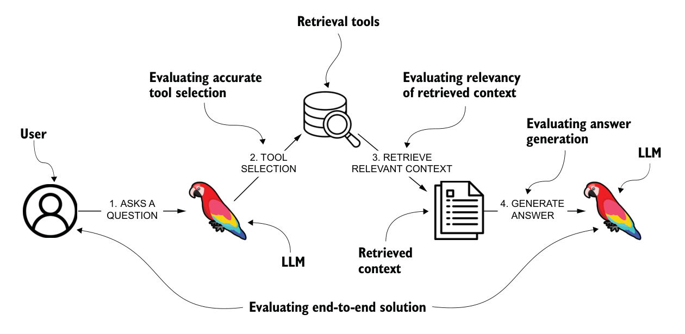
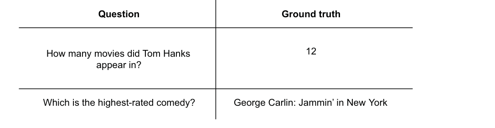
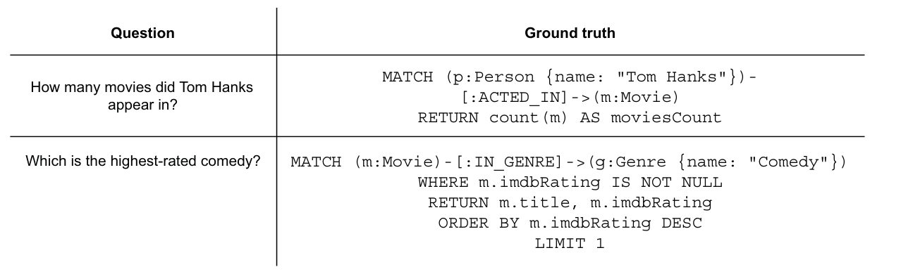

## 0. 章节简介

本章将带你了解为何要借助精心设计的基准问题来评估 RAG 应用的性能。随着 RAG 流程日益精巧、也日益复杂，确保智能体在各种查询下都能给出既准确又连贯的回答，就变得至关重要。基准评估为衡量智能体的能力提供了一套系统方法，同时也有助于清晰地界定和划定智能体的职责边界。

本章主要涵盖以下内容：

- 对 RAG 应用与智能体能力进行基准测试
- 设计评估数据集
- 应用 RAGAS 指标：召回率、忠实度、正确性

评估 RAG 应用涉及多种方法，每一种分别对应应用的不同环节，如图 8.1 所示。该图从宏观层面展示了一个由具备检索能力的大语言模型（LLM）驱动的问答系统流程。流程始于用户向系统提出问题；随后，大语言模型会选出最合适的检索工具来获取所需信息。这一步至关重要，其工具选择过程的准确性可以被单独评估。



_图 8.1 对 RAG 流程的不同环节进行评估。整个流程包含四步：（1）用户提出问题；（2）工具选择；（3）检索相关上下文；（4）生成答案。相应地，可评估的环节包括：工具选择是否准确、检索到的上下文是否相关、答案生成质量，以及端到端整体方案的效果。_

在本书中，你已经实现了多种检索工具的设计，从向量搜索起步，逐步过渡到 text2cypher 和 Cypher 模板等更结构化的方法。每种检索方法服务于不同的需求：

- 向量搜索能够高效检索语义相关的文档。
- Cypher 模板支持对数据库执行精确、结构化的查询。
- text2cypher 支持动态、灵活的查询，并能充分发挥基于图的检索所具备的表达能力。

评估大语言模型选择了哪个工具、以及它与查询需求的契合程度，对于优化检索性能至关重要。

一旦选定了合适的工具，它就会从知识库中检索相关的上下文或数据。检索到的上下文与用户问题的相关性，是另一个关键评估点。一个选择得当的检索方法，应当确保获取到的上下文既准确、又足以回答问题。

大语言模型会利用检索到的上下文生成答案，并最终呈现给用户。在这一阶段，我们不仅可以评估所生成回复的连贯性与准确性，还能评估模型理解并有效整合所提供上下文的能力。一个尤为重要的评估标准是：当给定正确的上下文时，大语言模型能否给出正确的答案。这使我们能够把模型的推理与综合能力，同检索性能区分开来分别衡量。

此外，还可以对整个流程进行整体评估，以衡量它在为用户查询提供准确且贴合上下文的答案方面的综合效果。通过分析不同环节——工具选择、检索相关性以及最终答案生成——中的失败情形，我们就能迭代式地改进检索机制，以及大语言模型利用检索信息的能力。

假设你负责评估第 5 章中所实现的大语言模型智能体的性能。为了更深入地了解它的实际效果，你将使用 RAGAS 这个 Python 库来设计并开展一次基准分析。但在此之前，你需要先设计基准数据集。在本章余下部分，我们会从概念过渡到代码，逐步走完整个实现。若你希望跟随实操，需要准备一个正在运行的 Neo4j 实例，可以是本地部署，也可以是云端托管。本章的实现使用的是我们所称的“电影数据集”，关于该数据集及其多种加载方式的更多信息，请参见附录。你也可以直接参考配套的 Jupyter Notebook 完成实现，地址如下：https://github.com/tomasonjo/kg-rag/blob/main/notebooks/ch08.ipynb。

下面我们正式开始。

## 1. 设计基准数据集

构建基准数据集，需要精心设计能够检验系统决策与回答生成各个方面的输入查询。由于 RAG 流程中的每一步都举足轻重，数据集就应当包含多样化的问题，以挑战不同的组件：

- 工具选择评估——一部分查询应当用于检验系统是否选择了正确的检索方法，确保它能识别出最相关的信息来源。
- 实体与取值映射——另一部分查询可以侧重于检验特定任务，例如把用户输入中的实体或取值映射到数据库中对应的条目。
- 多步检索场景——有些智能体能够执行多步检索，即把首次检索到的数据作为第二次检索的输入。基准数据集应当包含这样的用例：系统需要在首次检索的基础上进一步细化或扩展，才能完整回答问题。这类用例对于回答那些依赖动态串联多次查询的复杂问题尤为重要。
- 边界情况与功能覆盖——要全面了解系统性能，基准数据集必须覆盖所有功能以及已知的边界情况，包括处理含糊的查询、长尾概念，以及可能有多种检索方法都适用的场景。
- 对话可用性——此外，评估智能体处理问候语、澄清含糊查询以及有效说明自身能力的表现，也很有价值，这有助于确保流畅、友好的使用体验。

通过系统性地对这些方面进行基准测试，我们能够更清晰地了解智能体在不同条件下的表现，从而有针对性地加以改进，确保它在真实部署环境中的稳健性与可靠性。

### 1.1. 构思测试样例

要全面评估系统，你需要定义清晰的端到端测试样例。如图 8.2 所示，每个样例都由一个问题及其对应的标准答案（ground truth）构成，从而确保系统输出能够被可靠地衡量。



_图 8.2 基准测试样例：例如问题“汤姆·汉克斯出演过多少部电影？”对应标准答案“12”；问题“评分最高的喜剧片是哪一部？”对应标准答案“George Carlin: Jammin' in New York”。_

与其把一个固定的字符串作为预期答案，我们更可以用 Cypher 查询来动态地定义标准答案。由于我们面对的是图数据库，这种做法具有一个显著优势：即便底层数据发生变化，基准数据集依然有效。这样一来，如图 8.3 所示的测试用例便能长期保持准确，而无需不断更新。



_图 8.3 以 Cypher 语句作为标准答案的基准测试样例。_

在设计基准数据集时，你应当纳入多样化的样例，以评估智能体在不同方面的表现。例如，你可以评估智能体如何回应“你好”这类问候、如何向用户提供引导，或如何处理无关查询，如表 8.1 所示。

表 8.1 给出了智能体如何应对简单问候、用户引导请求以及无关查询的示例。它展示了如何用一条简单的 `RETURN` 语句来定义那些无需在数据库中查找信息的静态答案。例如，当被“你好”问候时，智能体会回以问候，并提醒用户自己的职责范围；当被问及“你能做什么”时，它会说明自己负责回答有关电影及其演职人员的问题；对于诸如天气之类的无关查询，智能体则会直接说明自己只处理与电影相关的问题。

_表 8.1 检验简单问候与无关问题的基准样例_

| 问题                               | Cypher                                                                                           |
| ---------------------------------- | ------------------------------------------------------------------------------------------------ |
| Hello                              | `RETURN "greeting and reminder it can only answer questions related to movies."`                 |
| What can you do?                   | `RETURN "answer questions related to movies and their cast."`                                    |
| What is the weather like in Spain? | `RETURN "irrelevant question as we can answer questions related to movies and their cast only."` |

接下来，我们可以定义一组问题，用于评估工具的使用情况，以及大语言模型借助这些工具生成准确答案的能力。相关示例见表 8.2。

表 8.2 中的示例展示了大语言模型需要借助可用工具从数据库中检索相关数据的情形。在这里，大语言模型应当使用两个关键工具：一个用于按演员查找电影，另一个用于按电影查找演员，以确保快速、可靠的响应。

此外，这些示例还让我们能够评估智能体把用户输入映射到数据库取值的效果。对于知名的电影和演员，大语言模型往往凭借预训练知识就能直接生成正确的查询；但对于冷门或私有的数据集，一套专门的映射系统对于准确的实体消解就必不可少。实现这样的系统，可以确保用户输入被正确地关联到数据库条目，从而同时提升准确性与可靠性。

_表 8.2 检验工具使用与取值映射的基准样例_

| 问题                                  | Cypher                                                                              |
| ------------------------------------- | ----------------------------------------------------------------------------------- |
| Who acted in Top Gun?                 | `RETURN 'MATCH (p:Person)-[:ACTED_IN]->(m:Movie {title: "Top Gun"}) RETURN p.name'` |
| Who acted in top gun?                 | `RETURN 'MATCH (p:Person)-[:ACTED_IN]->(m:Movie {title: "Top Gun"}) RETURN p.name'` |
| In which movies did Tom Hanks act in? | `MATCH (p:Person {name: "Tom Hanks"})-[:ACTED_IN]->(m:Movie) RETURN m.title`        |
| In which movies did tom Hanks act in? | `MATCH (p:Person {name: "Tom Hanks"})-[:ACTED_IN]->(m:Movie) RETURN m.title`        |

你还应当加入一些需要大语言模型使用 text2cypher 工具的示例，如表 8.3 所示。

表 8.3 包含了涉及聚合、过滤和关系的查询，例如查找出演电影最多的演员、列出在某一年份之前出生的人，以及找出在特定年份出生且执导过电影的导演。由于并没有为这些查询实现专门的工具，大语言模型必须依赖 text2cypher，根据所提供的图模式（schema）来构造合适的 Cypher 语句。

_表 8.3 检验涉及聚合与过滤的查询的基准样例_

| 问题                                           | Cypher                                                                                                           |
| ---------------------------------------------- | ---------------------------------------------------------------------------------------------------------------- |
| Who acted in the most movies?                  | `MATCH (p:Person)-[:ACTED_IN]->(m:Movie) RETURN p.name, COUNT(m) AS movieCount ORDER BY movieCount DESC LIMIT 1` |
| List people born before 1940.                  | `MATCH (p:Person) WHERE p.born < 1940 RETURN p.name`                                                             |
| Who was born in 1965 and has directed a movie? | `MATCH (p:Person)-[:DIRECTED]->(m:Movie) WHERE p.born = 1965 RETURN p.name`                                      |

你还应当测试一些边界情况，例如那些相关数据缺失、但仍处于领域范围之内的查询，如表 8.4 所示。

_表 8.4 检验数据缺失情形的基准样例_

| 问题                             | Cypher                                 |
| -------------------------------- | -------------------------------------- |
| Which movie has the most Oscars? | `RETURN "This information is missing"` |

基准数据集在很大程度上取决于你的智能体所具备的功能。诸如检索策略、推理方法、结构化输出处理等具体能力，都会影响基准数据集评估性能的有效性。在设计基准数据集时，务必确保全面覆盖智能体的各项功能。通过纳入多种多样的样例，你就能有效地检验智能体应对各类挑战的能力。

本基准数据集共包含 17 个样例，此处未全部列出。现在，你就可以对它们进行评估了。

## 2. 评估

为了评估基准数据集上的表现，你将使用 RAGAS——一个专为评估 RAG 系统而设计的框架。如前所述，评估聚焦于三个关键指标，下面依次介绍。

### 2.1. 上下文召回率

上下文召回率（context recall）衡量的是：借助“上下文召回率评估”中的提示词，系统成功检索到了多少条相关信息。得分越高，说明检索系统越能有效地捕捉到回答查询所需的全部上下文。

上下文召回率评估

目标：给定一段上下文和一个答案，逐句分析答案中的每个句子，判断该句子是否可以归因于给定的上下文。仅使用“是”（1）或“否”（0）作为二元分类。以 JSON 格式输出，并附上判断理由。

“上下文召回率评估”中的提示词，确保所生成答案中的每一句话都能得到检索上下文的明确支撑。借此，它有助于评估检索系统捕捉相关信息的效果。

接下来，忠实度评估将确保所生成的回复在事实层面与检索到的内容保持一致。

### 2.2. 忠实度

忠实度（faithfulness）评估的是：所生成的回复在事实层面是否与检索到的上下文保持一致。如果一段回复的所有论断都能直接由所提供的文档支撑，就被视为忠实的，从而最大限度地降低幻觉风险。忠实度通过一个两步流程来评估。第一步，它借助“忠实度语句拆解”中的提示词，把答案分解为一个个原子化的陈述，确保每一条信息单元都清晰、自足，从而便于核验。

忠实度语句拆解

目标：给定一个问题和一个答案，分析答案中每个句子的复杂度，将每个句子拆解为一条或多条完全可理解的陈述。确保任何陈述中都不使用代词。以 JSON 格式输出。

生成这些陈述之后，它会借助“忠实度评估”中的提示词来评估其忠实度。

忠实度评估

目标：你的任务是基于给定的上下文，判断一系列陈述的忠实度。对于每一条陈述，如果它可以直接从上下文中推断出来，则返回判定值 1；如果无法直接从上下文中推断出来，则返回 0。

“忠实度评估”中的提示词，用于检查所生成回复中的各条陈述是否在事实上根植于检索到的上下文。它确保模型不会引入缺乏支撑的论断。

最后，我们通过将所生成的回复与标准答案进行比较，来评估答案正确性。

### 2.3. 答案正确性

答案正确性（answer correctness）评估的是：回复对用户查询的回答有多准确、多完整。它同时考量事实准确性与相关性，以确保回复契合问题的本意。答案正确性沿用与忠实度相同的流程来生成陈述，然后借助“答案正确性评估”中的提示词对其进行评估。

答案正确性评估

目标：给定一个标准答案和一条答案陈述，逐条分析每个陈述，并将其归入以下类别之一：

- TP（真正例）：出现在答案中、且能被标准答案中一条或多条陈述直接支撑的陈述。
- FP（假正例）：出现在答案中、但未被标准答案中任何陈述直接支撑的陈述。
- FN（假负例）：出现在标准答案中、但未出现在答案里的陈述。

每一条陈述只能归属于其中一个类别。请为每次分类给出理由。

“答案正确性评估”中的提示词，通过系统性地将所生成的陈述与标准答案进行比对，确保回复既在事实上正确，又契合预期答案。

通过分析这些指标，你可以判断系统检索相关数据、保持事实一致性以及生成正确回复的能力如何。这样的评估有助于识别潜在弱点，例如上下文缺失、前后不一致或答案不准确，从而支持迭代式的优化与性能提升。

### 2.4. 加载数据集

基准数据集以 CSV 文件的形式提供在配套代码仓库中，便于加载和使用，如下方清单所示。

```python
test_data = pd.read_csv("../data/benchmark_data.csv", delimiter=";")
```

### 2.5. 运行评估

为了评估系统的性能，你需要为基准数据集生成答案，并将其与预期的标准答案进行比较。首先，你需要通过执行相应的 Cypher 语句来获取标准答案，并使用智能体生成答案，如清单 8.2 所示。此外，你还必须记录延迟（latency）和检索到的上下文，以便分析系统的效率与相关性。

```python
answers = []
ground_truths = []
latencies = []
contexts = []

for i, row in tqdm(test_data.iterrows(), total=len(test_data),
                   desc="Processing rows"):
    # 执行给定的 Cypher 语句以获取标准答案
    ground_truth, _, _ = neo4j_driver.execute_query(row["cypher"])
    ground_truths.append([str(el.data()) for el in ground_truth])
    start = datetime.now()
    try:
        # 执行智能体，为问题生成回复
        answer, context = get_answer(row["question"])
        context = [el['content'] for el in context]
    except Exception:
        answer, context = None, []
    # 计算延迟
    latencies.append((datetime.now() - start).total_seconds())
    answers.append(answer)
    contexts.append(context)

# 将结果写回 DataFrame
test_data['ground_truth'] = [str(el) for el in ground_truths]
test_data['answer'] = answers
test_data['latency'] = latencies
test_data['retrieved_contexts'] = contexts
```

在收集到全部所需的输入数据（包括生成的答案与标准答案）之后，我们就可以着手进行评估了。

```python
# 将缺失的回复填充为 “I don't know”
dataset = Dataset.from_pandas(test_data.fillna("I don't know"))

# 使用 RAGAS 框架运行评估
result = evaluate(
    dataset,
    # 相关指标
    metrics=[
        answer_correctness,
        context_recall,
        faithfulness,
    ],
)
```

清单 8.3 中的代码使用 RAGAS 框架运行评估。由于该框架要求取值不能为空，因此你需要把缺失的回复填充为“I don't know”。随后，它会基于答案正确性、上下文召回率和忠实度这三项指标，对生成的答案进行评估。

最后一步，是分析结果以了解系统的性能。

### 2.6. 观察与分析

你可以查看表 8.5 中的整体汇总，以对智能体的表现有一个总体认识。

_表 8.5 基准测试汇总_

| answer_correctness | context_recall | faithfulness |
| ------------------ | -------------- | ------------ |
| 0.7774             | 0.7941         | 0.9657       |

表 8.5 中的结果，基于三项关键指标给出了对系统性能的总体评估。答案正确性为 0.7774，说明模型大多数情况下都能答对，但仍有约四分之一的情形未能命中。上下文召回率为 0.7941，表明检索系统表现尚可，但偶尔会遗漏部分必要信息，这可能拖累整体准确性。值得欣慰的是，忠实度高达 0.9657，堪称优秀，意味着模型极少凭空编造，能够忠实于检索到的上下文。

总体来看，较高的忠实度得分说明模型不会引入错误信息；而答案正确性与上下文召回率相对偏低，则提示我们：改进检索机制有望带来更高的回答准确率。提升检索覆盖面、并优化大语言模型组织答案的方式，都可能改善整体性能。这些洞见可以为后续优化指明方向，例如优化检索系统、改进查询重写，或为含糊查询实现更好的实体映射。

你还可以借助下方清单中的代码，对每一条回复做进一步分析，以发现可改进之处。

```python
for key in ["answer_correctness", "context_recall", "faithfulness"]:
    test_data[key] = [el[key] for el in result.scores]
test_data
```

完整的结果篇幅过大，无法收录在本书中，但从对单个样例的分析中可以得到几点关键结论。一个明显的规律是：对于无需 text2cypher 的查询，延迟要低得多，因为省去一次额外的大语言模型调用能够加快响应。另一个观察是：由于我们依赖大语言模型充当评判者，部分得分可能显得前后不一致，例如在“Hello”这个样例上。

一个明显的局限是，系统无法回答“在所有演员中，谁的名字最长？”这一问题。原因在于模型没有能力生成合适的 Cypher 查询。要解决这一点，你可以为 text2cypher 添加一个少样本示例加以引导，或专门实现一个用于处理此类查询的工具。

这项分析展示了基准测试如何帮助我们评估结果、并就未来的改进做出有据可依的决策。随着系统不断演进，基准数据集也应持续扩充，以保证优化工作的延续和性能的稳步提升。

在本书中，你已经探索了如何构建基于知识图谱的 RAG 系统。你了解了不同的检索策略如何让智能体从结构化或非结构化数据中获取相关信息。理解何时该使用向量搜索或 Cypher 模板等方法，是设计高效、准确系统的关键。

通过实现并不断打磨检索策略，你现在已经具备了构建强大的知识图谱智能体的基础。你看到了结构化查询如何提升精确度、检索方式的选择如何影响答案质量，也学会了如何系统性地评估性能。本章引入了基准测试这一手段，用于衡量准确性、召回率与忠实度，为你持续改进智能体提供了工具。

## 3. 下一步

现在，你已经掌握了构建并打磨由知识图谱驱动的智能检索系统所需的知识与工具。无论你是要打造一个复杂的问答智能体，还是要为特定领域量身定制检索流程，你都已经具备了设计稳健、高性能、知识驱动型 AI 系统的基础。

大语言模型正在迅速进步，不仅体现在理解和生成语言的能力上，也体现在它们利用外部工具进行数据检索、转换与操作的效率上。随着这些模型愈发强大，它们将能够在极少提示的情况下完成越来越复杂的任务。然而，它们的效果仍然取决于你所提供工具的质量、设计与集成方式。周到而高效地实现这些工具，确保它们契合系统的目标与约束，正是你的职责所在。

有了这一基础，你现在就可以着手构建属于自己的智能体式 GraphRAG 系统了。你已经能够以多种方式处理非结构化数据：既可以直接嵌入文本以实现快速的相似性检索，也可以更进一步，抽取实体、关系和事件等结构化信息，来充实一个支持更精确、更语义化、多跳查询的知识图谱。把这些方法结合起来，你就能构建出不仅能找到相关信息、更能真正理解信息的检索系统，从而为强大的、具备上下文感知能力的 AI 应用铺平道路。

## 4. 章节摘要

- 评估 RAG 流程对于确保答案准确、连贯至关重要。基准评估有助于衡量性能并界定智能体的能力。
- 评估过程涉及对多个环节的考察：检索工具选择、检索上下文的相关性、答案生成质量，以及系统的整体效果。
- 一个结构良好的基准数据集，应当包含多样化的查询，用以检验检索准确性、实体映射、对问候语和无关查询的处理，以及各类基于 Cypher 的数据库查找。
- 与其使用静态的预期答案，不如以 Cypher 查询作为标准答案，这样即便底层数据发生变化，基准数据集依然有效。
- 上下文召回率衡量系统检索相关信息的能力。
- 忠实度评估所生成的答案在事实层面是否与检索到的内容一致。
- 答案正确性评估回复是否完整、准确地回答了查询。
